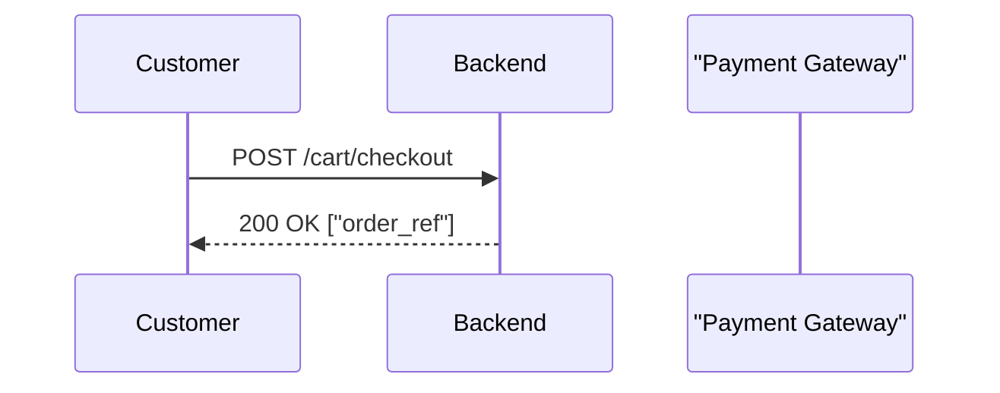

# Documentation Conventions

> **Last Reviewed:** 2026-07-02
> **Owner:** Engineering
> **Source of Truth:** This document

---

## Purpose

This document defines the conventions that every file in the `docs/` directory must follow. Consistent conventions make documentation scannable, trustworthy, and easy to maintain as the project evolves.

---

## File Naming

```
NN_Title_Case.md
```

- `NN` is a two-digit number that determines reading order and navigation position.
- Title is in `Title_Case` with underscores separating words.
- All files use the `.md` (Markdown) extension.
- Operational checklists that were produced as standalone runbooks (`DEPLOYMENT-CHECKLIST.md`, `ROLLBACK-PROCEDURE.md`, `REGRESSION-TEST-CHECKLIST.md`) keep their original UPPER_CASE names.

---

## Metadata Header

Every document **must** open with a metadata block immediately after the `# Title` line:

```markdown
# Document Title

> **Last Reviewed:** YYYY-MM-DD
> **Owner:** Engineering | Operations | Customer Support
> **Source of Truth:** path/to/authoritative/files
```

### Field Definitions

| Field | Purpose |
|---|---|
| `Last Reviewed` | The date the document was last verified against the live codebase. Update this whenever you change the doc. |
| `Owner` | The team or role responsible for keeping this document accurate. |
| `Source of Truth` | The actual code artefacts (files, folders, configs) that this document describes. When they conflict, the code wins. |

---

## The Authoritative Code Rule

> **Documentation describes code. Code does not follow documentation.**

When any document conflicts with the actual codebase:

1. Verify which is correct (check the migration, route, model, or service).
2. Update the document to match the code.
3. Never silently leave a conflict unresolved.

Specific authoritative sources by document:

| Document | Authoritative Source |
|---|---|
| Database Design | `database/migrations/*`, `app/Models/*` |
| API Documentation | `routes/web.php`, `routes/api.php`, `app/Http/Controllers/*`, `app/Http/Requests/*` |
| Module Documentation | `app/Models/*`, `app/Services/*`, `app/Policies/*`, `app/Jobs/*` |
| Authentication | `config/auth.php`, `app/Http/Middleware/*`, `app/Policies/*` |
| Technology Stack | `apps/backend/composer.json`, `apps/frontend/package.json` |
| Business Workflows | `app/Services/*`, `app/Http/Controllers/*` |

---

## Mermaid Diagram Syntax Rules

Mermaid diagrams are used for sequence diagrams, ER diagrams, flowcharts, and component diagrams throughout this documentation suite.

### Required Rules

1. **Quote labels containing special characters** — parentheses `()`, brackets `[]`, slashes `/`, and colons `:` must be inside double quotes:
   ```
   id["Label (with parens)"]   ✓ correct
   id[Label (with parens)]     ✗ will break
   ```

2. **No HTML tags** inside node labels. Use plain text only.

3. **Consistent arrow style** — use `-->` for standard directed edges, `->>` for sequence diagram messages, `-->>` for return messages.

4. **Diagram type on the first line** — always declare `sequenceDiagram`, `erDiagram`, `flowchart TD`, etc. as the first token.

5. **Actor/participant declarations** — in sequence diagrams, always declare all participants at the top before messages.

### Example (Correct)



---

## Cross-Reference Style

Link to other documents using **relative paths**:

```markdown
See [Database Design](./06_Database_Design.md) for the entity relationships.
```

Do not use absolute file system paths or URLs. Relative links work correctly in GitHub, VS Code preview, and most documentation renderers.

When linking to a specific section, use the GitHub anchor format:

```markdown
See [Module Ownership](./06_Database_Design.md#module-ownership)
```

---

## Update Policy

| Trigger | Who Updates | What to Update |
|---|---|---|
| New migration added | Developer | `06_Database_Design.md` (if it changes relationships or module ownership) |
| New endpoint added | Developer | `07_API_Documentation.md` |
| New module created | Developer | `09_Module_Documentation.md` |
| New role or permission added | Developer | `10_Authentication.md` |
| Dependency version change | Developer | `05_Technology_Stack.md` |
| Deployment procedure change | DevOps | `11_Deployment_Guide.md`, `DEPLOYMENT-CHECKLIST.md` |
| New workflow added | Developer | `08_Business_Workflows.md` |
| Architecture decision made | Tech lead | `04_Architecture_Decisions.md` |

Update the `Last Reviewed` date whenever you make a change to any document.

---

## Glossary

| Term | Definition |
|---|---|
| Minor units | Integer representation of currency amounts (paise for INR). `15000` = ₹150.00. |
| Public ID | Human-safe opaque identifier exposed in APIs (e.g. `ORD-00123`). Never expose internal database integer IDs. |
| Canonical date | The single agreed date field used for ordering/filtering. For sales: `COALESCE(placed_at, created_at)`. |
| Append-only | A table where rows are never updated or deleted after creation (inventory movements, audit logs). |
| Idempotency key | A unique token stored with a write operation to prevent duplicate execution on retry. |
| Soft delete | A row is marked `deleted_at` rather than physically removed from the database. |
| Guard | Laravel authentication guard — determines which user type is authenticated (`admin`, `web`). |
| Policy | Laravel authorisation class — determines whether an authenticated user may perform an action. |
| ADR | Architecture Decision Record — a short document capturing context, decision, and consequences for a significant technical choice. |
