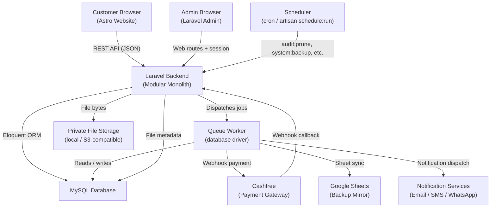
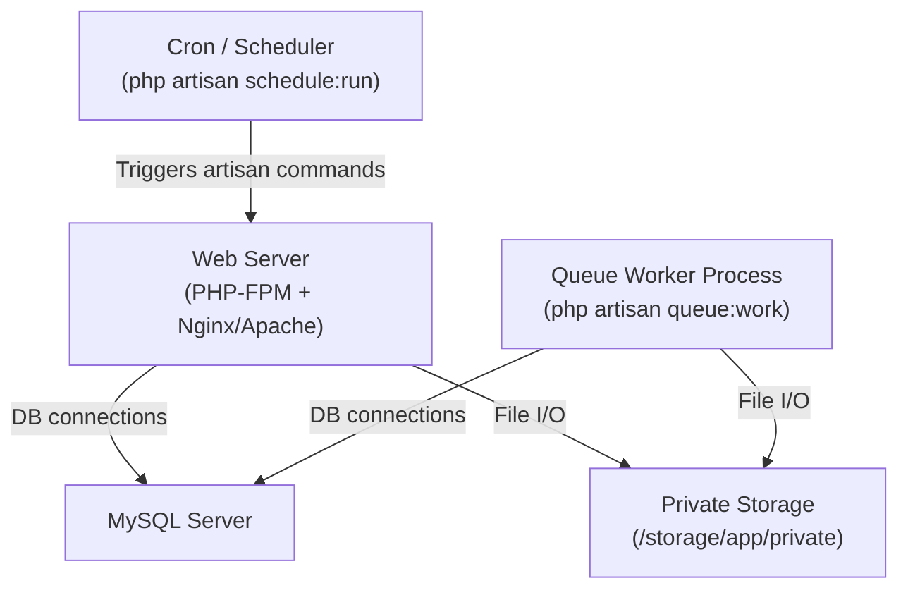

# System Architecture

> **Last Reviewed:** 2026-07-02
> **Owner:** Engineering
> **Source of Truth:** `apps/backend/`, `apps/frontend/`, `apps/backend/config/`, `routes/`

---

## Overview

Okina Business System is a **modular monolith**. One Laravel application serves both the admin operations panel and the backend API. One Astro application serves the customer-facing website. Both share a single MySQL database.

External integrations (Cashfree payments, Google Sheets, notifications) are decoupled from core business transactions via a queue-based job pipeline.

---

## System Context



---

## Component Breakdown

| Component | Technology | Role |
|---|---|---|
| Customer Website | Astro + Tailwind CSS | Public product pages, cart, checkout, customer account |
| Admin Panel | Laravel (web routes + session) | Order management, CRM, inventory, finance, settings |
| Backend API | Laravel (JSON API routes) | Serves customer website and customer account endpoints |
| Database | MySQL | Single shared source of truth for all data |
| Queue Worker | Laravel queue (`database` driver) | Processes notifications, Sheets sync, payment retries |
| Scheduler | Laravel Artisan (`schedule:run`) | Runs `audit:prune`, `system:backup`, and maintenance tasks |
| File Storage | Local disk (private) | Stores uploaded design files; bytes never in database |
| Payment Gateway | Cashfree (via replaceable interface) | Initiates and verifies customer payments |
| Google Sheets | Google Sheets API | Backup mirror of orders, payments, inventory records |

---

## Deployment Diagram



> For step-by-step deployment, see [Deployment Guide](./11_Deployment_Guide.md) and [DEPLOYMENT-CHECKLIST.md](./DEPLOYMENT-CHECKLIST.md).

---

## Folder Structure

```
Okina Business System/
├── apps/
│   ├── backend/                   Laravel application
│   │   ├── app/
│   │   │   ├── Console/           Artisan commands
│   │   │   ├── Contracts/         Shared interfaces
│   │   │   ├── Enums/             Backed PHP enums
│   │   │   ├── Events/            Domain events (AuditEvent, LowStockDetected, etc.)
│   │   │   ├── Exceptions/        Domain exceptions
│   │   │   ├── Http/
│   │   │   │   ├── Controllers/   API and web controllers
│   │   │   │   ├── Middleware/     Auth, CORS, rate limiting
│   │   │   │   └── Requests/      Form request validation classes
│   │   │   ├── Jobs/              Queued jobs
│   │   │   ├── Listeners/         Event listeners (AuditEventListener, etc.)
│   │   │   ├── Models/            Eloquent models (41 models)
│   │   │   ├── Observers/         Model observers
│   │   │   ├── Policies/          Authorization policies
│   │   │   ├── Providers/         Service providers
│   │   │   ├── Services/          Business logic services (20 services)
│   │   │   └── Support/           Shared helpers and value objects
│   │   ├── config/                App configuration (auth, audit, backup, sheets, etc.)
│   │   ├── database/
│   │   │   ├── migrations/        48 migration files (schema source of truth)
│   │   │   ├── factories/         Test factories
│   │   │   └── seeders/           Database seeders
│   │   ├── routes/
│   │   │   ├── web.php            Admin and shared routes
│   │   │   ├── api.php            Public and customer API routes
│   │   │   └── console.php        Scheduled commands
│   │   ├── storage/app/private/   Uploaded files (gitignored)
│   │   └── tests/Feature/         Feature test suite (792 tests)
│   │
│   └── frontend/                  Astro application
│       ├── src/
│       │   ├── pages/             Route pages
│       │   ├── components/        UI components
│       │   └── layouts/           Page layouts
│       └── public/                Static assets
│
└── docs/                          This documentation suite
```

---

## Module Boundary Rules

1. Each business domain owns its models, services, policies, events, and jobs.
2. Cross-module reads are performed through services or direct model queries — never duplicate domain logic.
3. Cross-module writes must be wrapped in database transactions.
4. External integrations (Cashfree, Google Sheets, notifications) are always behind queued jobs — they never block a database save.
5. The `audit_logs` table is written by a shared `AuditEventListener` — individual modules emit events but do not write directly to the audit table.

---

## Integration Pattern

All external integrations follow this pattern:

```
Core DB save (transaction)
    └── DB::afterCommit()
            └── dispatch(Job)
                    └── Job executes external call
                            ├── Success → log result
                            └── Failure → log + retry (with back-off)
```

This guarantees the core business transaction is never blocked or rolled back by an external service failure.
