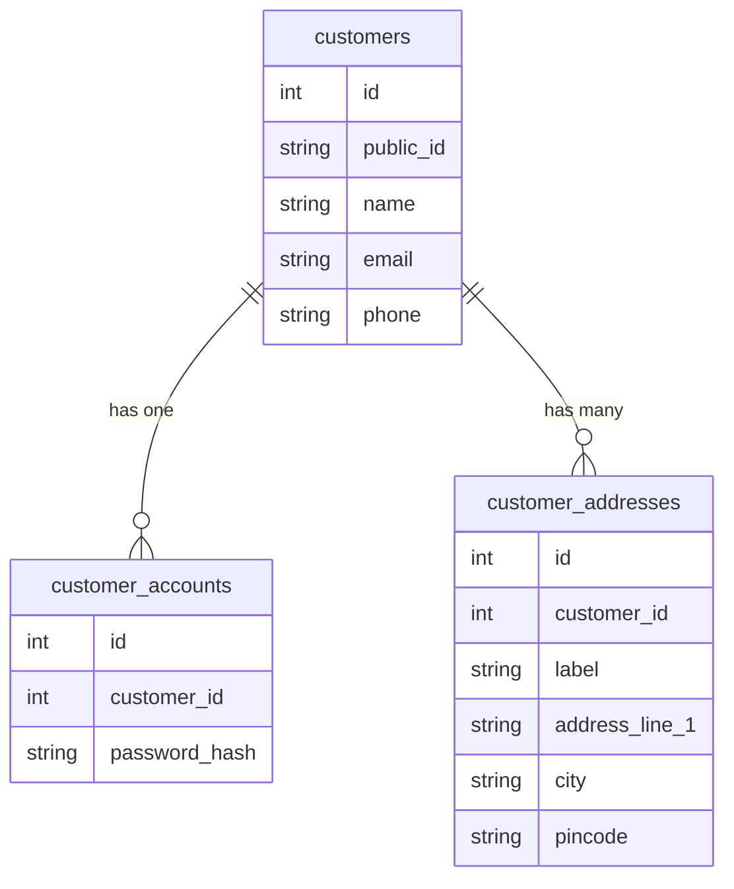
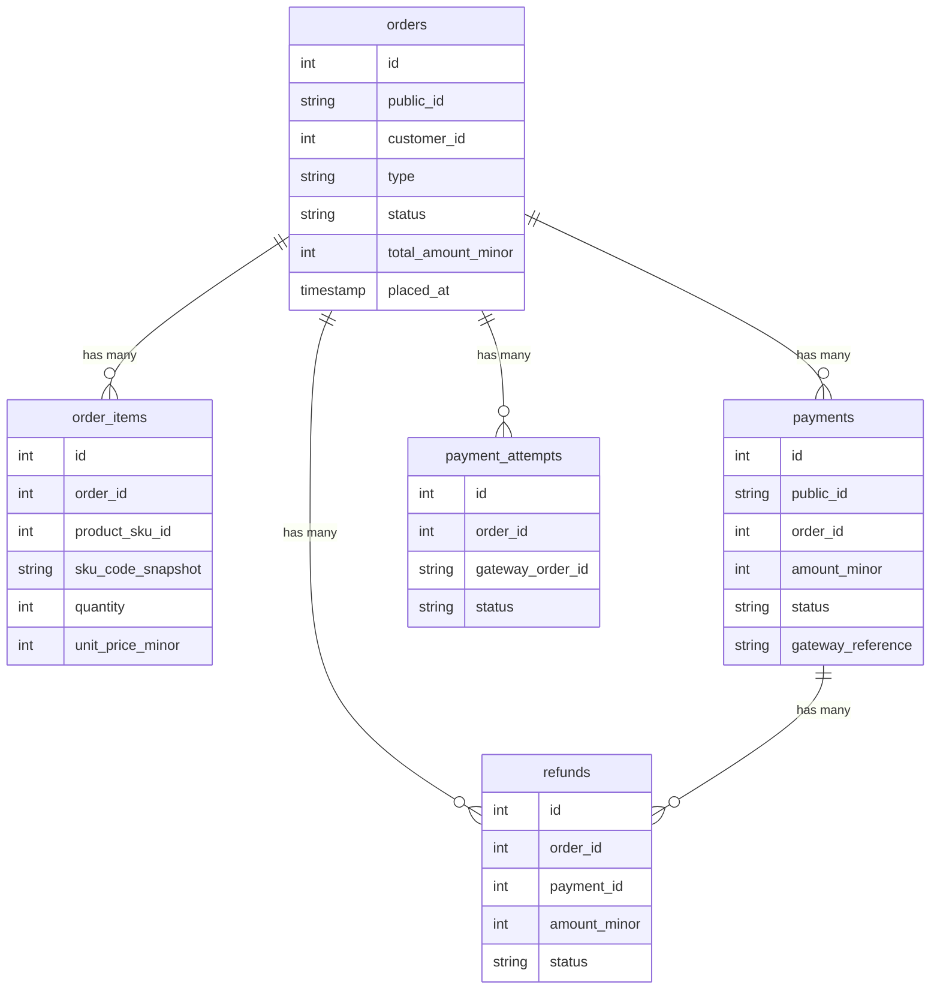
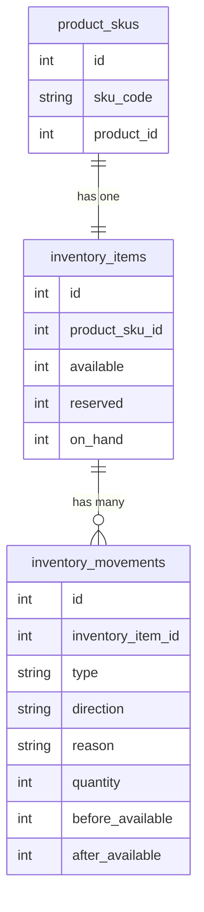
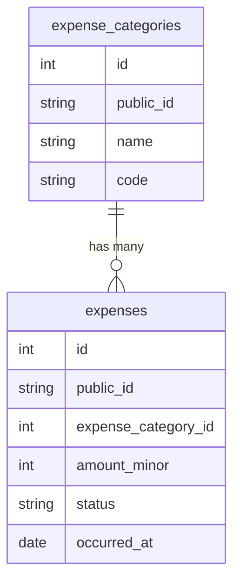
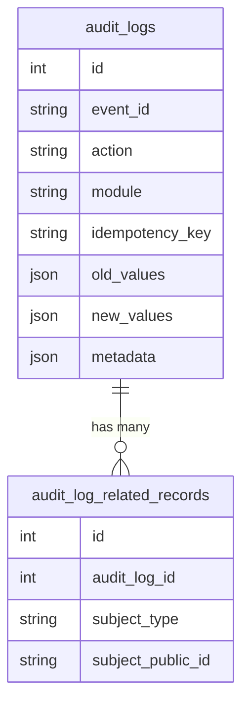

# Database Design

> **Last Reviewed:** 2026-07-02
> **Owner:** Engineering
> **Source of Truth:** `apps/backend/database/migrations/*`, `apps/backend/app/Models/*`

---

> ⚠️ **Migrations are the source of truth for field definitions.**
> This document covers architecture, relationships, ownership, and conventions.
> Per-table column listings are not duplicated here — read the migrations directly.

---

## Design Goals

1. One shared database for all modules — no per-module databases.
2. All domain data (orders, payments, inventory, customers, audit) is queryable from a single connection.
3. Schema changes are always forward-compatible — new columns and tables are added; existing columns are not renamed or removed without a migration.
4. Financial data is stored as integers in minor units — never as floating-point decimals.
5. Append-only tables (audit logs, inventory movements) are never updated after creation.

---

## Naming Conventions

| Convention | Rule | Example |
|---|---|---|
| Table names | Plural `snake_case` | `order_items`, `inventory_movements` |
| Column names | `snake_case` | `created_at`, `total_amount_minor` |
| Primary key | `id` (auto-increment integer, internal only) | `id` |
| Public identifier | `public_id` (opaque, exposed in API) | `ORD-00123` |
| Timestamps | `created_at`, `updated_at` (Laravel standard) | — |
| Soft delete | `deleted_at` (nullable) | — |
| Money columns | Suffix `_minor` (integer, paise) | `amount_minor`, `fee_minor` |
| Snapshot columns | Suffix `_snapshot` (denormalized copy at point in time) | `sku_code_snapshot`, `product_name_snapshot` |
| Status columns | Backed PHP enum cast | `status`, `payment_status` |
| Business date | `placed_at` (nullable), falls back to `created_at` | — |

---

## Relationship Philosophy

| Pattern | When Used |
|---|---|
| `RESTRICT` on delete | When a child record must not be orphaned (order items → orders) |
| `CASCADE` on delete | When child records are meaningless without the parent (audit related records → audit log) |
| `SET NULL` on delete | When the relationship is optional (expense category soft-deleted; expenses remain) |
| Soft delete | When records must be hidden but not permanently removed |
| Append-only | Audit logs, inventory movements — rows are never updated or deleted |
| Snapshot columns | Order items and quotation items snapshot SKU/price at creation time |

---

## Module Ownership

Each module owns its tables. Cross-module foreign keys are allowed but the table is owned by one module.

| Module | Tables Owned |
|---|---|
| **Auth / Users** | `users`, `roles`, `permissions`, `role_user`, `role_permissions` |
| **Customers** | `customers`, `customer_accounts`, `customer_addresses` |
| **Products** | `product_categories`, `products`, `product_variants`, `product_skus` |
| **Cart** | `carts`, `cart_items` |
| **Orders** | `orders`, `order_items` |
| **Payments** | `payment_attempts`, `payments`, `refunds`, `payment_webhook_logs` |
| **CRM** | `leads`, `lead_activities`, `lead_follow_ups` |
| **Quotations** | `quotations`, `quotation_items`, `quotation_revisions`, `quotation_approval_events` |
| **Inventory** | `inventory_items`, `inventory_movements` |
| **Vendors** | `vendors`, `vendor_orders`, `vendor_order_items`, `vendor_payments` |
| **Finance** | `expense_categories`, `expenses` |
| **Files** | `stored_files` |
| **Settings** | `settings` |
| **Notifications** | `notification_templates`, `notification_logs`, `notification_delivery_attempts` |
| **Audit** | `audit_logs`, `audit_log_related_records` |
| **Google Sheets** | `google_sheets_sync_logs` |
| **Queue / Cache** | `jobs`, `job_batches`, `failed_jobs`, `cache`, `cache_locks` |

---

## Entity Relationship Map

### Customer and Account Group

### Order and Payment Group

### Inventory Group

### Finance Group

### Audit Group

---

## Indexing Strategy

| Index Type | When Applied |
|---|---|
| Primary key | Every table — `id` |
| Unique index | `public_id` columns; idempotency keys; composite unique constraints (e.g. `vendor_order_id + product_sku_id`) |
| Foreign key index | All `*_id` foreign key columns |
| Lookup index | Status columns, date columns used in filter queries |
| Composite index | Multi-column queries (e.g. `[audit_logs: module, action, created_at]`) |
| Soft-delete compatible | Indexes that include `deleted_at IS NULL` where supported |

---

## Migration Conventions

- **File naming:** `YYYY_MM_DD_NNNNNN_describe_the_change.php`
- **Rollback safety:** Every migration implements a `down()` method. See [Rollback Procedure](./ROLLBACK-PROCEDURE.md) for when rollback is safe.
- **Additive only:** Prefer adding columns or tables over renaming or removing.
- **Constraints:** Foreign key constraints enforce referential integrity at the database level, not only in application code.
- **Check constraints:** MySQL check constraints are used for enum-like column validation where supported.

Migration files: [`apps/backend/database/migrations/`](../apps/backend/database/migrations/)
