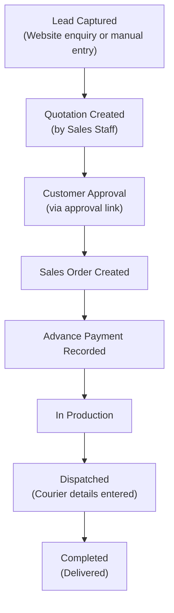
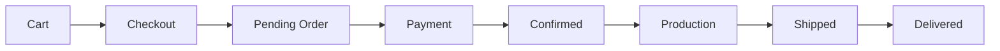
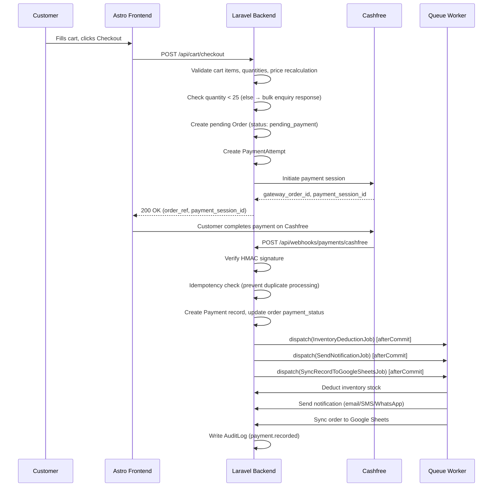
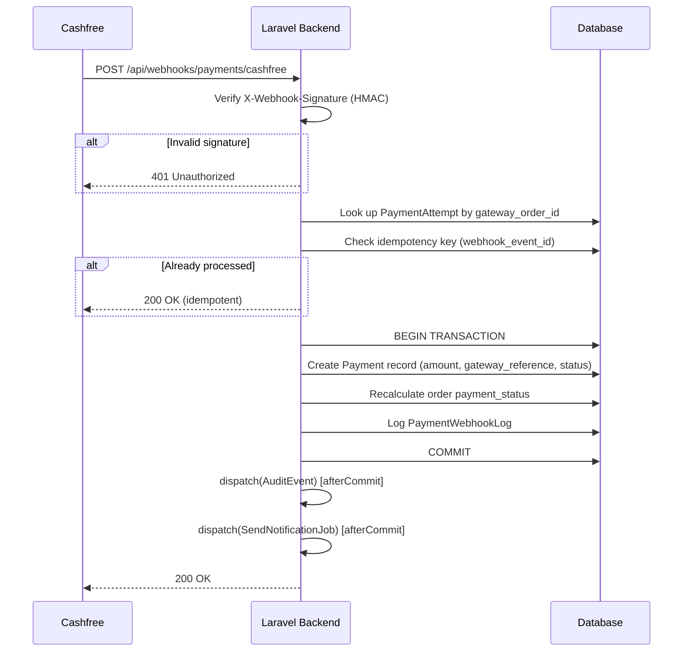
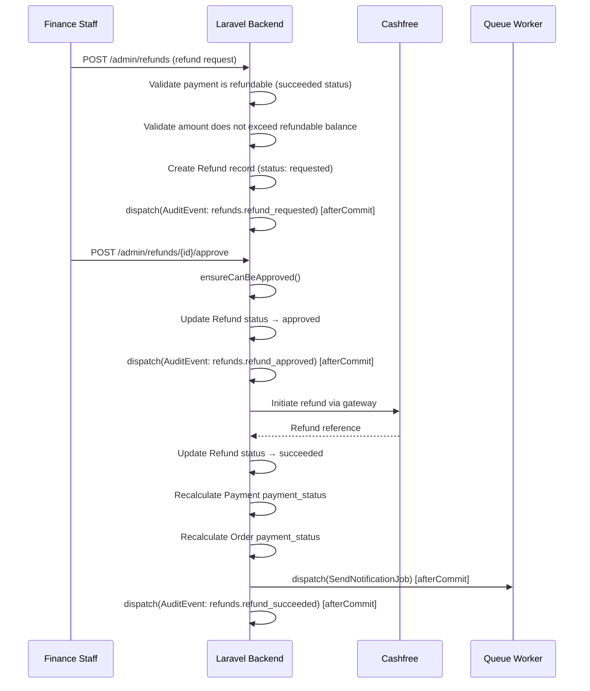
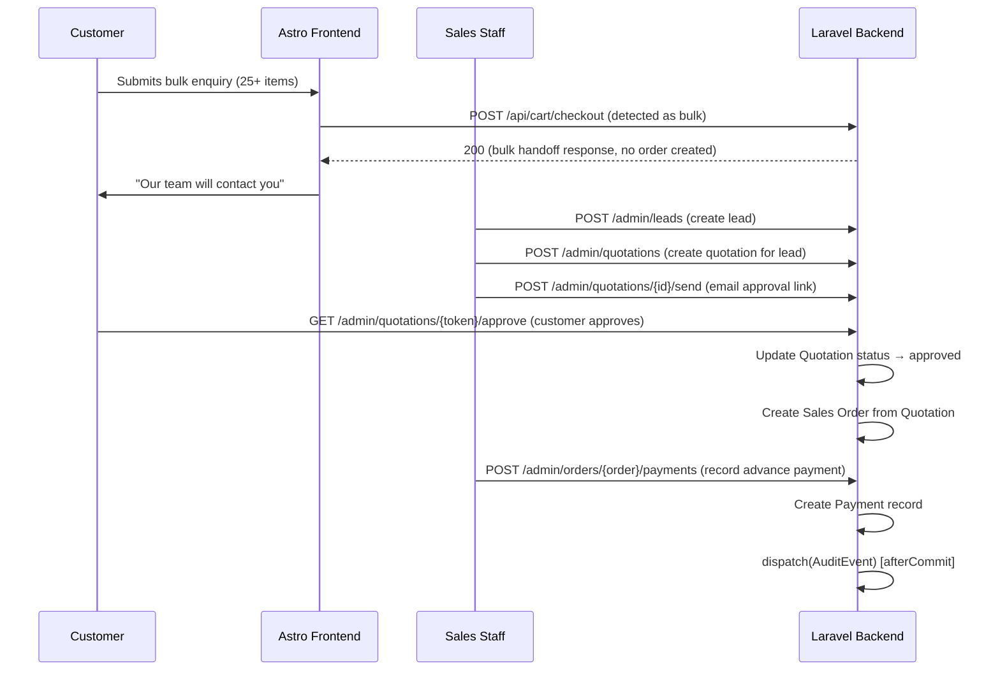
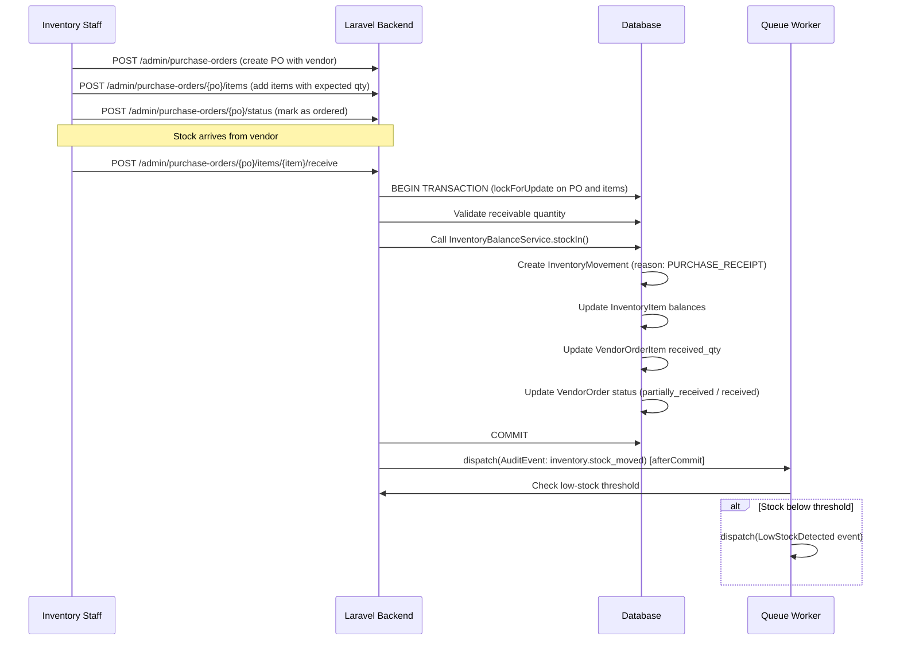
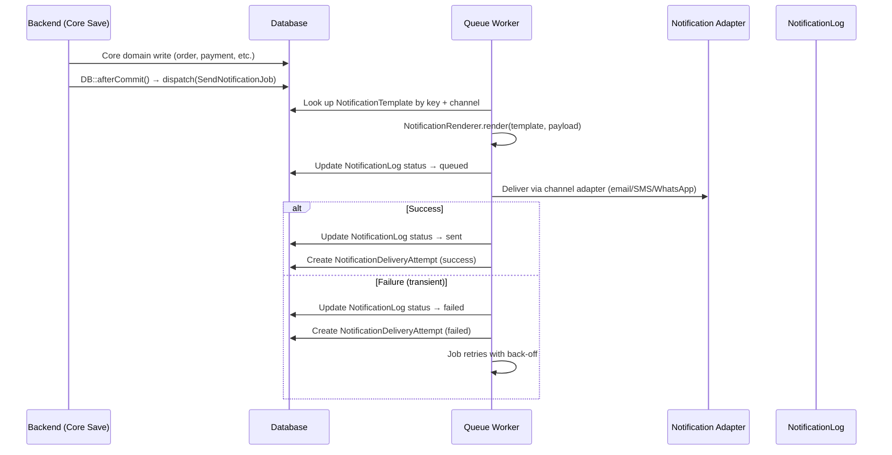

# Business Workflows

> **Last Reviewed:** 2026-07-02
> **Owner:** Engineering
> **Source of Truth:** `apps/backend/app/Services/*`, `apps/backend/app/Http/Controllers/*`

---

## 1. Business Lifecycle Overview

The high-level journey from first customer contact to completed order:

For website orders (retail customers), the flow is shorter:

---

## 2. Website Checkout Flow

---

## 3. Payment Webhook Reconciliation

---

## 4. Refund Workflow

---

## 5. Bulk Enquiry → Sales Order

---

## 6. Stock-In from Purchase Order

---

## 7. Notification Dispatch

