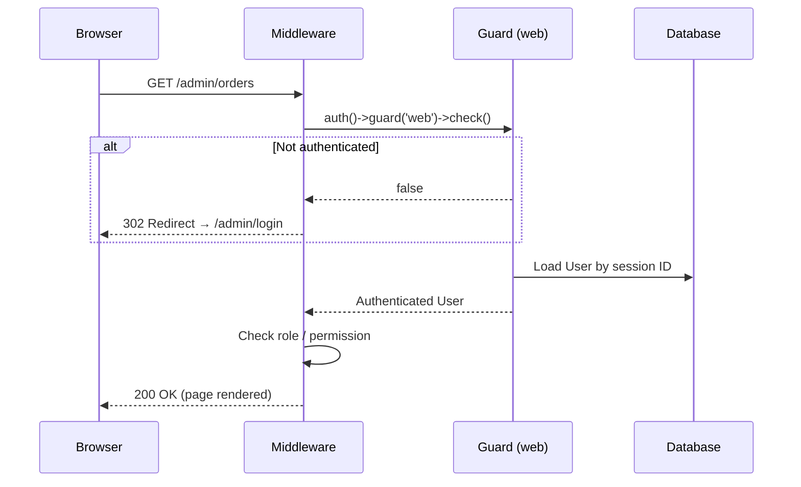
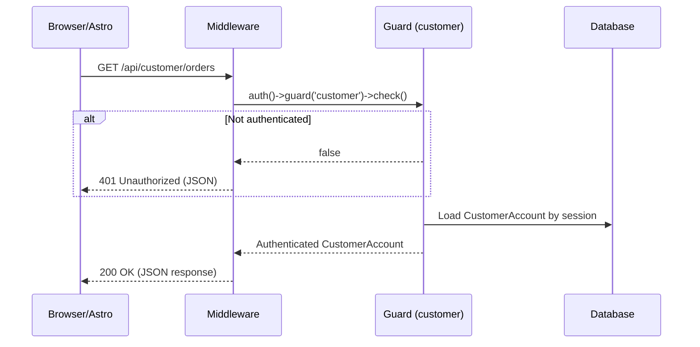
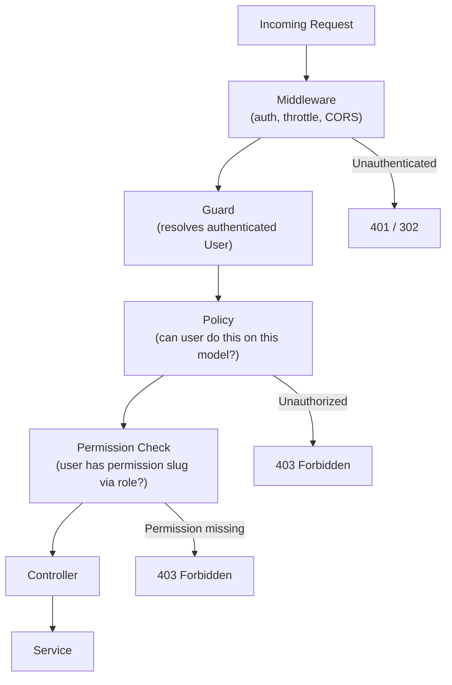

# Authentication & Authorization

> **Last Reviewed:** 2026-07-02
> **Owner:** Engineering
> **Source of Truth:** `apps/backend/config/auth.php`, `apps/backend/app/Http/Middleware/*`, `apps/backend/app/Policies/*`

---

## Two-Guard Architecture

The system uses two separate authentication guards, each with its own user model and session:

| Guard | User Model | Routes | Login Path |
|---|---|---|---|
| `web` (admin) | `App\Models\User` | `/admin/*` | `/admin/login` |
| `customer` | `App\Models\CustomerAccount` | `/api/customer/*` | `/api/auth/login` |

These guards are completely independent — an authenticated admin cannot access customer routes as a customer, and vice versa.

---

## Admin Authentication Flow



---

## Customer Authentication Flow



---

## Permission Flow (Admin)

Every admin request passes through this chain before reaching business logic:



---

## Roles

| Role | Description |
|---|---|
| `super_admin` | Full access to all modules including audit logs and settings |
| `admin` | Full operational access; cannot view finance cost/profit details |
| `sales_staff` | CRM, orders (view and create), quotations |
| `inventory_staff` | Inventory, vendors, purchase orders |
| `finance_staff` | Finance ledger, refunds, expenses, reports, audit logs |
| `production_staff` | Order status updates (production stages only), shipping details |

---

## Permission Slugs

Permissions are stored as slugs in the `permissions` table and assigned to roles.

| Slug | Description |
|---|---|
| `orders.view` | View order list and detail |
| `orders.manage` | Update order status, shipping, design approval |
| `orders.create` | Create manual sales orders |
| `payments.record` | Record manual payments |
| `finance.view` | View payment ledger and refunds |
| `finance.view_cost` | View sensitive cost/profit columns in finance |
| `finance.manage_expenses` | Create, update, approve expenses |
| `refunds.request` | Request a refund |
| `refunds.approve` | Approve a refund |
| `reports.view` | Access financial and expense reports |
| `inventory.view` | View stock balances and movements |
| `inventory.manage` | Record stock movements and adjustments |
| `crm.view` | View leads and quotations |
| `crm.manage` | Manage leads, follow-ups, and quotations |
| `audit.view` | View audit log records |
| `notifications.view` | View notification logs |
| `settings.manage` | Read and update business settings |
| `vendors.view` | View vendors and purchase orders |
| `vendors.manage` | Create and manage vendors and purchase orders |

---

## Policy Registration

All Eloquent model policies are registered in `AppServiceProvider`:

```php
Gate::policy(Order::class, OrderPolicy::class);
Gate::policy(Payment::class, PaymentPolicy::class);
Gate::policy(Refund::class, RefundPolicy::class);
Gate::policy(Expense::class, ExpensePolicy::class);
Gate::policy(AuditLog::class, AuditLogPolicy::class);
// ... all 15 module policies
```

---

## Sensitive Field Visibility

Some response fields are gated behind additional permissions:

| Field | Permission Required | Applied In |
|---|---|---|
| `gateway_fee`, `net_amount` on Payment | `finance.view_cost` | `PaymentResource` |
| `gateway_fee`, `net_amount` on Refund | `finance.view_cost` | `RefundResource` |
| Audit log full payload | `audit.view` | `AuditLogController` |

These fields are conditionally included using Laravel Resource's `$this->when()`:

```php
'gateway_fee' => $this->when(
    $request->user()->can('finance.view_cost'),
    fn () => $this->gateway_fee_minor
),
```

---

## Security Rules

- Passwords are hashed using Laravel's default `bcrypt` (configurable).
- Session tokens are regenerated on login to prevent session fixation.
- Private file bytes are never stored in the database — only metadata.
- Passwords, tokens, API keys, and card numbers are never written to audit logs (masked by `AuditPayloadPolicy`).
- Webhook signature verification uses HMAC — no shared session or API key.
