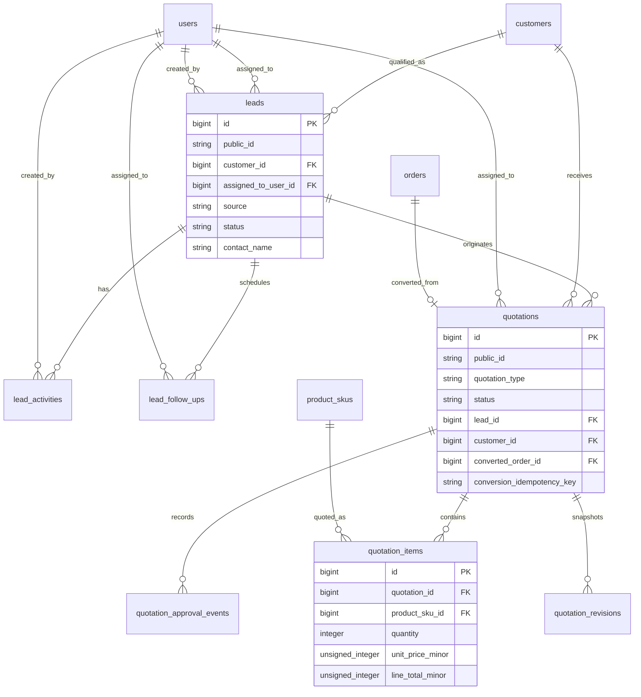

# CRM and Quotations Schema Plan

Task: A1.1.7 CRM/quotations schema

Status: Planning draft

## Scope

This document defines the database direction for CRM leads, lead activities, lead follow-ups, quotations, quotation items, approval events, revision history, and conversion tracking into future sales orders.

It does not implement Laravel migrations, website bulk enquiry forms, admin CRM screens, quotation PDFs/emails, sales-order conversion logic, advance payment recording, follow-up notifications, audit logs, Google Sheets sync, or seed data.

## Design Goals

- Bulk enquiries can become leads without immediately creating customer records.
- Leads can later link to an existing or newly created customer after qualification.
- Quotations can originate from leads or be created manually.
- Quotations are not official orders until approved and converted.
- Quotation items can reference products/SKUs and preserve item snapshots.
- Quotation approval, rejection, revision, and conversion must be traceable.
- Approved quotations must convert to sales orders only once.
- Sales staff assignment, follow-ups, activity history, and reporting must be supported.
- Follow-up reminders and external sync must not block lead or quotation saves.
- Audit events can be emitted later without changing the schema shape.

## Core ERD

## Table: leads

Purpose: one row per website bulk enquiry or manually entered sales lead.

A lead can exist before the business knows whether it should become a customer. Store contact details on the lead first, then link `customer_id` when qualified or matched.

| Column | Type | Nullable | Notes |
|---|---:|---:|---|
| `id` | unsigned big integer | No | Primary key. |
| `public_id` | varchar(40) | No | Internal lead ID. Unique. Final generator belongs to A1.1.9. |
| `customer_id` | unsigned big integer | Yes | FK to `customers.id` after qualification or matching. |
| `assigned_to_user_id` | unsigned big integer | Yes | FK to `users.id` for sales owner. |
| `created_by_user_id` | unsigned big integer | Yes | FK to `users.id`; null for website/system capture. |
| `source` | varchar(40) | No | Suggested values: `website_bulk_enquiry`, `manual`, `phone`, `whatsapp`, `email`, `referral`, `import`. |
| `source_detail` | varchar(160) | Yes | Campaign/source label, referral name, or staff-entered source detail. |
| `status` | varchar(40) | No | Suggested values below. |
| `priority` | varchar(20) | No | Suggested values: `low`, `normal`, `high`, `urgent`. Default `normal`. |
| `contact_name` | varchar(160) | Yes | Raw enquiry contact name. |
| `company_name` | varchar(180) | Yes | Optional company/organization name. |
| `email` | varchar(180) | Yes | Raw enquiry email. |
| `phone` | varchar(40) | Yes | Raw enquiry phone. |
| `city` | varchar(120) | Yes | Optional city for sales filtering. |
| `state` | varchar(120) | Yes | Optional state. |
| `country_code` | char(2) | No | Default `IN`. |
| `interest_summary` | varchar(300) | Yes | Short sales-facing summary. |
| `requirements` | text | Yes | Customer-provided enquiry text. |
| `product_interest` | json | Yes | Product/category/SKU/quantity hints from website or staff. |
| `utm_source` | varchar(120) | Yes | Website attribution. |
| `utm_medium` | varchar(120) | Yes | Website attribution. |
| `utm_campaign` | varchar(160) | Yes | Website attribution. |
| `utm_content` | varchar(160) | Yes | Website attribution. |
| `utm_term` | varchar(160) | Yes | Website attribution. |
| `referrer_url` | text | Yes | Website referrer. |
| `landing_page_url` | text | Yes | First relevant page. |
| `last_contacted_at` | timestamp | Yes | Last meaningful sales contact. |
| `qualified_at` | timestamp | Yes | When sales qualified the lead. |
| `lost_at` | timestamp | Yes | When lead was marked lost. |
| `lost_reason` | varchar(160) | Yes | Optional loss reason. |
| `converted_at` | timestamp | Yes | When lead became a customer/order/closed conversion path. |
| `created_at` | timestamp | No | Laravel timestamps. |
| `updated_at` | timestamp | No | Laravel timestamps. |
| `deleted_at` | timestamp | Yes | Soft delete only if needed for mistaken duplicate cleanup. |

### Lead Status

| Status | Meaning |
|---|---|
| `new` | Captured, not yet reviewed. |
| `assigned` | Assigned to sales staff. |
| `contacted` | Sales contact has started. |
| `qualified` | Valid opportunity, can move to quotation. |
| `quoted` | At least one quotation has been created or sent. |
| `won` | Converted to customer/order path. |
| `lost` | Closed without sale. |
| `spam` | Invalid or junk enquiry. |

### Lead Constraints

- Primary key: `id`.
- Unique: `public_id`.
- FK: `customer_id` references `customers.id`, null on delete only if customer cleanup policy allows; otherwise restrict.
- FK: `assigned_to_user_id` references `users.id`, null on delete.
- FK: `created_by_user_id` references `users.id`, null on delete.
- Check/app enum: `source` in approved lead sources.
- Check/app enum: `status` in `new`, `assigned`, `contacted`, `qualified`, `quoted`, `won`, `lost`, `spam`.
- Check/app enum: `priority` in `low`, `normal`, `high`, `urgent`.
- At least one contact route, such as phone, email, or customer link, should exist before a lead becomes `qualified`.
- `product_interest` must be valid JSON when present.

### Lead Indexes

- `unique(leads.public_id)`.
- `index(leads.status, leads.created_at)` for queues.
- `index(leads.assigned_to_user_id, leads.status, leads.created_at)` for staff work lists.
- `index(leads.customer_id, leads.created_at)` for customer history.
- `index(leads.source, leads.created_at)` for reporting.
- `index(leads.priority, leads.status, leads.created_at)` for sales priority queues.
- `index(leads.last_contacted_at)`.
- `index(leads.deleted_at)` if soft-deleted admin views are needed.

## Table: lead_activities

Purpose: timeline entries for lead notes, calls, emails, assignments, status changes, and quotation milestones.

This is operational CRM history, not the immutable audit log. Sensitive changes should still emit audit events later.

| Column | Type | Nullable | Notes |
|---|---:|---:|---|
| `id` | unsigned big integer | No | Primary key. |
| `lead_id` | unsigned big integer | No | FK to `leads.id`. |
| `activity_type` | varchar(40) | No | Suggested values below. |
| `subject` | varchar(180) | Yes | Short timeline title. |
| `body` | text | Yes | Internal activity/note body. |
| `metadata` | json | Yes | Safe structured details, such as from/to status. |
| `customer_visible` | boolean | No | Default `false`; avoid exposing internal notes. |
| `created_by_user_id` | unsigned big integer | Yes | FK to `users.id`; null for system entries. |
| `occurred_at` | timestamp | No | Activity time. |
| `created_at` | timestamp | No | Laravel timestamp. |

### Lead Activity Types

Suggested values:

- `note`
- `call`
- `email`
- `whatsapp`
- `status_change`
- `assignment`
- `follow_up_created`
- `follow_up_completed`
- `quotation_created`
- `quotation_sent`
- `quotation_approved`
- `quotation_rejected`

### Lead Activity Constraints

- Primary key: `id`.
- FK: `lead_id` references `leads.id`.
- FK: `created_by_user_id` references `users.id`, null on delete.
- Check/app enum: `activity_type` in approved activity types.
- `metadata` must not contain secrets, payment credentials, private file contents, or raw unsafe payloads.

### Lead Activity Indexes

- `index(lead_activities.lead_id, lead_activities.occurred_at)`.
- `index(lead_activities.activity_type, lead_activities.occurred_at)`.
- `index(lead_activities.created_by_user_id, lead_activities.occurred_at)`.

## Table: lead_follow_ups

Purpose: scheduled follow-up work for sales staff.

Follow-up reminders should be queued/notification-driven later, but lead saves must not depend on notification success.

| Column | Type | Nullable | Notes |
|---|---:|---:|---|
| `id` | unsigned big integer | No | Primary key. |
| `lead_id` | unsigned big integer | No | FK to `leads.id`. |
| `assigned_to_user_id` | unsigned big integer | Yes | FK to `users.id`. |
| `status` | varchar(32) | No | Suggested values: `pending`, `completed`, `snoozed`, `cancelled`. |
| `due_at` | timestamp | No | Follow-up due time. |
| `completed_at` | timestamp | Yes | Completion time. |
| `completed_by_user_id` | unsigned big integer | Yes | FK to `users.id`. |
| `snoozed_until` | timestamp | Yes | Optional snooze time. |
| `subject` | varchar(180) | Yes | Short task label. |
| `notes` | text | Yes | Internal follow-up note. |
| `notification_key` | varchar(120) | Yes | Optional deduplication key for reminder jobs. |
| `created_by_user_id` | unsigned big integer | Yes | FK to `users.id`. |
| `created_at` | timestamp | No | Laravel timestamps. |
| `updated_at` | timestamp | No | Laravel timestamps. |

### Follow-Up Constraints

- Primary key: `id`.
- FK: `lead_id` references `leads.id`.
- FK: `assigned_to_user_id` references `users.id`, null on delete.
- FK: `completed_by_user_id` references `users.id`, null on delete.
- FK: `created_by_user_id` references `users.id`, null on delete.
- Unique nullable: `notification_key`.
- Check/app enum: `status` in `pending`, `completed`, `snoozed`, `cancelled`.
- Application rule: completed follow-ups should have `completed_at`.

### Follow-Up Indexes

- `index(lead_follow_ups.lead_id, lead_follow_ups.due_at)`.
- `index(lead_follow_ups.assigned_to_user_id, lead_follow_ups.status, lead_follow_ups.due_at)`.
- `index(lead_follow_ups.status, lead_follow_ups.due_at)`.
- `unique(lead_follow_ups.notification_key)` when present.

## Table: quotations

Purpose: quotation header for bulk or manual sales quote workflow.

A quotation can be created from a lead or manually. It may link to a customer when known, but it must not become an official order until approval and conversion.

| Column | Type | Nullable | Notes |
|---|---:|---:|---|
| `id` | unsigned big integer | No | Primary key. |
| `public_id` | varchar(40) | No | Customer/admin-facing quotation ID. Unique. Final generator belongs to A1.1.9. |
| `quotation_type` | varchar(40) | No | Suggested values: `bulk_quotation`, `manual_quotation`. |
| `status` | varchar(40) | No | Suggested values below. |
| `lead_id` | unsigned big integer | Yes | FK to `leads.id` when quotation originates from a lead. |
| `customer_id` | unsigned big integer | Yes | FK to `customers.id` when linked to customer. |
| `assigned_to_user_id` | unsigned big integer | Yes | FK to `users.id` for sales owner. |
| `created_by_user_id` | unsigned big integer | Yes | FK to `users.id`. |
| `approved_by_user_id` | unsigned big integer | Yes | FK to `users.id` when staff records approval. |
| `converted_by_user_id` | unsigned big integer | Yes | FK to `users.id` when converted. |
| `converted_order_id` | unsigned big integer | Yes | FK to `orders.id` after conversion to sales order. Unique nullable. |
| `customer_snapshot` | json | Yes | Customer/contact snapshot for quote display. |
| `subtotal_amount_minor` | unsigned big integer | No | Default `0`. |
| `discount_amount_minor` | unsigned big integer | No | Default `0`. |
| `shipping_amount_minor` | unsigned big integer | No | Default `0`. |
| `tax_amount_minor` | unsigned big integer | No | Default `0`. |
| `total_amount_minor` | unsigned big integer | No | Default `0`. |
| `currency` | char(3) | No | Default `INR`. |
| `current_revision_number` | unsigned integer | No | Starts at `1`. |
| `valid_until` | date | Yes | Quote expiry date. |
| `sent_at` | timestamp | Yes | When sent to customer. |
| `approved_at` | timestamp | Yes | Approval time. |
| `rejected_at` | timestamp | Yes | Rejection time. |
| `expired_at` | timestamp | Yes | Expiry processing time. |
| `converted_at` | timestamp | Yes | Conversion time. |
| `conversion_idempotency_key` | varchar(120) | Yes | Prevents duplicate conversion to order. Unique. |
| `customer_note` | text | Yes | Customer-facing note or terms summary. |
| `internal_notes` | text | Yes | Staff-only note. Must not appear in customer APIs. |
| `created_at` | timestamp | No | Laravel timestamps. |
| `updated_at` | timestamp | No | Laravel timestamps. |

### Quotation Status

| Status | Meaning |
|---|---|
| `draft` | Staff is preparing the quotation. |
| `sent` | Sent to customer for approval. |
| `approved` | Customer approval is recorded. Eligible for conversion. |
| `rejected` | Customer rejected quotation. |
| `revision_requested` | Customer/staff requested changes. |
| `revised` | A newer revision exists or was prepared. |
| `expired` | Validity expired. |
| `cancelled` | Staff cancelled quotation. |
| `converted` | Converted to sales order. |

### Quotation Constraints

- Primary key: `id`.
- Unique: `public_id`.
- Unique nullable: `converted_order_id`.
- Unique nullable: `conversion_idempotency_key`.
- FK: `lead_id` references `leads.id`.
- FK: `customer_id` references `customers.id`.
- FK: `assigned_to_user_id`, `created_by_user_id`, `approved_by_user_id`, and `converted_by_user_id` reference `users.id`, null on delete.
- FK: `converted_order_id` references `orders.id`.
- Check/app enum: `quotation_type` in `bulk_quotation`, `manual_quotation`.
- Check/app enum: `status` in the approved quotation statuses.
- Check: `current_revision_number >= 1`.
- Check: monetary amount fields are `>= 0`.
- Check/app rule: `total_amount_minor = subtotal_amount_minor - discount_amount_minor + shipping_amount_minor + tax_amount_minor` where practical.
- Application rule: `converted_order_id` can be set only once.
- Application rule: conversion requires `status = approved`.

### Quotation Indexes

- `unique(quotations.public_id)`.
- `unique(quotations.converted_order_id)` when present.
- `unique(quotations.conversion_idempotency_key)` when present.
- `index(quotations.lead_id, quotations.created_at)`.
- `index(quotations.customer_id, quotations.created_at)`.
- `index(quotations.assigned_to_user_id, quotations.status, quotations.created_at)`.
- `index(quotations.status, quotations.valid_until)`.
- `index(quotations.quotation_type, quotations.status, quotations.created_at)`.
- `index(quotations.sent_at)`.
- `index(quotations.approved_at)`.
- `index(quotations.converted_at)`.

## Table: quotation_items

Purpose: one quoted line item for a product/SKU or custom item.

Quotation items should preserve snapshots because product names, SKU labels, prices, and customization rules may change before or after conversion.

| Column | Type | Nullable | Notes |
|---|---:|---:|---|
| `id` | unsigned big integer | No | Primary key. |
| `quotation_id` | unsigned big integer | No | FK to `quotations.id`. |
| `product_sku_id` | unsigned big integer | Yes | FK to `product_skus.id`; nullable for custom/manual lines if approved. |
| `product_id_snapshot` | unsigned big integer | Yes | Product ID at quote time. |
| `product_name_snapshot` | varchar(180) | Yes | Product name at quote time. |
| `sku_code_snapshot` | varchar(80) | Yes | SKU code at quote time. |
| `item_name` | varchar(180) | No | Display item name. |
| `selected_options_snapshot` | json | Yes | Quoted variant options. |
| `customization_snapshot` | json | Yes | Print method, position, file references, placement, or instructions. |
| `quantity` | unsigned integer | No | Quoted quantity. |
| `unit_price_minor` | unsigned big integer | No | Quoted unit price. |
| `discount_amount_minor` | unsigned big integer | No | Default `0`. |
| `tax_amount_minor` | unsigned big integer | No | Default `0`. |
| `line_subtotal_minor` | unsigned big integer | No | `quantity * unit_price_minor` before discount/tax. |
| `line_total_minor` | unsigned big integer | No | Final line total. |
| `currency` | char(3) | No | Default `INR`. |
| `sort_order` | unsigned integer | No | Stable display order. |
| `customer_note` | text | Yes | Customer-facing item note. |
| `internal_notes` | text | Yes | Staff-only item note. |
| `created_at` | timestamp | No | Laravel timestamps. |
| `updated_at` | timestamp | No | Laravel timestamps. |

### Quotation Item Constraints

- Primary key: `id`.
- FK: `quotation_id` references `quotations.id`.
- FK: `product_sku_id` references `product_skus.id`.
- Restrict/no-action on deleting referenced SKUs once quotation items exist.
- Check: `quantity >= 1`.
- Check: monetary amount fields are `>= 0`.
- Check/app rule: `line_subtotal_minor = quantity * unit_price_minor` where practical.
- `selected_options_snapshot` and `customization_snapshot` must be valid JSON when present.
- Store file IDs/references in customization snapshots, not private file contents or raw storage paths.

### Quotation Item Indexes

- `index(quotation_items.quotation_id, quotation_items.sort_order)`.
- `index(quotation_items.product_sku_id)`.
- `index(quotation_items.product_id_snapshot)`.
- `index(quotation_items.sku_code_snapshot)`.

## Table: quotation_approval_events

Purpose: approval, rejection, and change-request event history for a quotation.

This table records customer/staff approval facts without making quotation status history depend only on a mutable header row.

| Column | Type | Nullable | Notes |
|---|---:|---:|---|
| `id` | unsigned big integer | No | Primary key. |
| `quotation_id` | unsigned big integer | No | FK to `quotations.id`. |
| `event_type` | varchar(40) | No | Suggested values: `sent`, `approved`, `rejected`, `revision_requested`, `cancelled`. |
| `revision_number` | unsigned integer | No | Revision number this event applies to. |
| `actor_type` | varchar(40) | No | Suggested values: `customer`, `staff`, `system`. |
| `actor_user_id` | unsigned big integer | Yes | FK to `users.id` for staff actor. |
| `actor_customer_id` | unsigned big integer | Yes | FK to `customers.id` if authenticated customer actor exists. |
| `actor_name_snapshot` | varchar(160) | Yes | Name captured at event time for unauthenticated approval. |
| `actor_email_snapshot` | varchar(180) | Yes | Email captured at event time. |
| `note` | text | Yes | Approval/rejection/change note. |
| `idempotency_key` | varchar(120) | Yes | Prevents duplicate approval event submission. |
| `occurred_at` | timestamp | No | Event time. |
| `created_at` | timestamp | No | Laravel timestamp. |

### Approval Event Constraints

- Primary key: `id`.
- FK: `quotation_id` references `quotations.id`.
- FK: `actor_user_id` references `users.id`, null on delete.
- FK: `actor_customer_id` references `customers.id`, null on delete only if customer cleanup policy allows; otherwise restrict.
- Unique nullable: `idempotency_key`.
- Check/app enum: `event_type` in approved event types.
- Check/app enum: `actor_type` in `customer`, `staff`, `system`.
- Check: `revision_number >= 1`.

### Approval Event Indexes

- `index(quotation_approval_events.quotation_id, quotation_approval_events.occurred_at)`.
- `index(quotation_approval_events.event_type, quotation_approval_events.occurred_at)`.
- `index(quotation_approval_events.actor_user_id, quotation_approval_events.occurred_at)`.
- `index(quotation_approval_events.actor_customer_id, quotation_approval_events.occurred_at)`.
- `unique(quotation_approval_events.idempotency_key)` when present.

## Table: quotation_revisions

Purpose: immutable-ish revision snapshot each time quote terms/items materially change.

The current editable quotation header/items hold the latest version. Revision rows preserve past versions for review, customer communication, and conversion traceability.

| Column | Type | Nullable | Notes |
|---|---:|---:|---|
| `id` | unsigned big integer | No | Primary key. |
| `quotation_id` | unsigned big integer | No | FK to `quotations.id`. |
| `revision_number` | unsigned integer | No | Sequential revision number per quotation. |
| `status` | varchar(40) | No | Snapshot status at revision creation. |
| `subtotal_amount_minor` | unsigned big integer | No | Snapshot subtotal. |
| `discount_amount_minor` | unsigned big integer | No | Snapshot discount. |
| `shipping_amount_minor` | unsigned big integer | No | Snapshot shipping. |
| `tax_amount_minor` | unsigned big integer | No | Snapshot tax. |
| `total_amount_minor` | unsigned big integer | No | Snapshot total. |
| `currency` | char(3) | No | Default `INR`. |
| `items_snapshot` | json | No | Snapshot of quotation items at this revision. |
| `customer_snapshot` | json | Yes | Snapshot of customer/contact details. |
| `reason` | varchar(180) | Yes | Short revision reason. |
| `created_by_user_id` | unsigned big integer | Yes | FK to `users.id`. |
| `created_at` | timestamp | No | Laravel timestamp. |

### Revision Constraints

- Primary key: `id`.
- FK: `quotation_id` references `quotations.id`.
- FK: `created_by_user_id` references `users.id`, null on delete.
- Unique: `(quotation_id, revision_number)`.
- Check: `revision_number >= 1`.
- Check: monetary amount fields are `>= 0`.
- `items_snapshot` must be valid JSON array/object and must not contain private file contents.

### Revision Indexes

- `unique(quotation_revisions.quotation_id, quotation_revisions.revision_number)`.
- `index(quotation_revisions.quotation_id, quotation_revisions.created_at)`.
- `index(quotation_revisions.created_by_user_id, quotation_revisions.created_at)`.

## Relationship Rules

### Leads and Customers

- A lead can exist without a customer.
- A lead can link to a customer when sales qualifies, matches, or creates the customer.
- Lead raw contact fields preserve the original enquiry.
- Customer profile fields remain the shared customer source once the lead is converted or linked.
- Do not create duplicate customers just because a bulk enquiry was submitted.

### Leads and Quotations

- A lead can have zero or many quotations.
- A quotation can optionally reference a lead.
- Lead status can become `quoted` when a quotation is created or sent.
- Losing a lead should not delete quotations.

### Quotations and Customers

- A quotation can be prepared before a customer record exists, but should reference `customer_id` before approval/conversion when practical.
- `customer_snapshot` preserves quote display and approval context.
- Customer history can show related quotations through `customer_id`.

### Quotations and Products/SKUs

- Quotation items should reference `product_skus.id` when quoting catalog SKUs.
- Quotation item snapshots preserve product/SKU text, selected options, customization details, and prices.
- Custom/manual quote lines may be allowed later by leaving `product_sku_id` nullable, but they still need item names and prices.

### Quotations and Orders

- Quotations are not official orders.
- Do not create an order number until an approved quotation is converted.
- Converted sales orders should use `orders.order_type = sales_order` and `orders.order_source = quotation`.
- `quotations.converted_order_id` links the quote to the created order.
- `conversion_idempotency_key` prevents duplicate conversion from repeated submission.

## Delete Behavior

- Use soft delete for leads only if needed for mistaken duplicate cleanup; normal closure should use lead status.
- Do not hard-delete quotations, quotation items, approval events, or revisions through normal admin screens.
- Use restrict/no-action for customers, orders, products/SKUs, quotations, and quote items once referenced by business history.
- User assignment/creator/approval FKs may be set null on user deletion.
- Corrections should use revision or status/event records, not destructive deletion.

## Laravel Migration Plan

Migration sequence for this schema area:

1. Ensure `users` exists.
2. Ensure `customers` exists.
3. Ensure `products` and `product_skus` exist.
4. Ensure `orders` exists before adding `quotations.converted_order_id`.
5. Create `leads`.
6. Create `lead_activities`.
7. Create `lead_follow_ups`.
8. Create `quotations`.
9. Create `quotation_items`.
10. Create `quotation_approval_events`.
11. Create `quotation_revisions`.
12. Later sales-order conversion tasks create the actual `orders` and `order_items` records from approved quotations.
13. Later payment tasks record advance payments against the converted sales order, not the quotation.
14. Later audit, notification, reporting, and Google Sheets sync migrations reference these records.

## Notes for Later Website Bulk Enquiry Usage

- Website bulk enquiry creates a `lead` with raw contact and product interest data.
- Quantity threshold logic, such as 25+ items, can route checkout/product flows to bulk enquiry.
- The website should not create customer records for every casual enquiry unless customer auth or later policy requires it.
- UTM/referrer/landing data belongs on `leads`.
- Website submissions should use idempotency or duplicate detection later.

## Notes for Later Admin CRM Usage

- Sales staff can view assigned lead queues and follow-ups.
- Sales staff can create activities and schedule follow-ups.
- Sales staff can link a lead to an existing customer or create a customer after qualification.
- Sales staff should not delete core records by default.
- Internal notes must not appear in customer-facing APIs.

## Notes for Later Quotation Usage

- Staff can create quotations from leads or manual customer requests.
- Quotation status should move through draft, sent, approved/rejected/revision, and converted.
- Revisions should preserve prior item and total snapshots.
- Customer approval should be recorded before conversion.
- Quotation PDFs/emails can use quotation and item snapshots.

## Notes for Later Sales-Order Conversion Usage

- Only approved quotations should convert.
- Conversion creates a sales order, order items, payment schedule/advance rules, and relevant history in later tasks.
- Conversion should be transactional.
- Conversion must be idempotent and set `converted_order_id` only once.
- Converted sales order snapshots should come from approved quotation items.

## Notes for Later Audit and Notifications

- Lead assignment, lead status change, quotation creation, quotation sent, approval, rejection, revision, and conversion should emit audit events once A4.6/C6.1 exist.
- Notifications such as Follow-up Due, Quotation Sent, and Quotation Approved can reference these tables.
- Notification failures must not block lead, follow-up, quotation, or conversion saves.
- Google Sheets backup sync can include leads, follow-ups, quotations, and conversion records later, but Sheets is not the source of truth.

## Dependency Impact Summary

Affected projects:

- Platform A, Project B, and Project C.

Affected future tables:

- `customers`
- `product_skus`
- `orders`
- `order_items`
- `payment_schedules`
- `payments`
- `audit_logs`
- `notification_logs`
- `google_sheets_sync_jobs`

Affected APIs:

- Website bulk enquiry APIs.
- Admin CRM lead APIs.
- Admin quotation APIs.
- Customer approval APIs.
- Sales-order conversion APIs.
- Customer/admin quotation history APIs.

Affected admin screens:

- Lead list/detail.
- Follow-up queue.
- Quotation list/detail.
- Quotation revision history.
- Sales-order conversion action.
- Sales reports.

Affected customer screens:

- Bulk enquiry form.
- Quotation approval/rejection view.
- Customer dashboard quotation/order history if approved later.

Affected reports and notifications:

- Lead source reports.
- Sales pipeline reports.
- Quotation conversion reports.
- Follow-up due notifications.
- Quotation sent/approved notifications.
- Google Sheets lead/quotation backup sync.

Idempotency concerns:

- Website bulk enquiry submission should avoid duplicate lead creation.
- Customer approval events should avoid duplicate records on repeated submissions.
- Quotation conversion must not create multiple sales orders.
- Notification jobs should deduplicate follow-up and quotation messages.

Safe to proceed:

- Yes. This is a planning artifact. It does not change runtime behavior.

## Review Checklist

### Conversion Path Review

- Bulk enquiries can become leads.
- Leads can produce quotations.
- Approved quotations can later convert to sales orders.
- Conversion can be idempotent through `conversion_idempotency_key` and `converted_order_id`.

Result: Pass.

### Lead and Customer Relationship Review

- Leads can exist before customer creation.
- Leads can link to customers after qualification.
- Original enquiry contact data remains on the lead.
- Duplicate customer creation is not required for casual enquiries.

Result: Pass.

### Quotation and Customer Relationship Review

- Quotations can reference customers when known.
- Quotations can originate from leads or manual staff entry.
- Customer snapshots preserve quote display context.
- Customer history can include quotations.

Result: Pass.

### Quotation Item and SKU Relationship Review

- Quotation items can reference `product_skus.id`.
- Quotation items preserve product/SKU/options/customization snapshots.
- Custom/manual lines are possible without breaking SKU-based quote lines.
- Conversion can map approved quote item snapshots to order items later.

Result: Pass.

### Quotation Status and Approval Review

- Draft, sent, approved, rejected, revision, expired, cancelled, and converted states are representable.
- Approval/rejection/change-request events are traceable.
- Approval is recorded before conversion.

Result: Pass.

### Revision History Review

- Revisions are stored with `(quotation_id, revision_number)` uniqueness.
- Revision rows snapshot items, customer context, and totals.
- Current quotation data can evolve while history remains reviewable.

Result: Pass.

### Sales-Order Conversion Readiness Review

- Quotations link to converted orders through `converted_order_id`.
- Converted orders can use `order_type = sales_order` and `order_source = quotation`.
- Advance payment belongs to the converted sales order payment records, not directly to quotation rows.
- Duplicate conversion can be prevented.

Result: Pass.

### Migration Sequencing Review

- CRM tables depend on users and customers.
- Quotation items depend on quotations and SKUs.
- Converted order links depend on orders.
- Audit, notifications, reporting, and Sheets sync can build on these records later.

Result: Pass.

## Open Decisions for Future Tasks

- Final lead public ID and quotation public ID formats.
- Whether customer login is required for quotation approval or whether signed approval links are allowed.
- Whether quotations can be created without `customer_id` or must be linked before sending.
- Whether custom/manual quotation items without SKUs are allowed in V1.
- Final quotation expiry rules and reminder timing.
- Final approval/rejection wording and customer-visible notes policy.
- Final sales-order conversion transaction details and order status after conversion.
- Whether lead duplicate detection uses email, phone, idempotency key, or a shared deduplication table.
- Whether quotation PDFs are stored as files or generated on demand.
