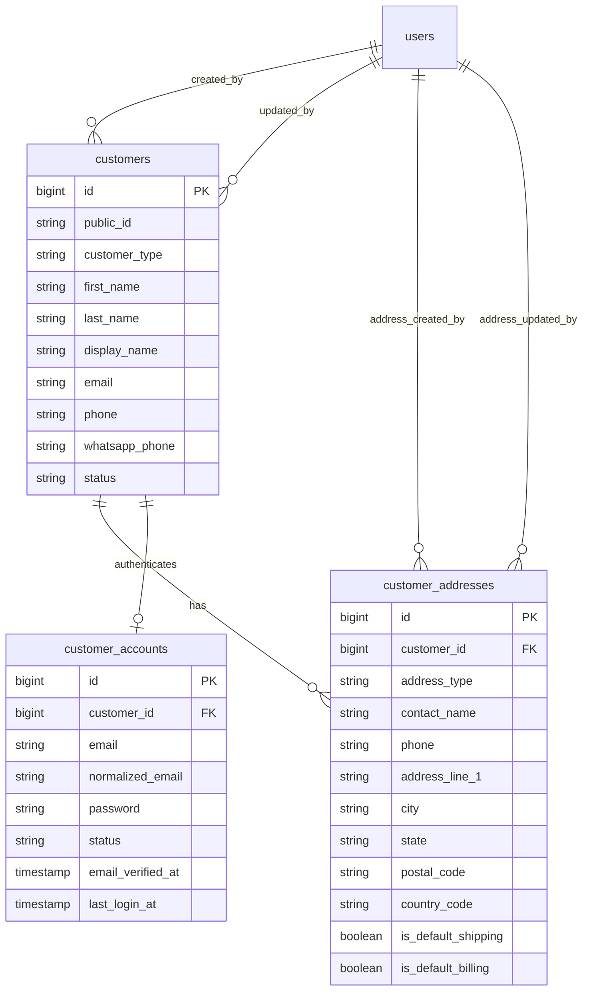

# Customers and Addresses Schema Plan

Task: A1.1.2 Customers/addresses schema

Status: Planning draft

## Scope

This document defines the database direction for shared customer records and customer addresses.

It does not implement Laravel migrations, customer authentication, admin customer screens, checkout, sales orders, CRM leads, quotations, customer dashboard pages, order snapshots, file permissions, or seed data.

## Design Goals

- Website customers and manual/admin-created customers must use the same customer table.
- A customer must be able to have multiple saved addresses.
- Checkout must be able to reference valid shipping and billing addresses.
- Admin sales orders must be able to select or create customers.
- CRM leads and quotations must be able to connect to customer records later.
- Customer account access must be separable from staff/admin users.
- Orders should keep historical customer/address snapshots later instead of depending only on mutable customer and address records.
- Customer data must support privacy checks so one customer cannot access another customer's records, addresses, orders, or files.

## Core ERD

## Table: customers

Purpose: one row per customer identity used by the public website, checkout, customer account area, admin sales orders, CRM, quotations, and reporting.

Customers are domain records. Staff/admin users remain in `users`.

| Column | Type | Nullable | Notes |
|---|---:|---:|---|
| `id` | unsigned big integer | No | Primary key. |
| `public_id` | varchar(40) | No | Customer-facing/admin-searchable stable ID. Unique. Example format can be finalized in A1.1.9. |
| `customer_type` | varchar(32) | No | Suggested values: `individual`, `business`. Default `individual`. |
| `first_name` | varchar(100) | Yes | Customer first name. Nullable to support business/manual leads with incomplete data. |
| `last_name` | varchar(100) | Yes | Customer last name. |
| `display_name` | varchar(180) | No | Search/display name, derived or entered. |
| `company_name` | varchar(180) | Yes | For B2B/corporate buyers. |
| `email` | varchar(190) | Yes | Customer contact email. Nullable for manual/phone-first records. Login email belongs to `customer_accounts`. |
| `phone` | varchar(30) | No | Required primary phone number for V1 customer records. |
| `whatsapp_phone` | varchar(30) | Yes | Optional WhatsApp number, can match `phone`. Final difference rule is a future decision. |
| `status` | varchar(32) | No | Suggested values: `active`, `inactive`, `blocked`, `merged`. Default `active`. |
| `source` | varchar(40) | Yes | Suggested values: `website`, `admin`, `lead`, `import`, `quotation`. |
| `accepts_marketing` | boolean | No | Default `false`. Must respect consent requirements later. |
| `email_verified_at` | timestamp | Yes | Reserved only for contact-email verification if needed. Website login email verification belongs to `customer_accounts`. |
| `phone_verified_at` | timestamp | Yes | Reserved for OTP/phone verification if implemented later. |
| `last_login_at` | timestamp | Yes | Deprecated for login tracking direction; website login tracking belongs to `customer_accounts`. |
| `created_by_user_id` | unsigned big integer | Yes | Staff creator, FK to `users.id`; null for self-registered website customers. |
| `updated_by_user_id` | unsigned big integer | Yes | Staff updater, FK to `users.id`; null when updated by customer/self-service. |
| `merged_into_customer_id` | unsigned big integer | Yes | Self-FK used only if a later merge strategy is approved. |
| `created_at` | timestamp | No | Laravel timestamps. |
| `updated_at` | timestamp | No | Laravel timestamps. |
| `deleted_at` | timestamp | Yes | Soft delete only. |

### Customer Auth Direction

Architecture decision recorded for A2.2:

- Customer authentication must use a separate `customer_accounts` table linked one-to-one to `customers`.
- Do not add customer authentication fields directly to `customers`.
- Do not use the existing staff-oriented `users` table for customers.
- Existing staff/admin authentication remains on `users`.
- Customer website authentication uses `customer_accounts`.
- Staff and customer sessions, guards, providers, and password brokers must remain logically separate.

Required model boundaries:

- `customers` stores customer and business-domain information.
- `customer_accounts` stores website authentication credentials, account verification, login status, password information, and authentication security metadata.
- `customer_addresses` stores customer-owned billing and shipping addresses.
- A customer may exist without a customer account.
- A customer account must belong to exactly one customer.

Disabling or deleting customer login access must not delete the customer, addresses, orders, payments, or historical business records.

## Table: customer_accounts

Purpose: one row per website-authenticated customer login account.

This table stores authentication state for customers only. Staff/admin accounts stay in `users`.

| Column | Type | Nullable | Notes |
|---|---:|---:|---|
| `id` | unsigned big integer | No | Primary key. |
| `customer_id` | unsigned big integer | No | FK to `customers.id`. Unique one-to-one account link. |
| `email` | varchar(190) | No | Customer login email as entered/displayed. |
| `normalized_email` | varchar(190) | No | Lowercase canonical login email. Unique. |
| `password` | varchar(255) | No | Laravel-hashed password only. |
| `status` | varchar(32) | No | `pending_verification`, `active`, `suspended`, or `disabled`. |
| `email_verified_at` | timestamp | Yes | Required before protected customer account access if email verification is enabled for V1. |
| `last_login_at` | timestamp | Yes | Last successful website login. |
| `last_login_ip` | varchar(45) | Yes | IP for last successful website login. |
| `failed_login_attempts` | unsigned tiny integer | No | Default `0`; supports customer login protection. |
| `locked_until` | timestamp | Yes | Temporary lock timestamp for repeated failed login attempts. |
| `password_changed_at` | timestamp | Yes | Useful for password reset/session invalidation checks. |
| `remember_token` | varchar(100) | Yes | Laravel remember token only if customer remember-me is enabled later. |
| `created_at` | timestamp | No | Laravel timestamps. |
| `updated_at` | timestamp | No | Laravel timestamps. |
| `disabled_at` | timestamp | Yes | When login access was disabled. |

### Customer Account Constraints

- Primary key: `id`.
- FK: `customer_id` references `customers.id`.
- Unique: `customer_accounts.customer_id`.
- Unique: `customer_accounts.normalized_email`.
- Check/app enum: `status` in `pending_verification`, `active`, `suspended`, `disabled`.
- `password` must store a hash, never a plain password.
- Only `active` and appropriately verified customer accounts may access protected customer account routes.
- Suspended, disabled, or temporarily locked customer accounts must not authenticate.
- Deleting or disabling a `customer_accounts` row must not delete the linked `customers` row or any addresses, orders, payments, files, quotations, or audit history.

### Customer Account Indexes

- `unique(customer_accounts.customer_id)`.
- `unique(customer_accounts.normalized_email)`.
- `index(customer_accounts.status, customer_accounts.email_verified_at)`.
- `index(customer_accounts.locked_until)`.
- `index(customer_accounts.last_login_at)`.

### Customer Constraints

- Primary key: `id`.
- Unique: `public_id`.
- FK: `created_by_user_id` references `users.id`, null on delete.
- FK: `updated_by_user_id` references `users.id`, null on delete.
- FK: `merged_into_customer_id` references `customers.id`, restrict or null on delete depending on final merge strategy.
- Check/app enum: `customer_type` in `individual`, `business`.
- Check/app enum: `status` in `active`, `inactive`, `blocked`, `merged`.
- Check/app enum: `source` in `website`, `admin`, `lead`, `import`, `quotation` when present.
- `phone` is required in V1.
- Customer login email uniqueness is enforced on `customer_accounts.normalized_email`.
- Customer contact email on `customers.email` remains indexed for search/duplicate detection, not strict login uniqueness.
- Phone uniqueness should be finalized in A3.1 because the master plan still lists phone uniqueness as an open decision.

### Recommended Uniqueness Direction

Use conservative lookup support without blocking legitimate customers:

- `public_id` must be unique.
- `customer_accounts.normalized_email` must be unique for customer login.
- `customers.email` should remain indexed for contact lookup and duplicate detection.
- `phone` should be indexed for duplicate detection, but final strict uniqueness remains an open decision.
- Duplicate detection by phone/email should be supported in admin before any customer merge workflow is added.

### Customer Indexes

- `unique(customers.public_id)`.
- `index(customers.phone)` for checkout/account lookup and duplicate detection.
- `index(customers.email)` for account lookup and duplicate detection.
- `index(customers.display_name)` or full-text search if MySQL configuration supports it.
- `index(customers.status, customers.deleted_at)` for admin filters.
- `index(customers.customer_type, customers.status)` for B2B/customer segmentation.
- `index(customers.created_by_user_id)` and `index(customers.updated_by_user_id)` for staff/admin references.
- `index(customers.merged_into_customer_id)` if merge support is implemented.

## Table: customer_addresses

Purpose: saved billing and shipping addresses for customers.

Orders should reference selected address IDs during checkout/admin order creation and later store address snapshots for historical accuracy.

| Column | Type | Nullable | Notes |
|---|---:|---:|---|
| `id` | unsigned big integer | No | Primary key. |
| `customer_id` | unsigned big integer | No | FK to `customers.id`. |
| `address_type` | varchar(32) | No | Suggested values: `shipping`, `billing`, `both`. Default `shipping`. |
| `label` | varchar(80) | Yes | Customer/admin label, such as `Home`, `Office`, or `Warehouse`. |
| `contact_name` | varchar(160) | No | Person receiving order or invoice contact. |
| `phone` | varchar(30) | No | Contact phone for delivery/billing. |
| `company_name` | varchar(180) | Yes | Optional business/company address name. |
| `gstin` | varchar(20) | Yes | Optional GST number if business invoicing requires it later. |
| `address_line_1` | varchar(180) | No | Building/street/address line. |
| `address_line_2` | varchar(180) | Yes | Apartment, floor, area, or additional detail. |
| `landmark` | varchar(160) | Yes | Optional landmark. |
| `city` | varchar(120) | No | City. |
| `state` | varchar(120) | No | State/region. |
| `postal_code` | varchar(20) | No | PIN/postal code. |
| `country_code` | char(2) | No | Default `IN`. |
| `is_default_shipping` | boolean | No | Default `false`. |
| `is_default_billing` | boolean | No | Default `false`. |
| `delivery_notes` | varchar(300) | Yes | Customer-safe delivery notes. No private file data. |
| `created_by_user_id` | unsigned big integer | Yes | Staff creator, FK to `users.id`; null for customer-created addresses. |
| `updated_by_user_id` | unsigned big integer | Yes | Staff updater, FK to `users.id`; null for customer-updated addresses. |
| `created_at` | timestamp | No | Laravel timestamps. |
| `updated_at` | timestamp | No | Laravel timestamps. |
| `deleted_at` | timestamp | Yes | Soft delete only. |

### Address Constraints

- Primary key: `id`.
- FK: `customer_id` references `customers.id`.
- FK: `created_by_user_id` references `users.id`, null on delete.
- FK: `updated_by_user_id` references `users.id`, null on delete.
- Check/app enum: `address_type` in `shipping`, `billing`, `both`.
- Check: `country_code` is ISO 3166-1 alpha-2 format.
- App validation: Indian PIN codes should be validated when `country_code = IN`.
- App validation: `gstin` format should be validated only when GST/invoicing rules are finalized.

### Default Address Rules

- A customer can have many addresses.
- A customer should have at most one default shipping address.
- A customer should have at most one default billing address.
- If MySQL version supports functional or generated-column unique indexes, enforce one default per customer at the database level.
- Otherwise, enforce default-address uniqueness in application logic inside a transaction.
- Soft-deleted addresses must not be selectable for checkout or new admin orders.

### Address Indexes

- `index(customer_addresses.customer_id, customer_addresses.deleted_at)` for customer address lists.
- `index(customer_addresses.customer_id, customer_addresses.is_default_shipping)`.
- `index(customer_addresses.customer_id, customer_addresses.is_default_billing)`.
- `index(customer_addresses.postal_code)` for shipping/serviceability checks.
- `index(customer_addresses.city, customer_addresses.state)` for admin reporting/search.
- `index(customer_addresses.created_by_user_id)` and `index(customer_addresses.updated_by_user_id)` for staff/admin references.

## Relationship Rules

### customers to customer_addresses

- A customer has zero or many addresses.
- Checkout requires a valid customer and at least one valid shipping address.
- Billing address can be the same as shipping address by using an address with `address_type = both` or by selecting the same address ID for billing and shipping.
- Orders should later reference `customer_id`, `shipping_address_id`, and `billing_address_id` for traceability.
- Orders must also store customer/address snapshots so historical order display does not change when a customer edits an address.

### customers to staff users

- `users.id` can be used for staff-created/staff-updated references.
- Staff/admin users must not be treated as customer identities.
- Website customer self-service updates should leave staff reference fields null or use separate actor metadata in the later audit system.

### customers to CRM and quotations

- Leads can later link to a customer when the lead converts or a matching customer is found.
- Quotations can later reference `customer_id` once customer identity is known.
- Lead capture should not create messy duplicate customer records unless conversion rules approve it.

## Public and Private Data Rules

Customer-facing APIs may expose only the authenticated customer's own profile and addresses.

Admin APIs/screens may expose customer data according to staff permissions.

Do not expose:

- Another customer's addresses, orders, uploads, or files.
- Staff-only notes.
- Internal audit metadata.
- Payment credentials, tokens, or sensitive gateway details.
- Private file contents or upload storage paths.

## Laravel Migration Plan

Migration sequence for this schema area:

1. Create `customers`.
2. Create `customer_addresses`.
3. Create `customer_accounts` for A2.2 website authentication.
4. Configure a separate Laravel customer provider, session guard, and password broker for `customer_accounts`.
5. Later order migration adds `orders.customer_id`, `orders.shipping_address_id`, and `orders.billing_address_id` FKs.
6. Later order migration adds customer and address snapshot columns to preserve historical order details.
7. Later CRM migration adds lead-to-customer and quotation-to-customer references.
8. Later audit work records customer and address changes through the audit interface.

### Delete Behavior

- Use soft deletes on `customers` and `customer_addresses`.
- Do not hard-delete customers through normal admin screens after launch.
- Future orders, quotations, files, payments, and audit records should restrict/no-action on customer hard delete.
- Soft-deleted customers should not be able to log in, checkout, or create new orders.
- Disabled/deleted customer login access must affect only `customer_accounts`; it must not delete business records.
- Soft-deleted addresses should remain unavailable for new checkout/order selection but historical order snapshots should remain readable.

## Notes for Later Checkout Usage

- Checkout must require an authenticated customer if the approved V1 flow remains account-required.
- Checkout must validate that selected address IDs belong to the authenticated customer.
- Checkout must reject deleted or invalid addresses.
- Checkout should store `customer_id`, selected address IDs, and customer/address snapshots on the order.
- Checkout idempotency must prevent duplicate pending orders even when customer/address validation is retried.

## Notes for Later Customer Account Usage

- Customers can manage their own profile and addresses.
- Customer account routes must scope every lookup by authenticated customer ID.
- Customer order listing must use `orders.customer_id`, not email or phone matching.
- Password reset and login identifiers belong to `customer_accounts`.
- Customer website authentication must use the customer guard/provider/broker, not the staff/admin `web` guard backed by `users`.

## Notes for Later Admin Sales Order Usage

- Staff should be able to search customers by public ID, name, phone, email, company name, and address city/postal code.
- Sales staff can select existing customers or create allowed customer records.
- Duplicate customer warnings should use phone/email matching before creating a new customer.
- Admin-created sales orders should reference the same `customers` and `customer_addresses` tables as website orders.

## Notes for Later CRM and Quotations Usage

- Lead records can store raw enquiry contact data first.
- Conversion can link a lead to an existing or newly created customer.
- Quotations should reference `customer_id` once the quote is associated with a customer.
- Do not force every casual/bulk enquiry to become a customer before staff qualification, unless a later CRM rule requires it.

## Notes for Later Audit Usage

- Customer creation, profile edits, address creation, address edits, address deletion, customer blocking, and merge actions should emit audit events once A4.6/C6.1 exist.
- Audit payloads should mask or omit sensitive data where needed.
- Audit payloads must not include passwords, password reset tokens, payment credentials, or private file contents.

## Dependency Impact Summary

Affected projects:

- Platform A, Project B, and Project C.

Affected future tables:

- `orders`
- `order_items` only indirectly through order/customer display snapshots
- `leads`
- `quotations`
- `files`
- `audit_logs`
- `customer_accounts`

Affected APIs:

- Customer registration/login/profile APIs.
- Customer address APIs.
- Checkout APIs.
- Customer dashboard/order APIs.
- Admin customer, sales order, CRM, and quotation APIs.

Affected admin screens:

- Customer management.
- Sales order creation.
- CRM lead conversion.
- Quotations.
- Admin order view.
- Audit/customer history views.

Affected customer screens:

- Registration/login.
- Account profile.
- Saved addresses.
- Checkout address selection.
- Order dashboard.
- Tracking pages.

Affected reports and notifications:

- Customer/order reports.
- Google Sheets customer backup sync.
- Order confirmation and customer communication notifications.

Idempotency concerns:

- Customer/address schema itself does not require an idempotency table.
- Checkout, registration, lead conversion, and customer import should later use idempotency or duplicate-detection rules where appropriate.

Safe to proceed:

- Yes. This is a planning artifact. It does not change application behavior or an approved shared runtime rule.

## Review Checklist

### Customer Relationship Review

- Website and admin-created customers use the same `customers` table.
- Staff/admin users remain separate from customer identity.
- Customer records can later connect to orders, leads, quotations, files, and audit records.

Result: Pass.

### Address Relationship Review

- A customer can have multiple addresses.
- Addresses belong to exactly one customer.
- Default billing and shipping behavior is defined.

Result: Pass.

### Checkout Address Reference Review

- Checkout can reference customer, shipping address, and billing address IDs.
- Checkout must validate ownership of selected addresses.
- Orders should store address snapshots for historical accuracy.

Result: Pass.

### Sales Order Customer Selection Review

- Admin sales orders can select/create customer records from the shared customer table.
- Customer search paths support public ID, name, phone, email, and company lookup.
- Duplicate customer detection is supported by indexed phone/email fields.

Result: Pass.

### Privacy and Access-Control Readiness Review

- Customer account access can scope records by `customer_id`.
- Staff/admin access can be permissioned later.
- Private files, other customer records, and sensitive metadata are excluded from public exposure.
- Website login credentials are isolated in `customer_accounts`, separate from customer business data and staff/admin `users`.

Result: Pass.

### Migration Sequencing Review

- Customers can be created before addresses.
- Orders, CRM, quotations, files, and audit tables can reference customers later.
- Customer authentication can be added later without merging with staff/admin users.

Result: Pass.

## Open Decisions for Future Tasks

- Whether customer email verification is required in V1.
- Whether customer phone number must be globally unique.
- Whether WhatsApp number can differ from primary phone number.
- Whether guest checkout or guest cart conversion is approved.
- Final customer public ID format.
- Final customer merge workflow and permissions.
- Final GST/invoicing fields required for business customers.
