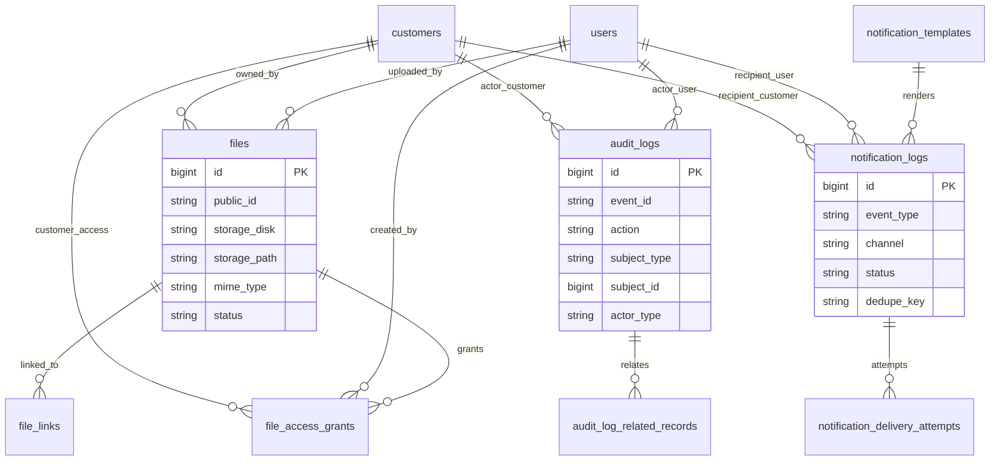

# Files, Audit and Notifications Schema Plan

Task: A1.1.8 Files/audit/notifications schema

Status: Planning draft

## Scope

This document defines the database direction for private file metadata, file links to business records, signed access grants, immutable audit logs, audit related records, notification templates, notification logs, and notification delivery attempts.

It does not implement Laravel migrations, file upload controllers, preview generation, signed URL generation, file authorization policies, cleanup jobs, audit event interfaces, notification rendering, queue workers, provider integrations, Google Sheets sync, security tests, or seed data.

## Design Goals

- Uploaded originals must be stored privately, not in MySQL.
- Database records store file metadata and references only.
- Files can link to orders, order items, customers, products/SKUs, payments, refunds, quotations, inventory, and future modules.
- Signed access can be represented without storing raw access tokens.
- Audit logs can represent actor, action, subject, source, old/new values, and related records.
- Audit payloads can be masked and must never store secrets, passwords, payment credentials, full card data, private file contents, or unsafe raw payloads.
- Audit records are append-only and immutable once implemented.
- Notification templates, logs, delivery attempts, provider references, retries, failures, and deduplication are representable.
- Notification failures must not block core business saves.
- Notification and external integration writes must be retryable and deduplicated where relevant.

## Core ERD

## Table: files

Purpose: one row per stored file object or generated preview.

This table stores metadata only. File bytes live in private storage. Public URLs should be generated through signed access or a controlled controller, not by exposing raw storage paths.

| Column | Type | Nullable | Notes |
|---|---:|---:|---|
| `id` | unsigned big integer | No | Primary key. |
| `public_id` | varchar(40) | No | File-facing ID. Unique. Final generator belongs to A1.1.9. |
| `customer_id` | unsigned big integer | Yes | FK to `customers.id` when customer-owned. |
| `uploaded_by_user_id` | unsigned big integer | Yes | FK to `users.id` for staff upload. |
| `uploaded_by_customer_id` | unsigned big integer | Yes | FK to `customers.id` for customer upload. |
| `storage_disk` | varchar(60) | No | Laravel disk name, such as `private`. |
| `storage_path` | varchar(500) | No | Private storage path/key. Never expose directly in public APIs. |
| `original_filename` | varchar(255) | Yes | Sanitized original name for display. |
| `stored_filename` | varchar(255) | No | Stored/randomized filename or object key segment. |
| `extension` | varchar(20) | Yes | Lowercase extension. |
| `mime_type` | varchar(120) | No | Detected MIME type. |
| `size_bytes` | unsigned big integer | No | File size. |
| `checksum_sha256` | char(64) | Yes | Optional content checksum. |
| `file_kind` | varchar(40) | No | Suggested values: `original_upload`, `preview`, `mockup`, `proof`, `attachment`, `export`. |
| `visibility` | varchar(40) | No | Suggested values: `private`, `customer_visible`, `staff_only`, `public_safe_preview`. |
| `status` | varchar(40) | No | Suggested values below. |
| `scan_status` | varchar(40) | Yes | Suggested values: `pending`, `passed`, `failed`, `skipped`. |
| `metadata` | json | Yes | Safe metadata such as image dimensions. No private contents. |
| `protected_until` | timestamp | Yes | Prevent cleanup while record is business-critical. |
| `deleted_by_user_id` | unsigned big integer | Yes | FK to `users.id` for staff deletion marker. |
| `deleted_at` | timestamp | Yes | Soft deletion marker. |
| `created_at` | timestamp | No | Laravel timestamps. |
| `updated_at` | timestamp | No | Laravel timestamps. |

### File Status

| Status | Meaning |
|---|---|
| `uploading` | Upload started but not finalized. |
| `active` | File is available through authorized access. |
| `quarantined` | File failed safety checks or needs review. |
| `replaced` | File was superseded but retained for history. |
| `deleted` | File is marked deleted or cleanup pending. |

### File Constraints

- Primary key: `id`.
- Unique: `public_id`.
- Unique nullable: `(storage_disk, storage_path)`.
- FK: `customer_id` references `customers.id`.
- FK: `uploaded_by_user_id` references `users.id`, null on delete.
- FK: `uploaded_by_customer_id` references `customers.id`.
- FK: `deleted_by_user_id` references `users.id`, null on delete.
- Check/app enum: `file_kind` in approved file kinds.
- Check/app enum: `visibility` in `private`, `customer_visible`, `staff_only`, `public_safe_preview`.
- Check/app enum: `status` in `uploading`, `active`, `quarantined`, `replaced`, `deleted`.
- Check/app enum: `scan_status` in `pending`, `passed`, `failed`, `skipped` when present.
- Check: `size_bytes > 0`.
- `metadata` must not contain raw file contents, credentials, tokens, full payment data, or unsafe payloads.

### File Indexes

- `unique(files.public_id)`.
- `unique(files.storage_disk, files.storage_path)`.
- `index(files.customer_id, files.created_at)`.
- `index(files.uploaded_by_user_id, files.created_at)`.
- `index(files.uploaded_by_customer_id, files.created_at)`.
- `index(files.file_kind, files.status, files.created_at)`.
- `index(files.visibility, files.status)`.
- `index(files.checksum_sha256)`.
- `index(files.deleted_at)`.
- `index(files.protected_until)`.

## Table: file_links

Purpose: links files to business records.

Use direct nullable FKs for core records already known in A1.1. For future modules that are not yet planned, `related_type` and `related_id` can be used until a dedicated FK is added.

| Column | Type | Nullable | Notes |
|---|---:|---:|---|
| `id` | unsigned big integer | No | Primary key. |
| `file_id` | unsigned big integer | No | FK to `files.id`. |
| `customer_id` | unsigned big integer | Yes | FK to `customers.id`. |
| `product_id` | unsigned big integer | Yes | FK to `products.id`. |
| `product_sku_id` | unsigned big integer | Yes | FK to `product_skus.id`. |
| `order_id` | unsigned big integer | Yes | FK to `orders.id`. |
| `order_item_id` | unsigned big integer | Yes | FK to `order_items.id`. |
| `payment_id` | unsigned big integer | Yes | FK to `payments.id`. |
| `refund_id` | unsigned big integer | Yes | FK to `refunds.id`. |
| `quotation_id` | unsigned big integer | Yes | FK to `quotations.id`. |
| `quotation_item_id` | unsigned big integer | Yes | FK to `quotation_items.id`. |
| `related_type` | varchar(120) | Yes | Future module relation label. |
| `related_id` | unsigned big integer | Yes | Future module relation ID. |
| `link_type` | varchar(60) | No | Suggested values below. |
| `visibility_override` | varchar(40) | Yes | Optional override for this link. |
| `sort_order` | unsigned integer | No | Default `0`. |
| `created_by_user_id` | unsigned big integer | Yes | FK to `users.id`. |
| `created_at` | timestamp | No | Laravel timestamp. |

### File Link Types

Suggested values:

- `customer_upload`
- `order_design`
- `order_mockup`
- `order_attachment`
- `product_image`
- `product_mockup`
- `payment_proof`
- `refund_attachment`
- `quotation_attachment`
- `quotation_mockup`
- `internal_attachment`

### File Link Constraints

- Primary key: `id`.
- FK: `file_id` references `files.id`.
- FKs to known related tables reference their primary IDs.
- FK: `created_by_user_id` references `users.id`, null on delete.
- Check/app enum: `link_type` in approved link types.
- Check/app enum: `visibility_override` in approved file visibility values when present.
- Application rule: at least one related FK or `(related_type, related_id)` pair should be present.
- Application rule: customer-visible links must pass policy checks; link visibility must not override file safety status.

### File Link Indexes

- `index(file_links.file_id, file_links.link_type)`.
- `index(file_links.customer_id, file_links.created_at)`.
- `index(file_links.product_id, file_links.sort_order)`.
- `index(file_links.product_sku_id)`.
- `index(file_links.order_id, file_links.created_at)`.
- `index(file_links.order_item_id, file_links.created_at)`.
- `index(file_links.payment_id)`.
- `index(file_links.refund_id)`.
- `index(file_links.quotation_id, file_links.created_at)`.
- `index(file_links.related_type, file_links.related_id)`.

## Table: file_access_grants

Purpose: signed access or temporary authorization records for previews/downloads.

Store token hashes only. Raw tokens belong only in generated URLs and should not be persisted.

| Column | Type | Nullable | Notes |
|---|---:|---:|---|
| `id` | unsigned big integer | No | Primary key. |
| `file_id` | unsigned big integer | No | FK to `files.id`. |
| `purpose` | varchar(40) | No | Suggested values: `preview`, `download`, `admin_review`, `customer_view`. |
| `token_hash` | char(64) | No | SHA-256 or stronger hash of signed token. Unique. |
| `recipient_user_id` | unsigned big integer | Yes | FK to `users.id` if staff-specific. |
| `recipient_customer_id` | unsigned big integer | Yes | FK to `customers.id` if customer-specific. |
| `created_by_user_id` | unsigned big integer | Yes | FK to `users.id`. |
| `expires_at` | timestamp | No | Grant expiry. |
| `last_used_at` | timestamp | Yes | Last successful use. |
| `used_count` | unsigned integer | No | Default `0`. |
| `max_uses` | unsigned integer | Yes | Optional use limit. |
| `revoked_at` | timestamp | Yes | Revocation time. |
| `created_at` | timestamp | No | Laravel timestamp. |

### File Access Grant Constraints

- Primary key: `id`.
- FK: `file_id` references `files.id`.
- FK: `recipient_user_id` references `users.id`, null on delete.
- FK: `recipient_customer_id` references `customers.id`.
- FK: `created_by_user_id` references `users.id`, null on delete.
- Unique: `token_hash`.
- Check/app enum: `purpose` in approved access purposes.
- Check: `used_count >= 0`.
- Check: `max_uses is null or max_uses > 0`.
- Application rule: raw token must never be logged or stored.

### File Access Grant Indexes

- `unique(file_access_grants.token_hash)`.
- `index(file_access_grants.file_id, file_access_grants.expires_at)`.
- `index(file_access_grants.recipient_user_id, file_access_grants.expires_at)`.
- `index(file_access_grants.recipient_customer_id, file_access_grants.expires_at)`.
- `index(file_access_grants.expires_at, file_access_grants.revoked_at)`.

## Table: audit_logs

Purpose: append-only audit event records for sensitive business changes.

Audit logs should be created from an audit event interface later. Normal admin flows should not edit or delete audit rows.

| Column | Type | Nullable | Notes |
|---|---:|---:|---|
| `id` | unsigned big integer | No | Primary key. |
| `event_id` | varchar(80) | No | Globally unique event ID, such as UUID/ULID. |
| `action` | varchar(120) | No | Action key, such as `order.status_changed`. |
| `module` | varchar(60) | No | Module/source, such as `orders`, `payments`, `inventory`, `files`. |
| `actor_type` | varchar(40) | No | Suggested values: `user`, `customer`, `system`, `job`, `provider`. |
| `actor_user_id` | unsigned big integer | Yes | FK to `users.id` for staff/admin actor. |
| `actor_customer_id` | unsigned big integer | Yes | FK to `customers.id` for customer actor. |
| `actor_label_snapshot` | varchar(180) | Yes | Safe actor label at event time. |
| `subject_type` | varchar(120) | No | Subject model/table label. |
| `subject_id` | unsigned big integer | Yes | Subject primary ID when available. |
| `subject_public_id` | varchar(80) | Yes | Public/business ID snapshot. |
| `summary` | varchar(300) | Yes | Safe human summary. |
| `old_values` | json | Yes | Masked before-state fields. |
| `new_values` | json | Yes | Masked after-state fields. |
| `metadata` | json | Yes | Safe structured context. |
| `request_id` | varchar(120) | Yes | Request/correlation ID. |
| `idempotency_key` | varchar(120) | Yes | Optional dedupe key for repeated event emission. |
| `ip_address` | varchar(45) | Yes | IP address if relevant and allowed. |
| `user_agent` | varchar(500) | Yes | User agent if relevant. |
| `occurred_at` | timestamp | No | Business event time. |
| `created_at` | timestamp | No | Laravel timestamp. |

### Audit Log Constraints

- Primary key: `id`.
- Unique: `event_id`.
- Unique nullable: `idempotency_key`.
- FK: `actor_user_id` references `users.id`, null on delete.
- FK: `actor_customer_id` references `customers.id`, null on delete only if customer cleanup policy allows; otherwise restrict.
- Check/app enum: `actor_type` in `user`, `customer`, `system`, `job`, `provider`.
- `old_values`, `new_values`, and `metadata` must be valid JSON when present.
- Audit payloads must be masked before insert.
- Audit payloads must not include passwords, password hashes, reset tokens, remember tokens, API keys, payment credentials, full card data, raw webhook payloads, private file contents, or raw signed access tokens.
- Implementation rule: audit records are append-only. No normal update/delete path.

### Audit Log Indexes

- `unique(audit_logs.event_id)`.
- `unique(audit_logs.idempotency_key)` when present.
- `index(audit_logs.module, audit_logs.occurred_at)`.
- `index(audit_logs.action, audit_logs.occurred_at)`.
- `index(audit_logs.actor_type, audit_logs.actor_user_id, audit_logs.occurred_at)`.
- `index(audit_logs.actor_type, audit_logs.actor_customer_id, audit_logs.occurred_at)`.
- `index(audit_logs.subject_type, audit_logs.subject_id, audit_logs.occurred_at)`.
- `index(audit_logs.subject_public_id)`.
- `index(audit_logs.request_id)`.

## Table: audit_log_related_records

Purpose: optional related-record links for audit events involving multiple records.

Examples: an order status change may relate to an order, customer, payment, notification, inventory movement, and staff user.

| Column | Type | Nullable | Notes |
|---|---:|---:|---|
| `id` | unsigned big integer | No | Primary key. |
| `audit_log_id` | unsigned big integer | No | FK to `audit_logs.id`. |
| `related_type` | varchar(120) | No | Related model/table label. |
| `related_id` | unsigned big integer | Yes | Related primary ID when available. |
| `related_public_id` | varchar(80) | Yes | Public/business ID snapshot. |
| `relation` | varchar(60) | No | Suggested values: `subject`, `customer`, `order`, `payment`, `file`, `notification`, `source`, `target`. |
| `created_at` | timestamp | No | Laravel timestamp. |

### Related Record Constraints

- Primary key: `id`.
- FK: `audit_log_id` references `audit_logs.id`.
- Check: `related_type` is not empty.
- Check/app enum: `relation` in approved relation labels.

### Related Record Indexes

- `index(audit_log_related_records.audit_log_id)`.
- `index(audit_log_related_records.related_type, audit_log_related_records.related_id)`.
- `index(audit_log_related_records.related_public_id)`.

## Table: notification_templates

Purpose: reusable template definitions for email, SMS, WhatsApp, database, or future channels.

Actual rendering and provider adapters belong to later tasks.

| Column | Type | Nullable | Notes |
|---|---:|---:|---|
| `id` | unsigned big integer | No | Primary key. |
| `template_key` | varchar(120) | No | Stable key, such as `order_created.customer`. Unique. |
| `channel` | varchar(40) | No | Suggested values: `email`, `sms`, `whatsapp`, `database`. |
| `name` | varchar(180) | No | Admin display name. |
| `subject_template` | varchar(300) | Yes | Email/database subject template. |
| `body_template` | text | No | Template body. Must not store secrets. |
| `locale` | varchar(12) | No | Default `en`. |
| `status` | varchar(32) | No | Suggested values: `draft`, `active`, `inactive`. |
| `version` | unsigned integer | No | Starts at `1`. |
| `allowed_variables` | json | Yes | Whitelist of render variables. |
| `created_by_user_id` | unsigned big integer | Yes | FK to `users.id`. |
| `updated_by_user_id` | unsigned big integer | Yes | FK to `users.id`. |
| `created_at` | timestamp | No | Laravel timestamps. |
| `updated_at` | timestamp | No | Laravel timestamps. |

### Notification Template Constraints

- Primary key: `id`.
- Unique: `(template_key, channel, locale, version)`.
- FK: `created_by_user_id` references `users.id`, null on delete.
- FK: `updated_by_user_id` references `users.id`, null on delete.
- Check/app enum: `channel` in `email`, `sms`, `whatsapp`, `database`.
- Check/app enum: `status` in `draft`, `active`, `inactive`.
- Check: `version >= 1`.
- `allowed_variables` must be valid JSON when present.
- Templates must not contain credentials, private tokens, or unsafe raw payloads.

### Notification Template Indexes

- `unique(notification_templates.template_key, notification_templates.channel, notification_templates.locale, notification_templates.version)`.
- `index(notification_templates.template_key, notification_templates.status)`.
- `index(notification_templates.channel, notification_templates.status)`.

## Table: notification_logs

Purpose: one row per intended notification to a recipient.

Notification logs can be created from business events and processed asynchronously. A failed notification must not roll back the business event.

| Column | Type | Nullable | Notes |
|---|---:|---:|---|
| `id` | unsigned big integer | No | Primary key. |
| `event_type` | varchar(120) | No | Event key, such as `order.created` or `quotation.approved`. |
| `template_id` | unsigned big integer | Yes | FK to `notification_templates.id`. |
| `template_key` | varchar(120) | Yes | Snapshot key for traceability. |
| `template_version` | unsigned integer | Yes | Snapshot version used. |
| `channel` | varchar(40) | No | Suggested values: `email`, `sms`, `whatsapp`, `database`. |
| `status` | varchar(40) | No | Suggested values below. |
| `recipient_type` | varchar(40) | No | Suggested values: `customer`, `user`, `external`. |
| `recipient_user_id` | unsigned big integer | Yes | FK to `users.id`. |
| `recipient_customer_id` | unsigned big integer | Yes | FK to `customers.id`. |
| `recipient_address` | varchar(255) | Yes | Email/phone/handle snapshot. |
| `subject_rendered` | varchar(300) | Yes | Rendered subject when applicable. |
| `body_summary` | text | Yes | Sanitized body or summary. Do not store secrets. |
| `payload` | json | Yes | Safe structured render payload. |
| `related_type` | varchar(120) | Yes | Subject model/table label. |
| `related_id` | unsigned big integer | Yes | Subject ID. |
| `dedupe_key` | varchar(160) | Yes | Prevents duplicate notification creation. |
| `scheduled_at` | timestamp | Yes | Future delivery time. |
| `sent_at` | timestamp | Yes | Final successful delivery time. |
| `failed_at` | timestamp | Yes | Last failure time. |
| `created_at` | timestamp | No | Laravel timestamps. |
| `updated_at` | timestamp | No | Laravel timestamps. |

### Notification Status

| Status | Meaning |
|---|---|
| `pending` | Created and waiting for delivery. |
| `queued` | Queued for delivery worker. |
| `sent` | Delivered or accepted by provider. |
| `failed` | Failed after attempts or needs review. |
| `cancelled` | Cancelled before delivery. |
| `skipped` | Intentionally skipped by rule or preference. |

### Notification Log Constraints

- Primary key: `id`.
- FK: `template_id` references `notification_templates.id`.
- FK: `recipient_user_id` references `users.id`, null on delete.
- FK: `recipient_customer_id` references `customers.id`.
- Unique nullable: `dedupe_key`.
- Check/app enum: `channel` in approved channels.
- Check/app enum: `status` in approved notification statuses.
- Check/app enum: `recipient_type` in `customer`, `user`, `external`.
- `payload` must not include private file contents, passwords, tokens, payment credentials, full card data, or unsafe raw provider payloads.

### Notification Log Indexes

- `unique(notification_logs.dedupe_key)` when present.
- `index(notification_logs.event_type, notification_logs.created_at)`.
- `index(notification_logs.status, notification_logs.scheduled_at)`.
- `index(notification_logs.channel, notification_logs.status, notification_logs.created_at)`.
- `index(notification_logs.recipient_user_id, notification_logs.created_at)`.
- `index(notification_logs.recipient_customer_id, notification_logs.created_at)`.
- `index(notification_logs.related_type, notification_logs.related_id)`.

## Table: notification_delivery_attempts

Purpose: delivery attempt history for notification retries and provider references.

Each send attempt should append a row. Provider responses should be summarized safely, not stored as raw secrets or full unsafe payloads.

| Column | Type | Nullable | Notes |
|---|---:|---:|---|
| `id` | unsigned big integer | No | Primary key. |
| `notification_log_id` | unsigned big integer | No | FK to `notification_logs.id`. |
| `attempt_number` | unsigned integer | No | Starts at `1` per notification. |
| `provider` | varchar(60) | Yes | Provider label, such as SMTP, SMS provider, WhatsApp provider. |
| `provider_message_id` | varchar(160) | Yes | Provider message/reference ID. |
| `status` | varchar(40) | No | Suggested values: `queued`, `sent`, `failed`, `retry_scheduled`, `cancelled`. |
| `error_code` | varchar(80) | Yes | Sanitized provider/internal error code. |
| `error_message` | varchar(300) | Yes | Sanitized error summary. |
| `response_summary` | json | Yes | Sanitized provider response summary. |
| `retry_at` | timestamp | Yes | Next retry time. |
| `started_at` | timestamp | Yes | Attempt start time. |
| `finished_at` | timestamp | Yes | Attempt completion time. |
| `created_at` | timestamp | No | Laravel timestamp. |

### Delivery Attempt Constraints

- Primary key: `id`.
- FK: `notification_log_id` references `notification_logs.id`.
- Unique: `(notification_log_id, attempt_number)`.
- Unique nullable by provider: `(provider, provider_message_id)`.
- Check/app enum: `status` in approved attempt statuses.
- Check: `attempt_number >= 1`.
- `response_summary` must not contain secrets, full raw provider payloads, private tokens, or private file contents.

### Delivery Attempt Indexes

- `unique(notification_delivery_attempts.notification_log_id, notification_delivery_attempts.attempt_number)`.
- `index(notification_delivery_attempts.notification_log_id, notification_delivery_attempts.created_at)`.
- `index(notification_delivery_attempts.status, notification_delivery_attempts.retry_at)`.
- `index(notification_delivery_attempts.provider, notification_delivery_attempts.provider_message_id)`.

## Relationship Rules

### Files and Business Records

- A file has one metadata row in `files`.
- A file can have many `file_links`.
- Files should link to orders, order items, quotations, products, payments, refunds, customers, or future modules through `file_links`.
- File links control business association; file access policies still decide who can view/download.
- Private file contents never live in MySQL.

### Files and Signed Access

- `file_access_grants` stores token hashes only.
- Raw tokens must never be stored in logs, audit payloads, notification payloads, or database rows.
- Signed access should expire and may be revoked.
- Customer access must be scoped to authenticated customer ownership or explicit grant.

### Audit Logs and Related Records

- Audit rows are append-only business facts.
- `audit_logs.subject_type` and `subject_id` identify the primary changed record.
- `audit_log_related_records` can link secondary affected records.
- Audit payloads store masked old/new values, not entire raw records.
- Sensitive fields must be excluded or masked before insert.

### Notifications and Delivery Attempts

- `notification_logs` records intended notifications.
- `notification_delivery_attempts` records each send attempt.
- A notification can have zero or many attempts.
- Dedupe keys prevent duplicate notification creation.
- Provider message IDs help match callbacks or troubleshoot delivery.
- Notification failure should update notification state, not roll back the originating order/payment/lead/inventory event.

## Delete Behavior

- Do not hard-delete audit logs or audit related records.
- Do not hard-delete notification logs or delivery attempts through normal admin screens.
- Files should use soft deletion and cleanup jobs only after protection rules allow it.
- Business-critical files should use `protected_until` or link rules to prevent cleanup while referenced by orders, payments, quotations, or audits.
- User FKs can set null on delete; audit actor labels preserve historical readability.
- Customer FKs should usually restrict/no-action for business history unless a privacy cleanup policy explicitly defines anonymization.

## Laravel Migration Plan

Migration sequence for this schema area:

1. Ensure `users` exists.
2. Ensure `customers` exists.
3. Ensure `products` and `product_skus` exist.
4. Ensure `orders` and `order_items` exist.
5. Ensure `payments` and `refunds` exist.
6. Ensure `quotations` and `quotation_items` exist when quotation file links are added.
7. Create `files`.
8. Create `file_links`.
9. Create `file_access_grants`.
10. Create `audit_logs`.
11. Create `audit_log_related_records`.
12. Create `notification_templates`.
13. Create `notification_logs`.
14. Create `notification_delivery_attempts`.
15. Later queue, idempotency, audit interface, notification provider, and backup/sync tasks build on these records.

If some referenced modules are not migrated yet during implementation, create the nullable FK columns after those tables exist or temporarily use `related_type` and `related_id` until the dedicated FK migration is available.

## Notes for Later Upload Service Usage

- Upload validation belongs to A4.1, but this schema records validation results and safe metadata.
- Store originals on a private disk.
- Generate random stored filenames or object keys.
- Store MIME type, extension, size, checksum, and safe image dimensions.
- Store preview/generated files as separate `files` rows linked to the original or business record.
- Cleanup jobs must respect status, links, and `protected_until`.

## Notes for Later Signed Access Usage

- Signed URLs should use short expiry windows.
- Store only `token_hash`, never raw token.
- Access checks should verify file status, link policy, recipient, expiry, revocation, and usage count.
- Customer access must not rely on obscurity of storage paths.

## Notes for Later Audit Usage

- Staff account, permission, customer, product, order, payment/refund, inventory, file, quotation, finance, settings, and notification changes can emit audit events.
- Audit rows should be append-only after insert.
- Audit viewing requires explicit permission.
- Mask sensitive fields before creating the audit event.
- Audit storage must not become a dump of raw request data.

## Notes for Later Notification Usage

- Notification creation should occur after the core business save succeeds, preferably through events/jobs.
- Notification templates should be versioned.
- Rendered content should be summarized or stored safely.
- Retry behavior belongs to queue/job tasks, but attempts and retry timestamps are supported here.
- Notification events include Order Created, Payment Received, Quotation Sent, Quotation Approved, Design Approval Requested, Production Started, Shipment Created, Order Delivered, Payment Pending, Follow-up Due, Low Stock, and Job Failed.

## Dependency Impact Summary

Affected projects:

- Platform A, Project B, and Project C.

Affected future tables:

- `users`
- `customers`
- `products`
- `product_skus`
- `orders`
- `order_items`
- `payments`
- `refunds`
- `quotations`
- `quotation_items`
- `inventory_movements`
- `lead_follow_ups`
- `settings`
- `google_sheets_sync_jobs`

Affected APIs:

- Upload and preview APIs.
- Signed file access APIs.
- Admin file APIs.
- Audit event/reporting APIs.
- Notification template/log APIs.
- Notification provider callback APIs.

Affected admin screens:

- File browser/detail.
- Order/customer/quotation file panels.
- Audit log viewer.
- Notification template manager.
- Notification log/detail and retry queue.
- Security review tools.

Affected customer screens:

- Upload design flow.
- Mockup/preview display.
- Customer dashboard files.
- Order/quotation attachment views.
- Notification preferences if added later.

Affected reports and notifications:

- Upload/security reports.
- Audit reports.
- Notification delivery reports.
- Job failure reports.
- Google Sheets backup sync reporting.

Idempotency concerns:

- File uploads should avoid duplicate records for repeated completion callbacks where practical.
- Signed access tokens must be unique and hashed.
- Audit event emission should deduplicate by event ID or idempotency key.
- Notification logs should deduplicate by event/recipient/channel key.
- Delivery attempts should track attempt numbers and provider message IDs.

Safe to proceed:

- Yes. This is a planning artifact. It does not change runtime behavior.

## Review Checklist

### Security and Audit Schema Review

- Private file contents are not stored in MySQL.
- Audit payloads exclude secrets, tokens, credentials, full card data, raw unsafe payloads, and private file contents.
- Audit logs can represent actor, action, subject, source, old/new values, and related records.
- Audit logs are designed for append-only implementation.

Result: Pass.

### File Relationship Review

- Files can link to customers, products/SKUs, orders, order items, payments, refunds, quotations, and future modules.
- Link rows separate file storage metadata from business association.
- Customer/admin access can be policy-driven later.

Result: Pass.

### Private Storage Metadata Review

- Files include private disk/path metadata, MIME type, extension, size, checksum, file kind, visibility, and status.
- Raw storage paths are not intended for public APIs.
- Cleanup/protection metadata is available.

Result: Pass.

### Signed Access Readiness Review

- Signed access grants store token hashes only.
- Grants support recipient scoping, expiry, revocation, use counts, and purpose.
- Raw access tokens are excluded from logs and audit payloads.

Result: Pass.

### Audit Immutability and Masking Readiness Review

- Audit records have unique event IDs and optional idempotency keys.
- Actor and subject lookup is indexed.
- Masked old/new JSON payloads are supported.
- Related records can be linked without overwriting audit rows.

Result: Pass.

### Notification Template and Log Relationship Review

- Notification templates are versioned by key, channel, locale, and version.
- Notification logs snapshot template details and recipient data.
- Delivery attempts record provider send history.

Result: Pass.

### Retry and Deduplication Readiness Review

- Notification logs include `dedupe_key`.
- Delivery attempts include attempt numbers, retry time, provider, and provider message ID.
- Audit logs support event ID and idempotency keys.
- Notification failures can be tracked without blocking core saves.

Result: Pass.

### Migration Sequencing Review

- File and audit tables depend on users/customers and can link to existing schema records.
- Notification tables can be created after users/customers and before provider implementation.
- Dedicated FKs can be added after related module tables exist if implementation order requires it.

Result: Pass.

## Open Decisions for Future Tasks

- Final file public ID format and retention policy.
- Whether file checksums are always calculated or only for selected file types/sizes.
- Whether antivirus/scanning is available in the first hosting environment.
- Final signed URL expiry defaults by file type and recipient.
- Whether quotation PDFs are stored as files or generated on demand.
- Final audit retention/anonymization policy for customer privacy requests.
- Final audit masking field list by module.
- Final notification channels for V1: email only, WhatsApp, SMS, database, or a mix.
- Final provider callback/webhook handling for notification delivery status.
- Whether notification rendered bodies are stored fully, summarized, or not stored after send.
