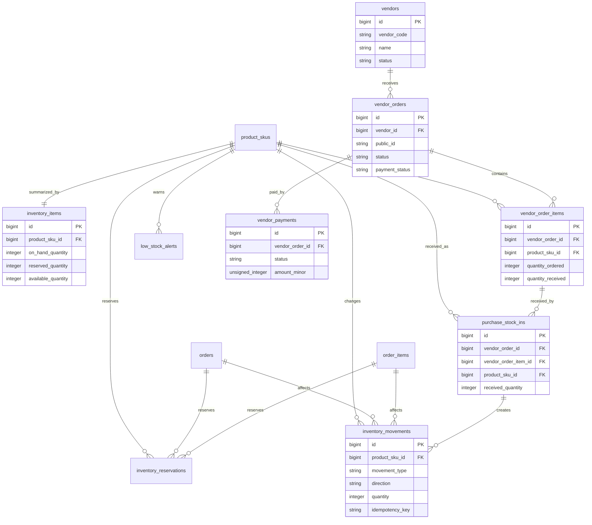

# Inventory, Vendors and Purchases Schema Plan

Task: A1.1.6 Inventory/vendors/purchases schema

Status: Planning draft

## Scope

This document defines the database direction for SKU stock balances, inventory movements, inventory reservations, low-stock alerts, vendors, vendor purchase orders, purchase items, receiving records, and vendor payment tracking.

It does not implement Laravel migrations, inventory services, checkout stock validation, purchase order workflow, vendor payment workflow, admin screens, low-stock notifications, audit logs, finance reports, or seed data.

## Design Goals

- SKU stock must be visible per `product_skus.id`.
- Every inventory movement must reference `product_skus.id`.
- Every vendor purchase item must reference `product_skus.id`.
- Stock-in, stock-out, manual adjustment, order reservation, order deduction, cancellation release, and cancellation reversal must be traceable.
- Purchase receiving must create traceable inventory stock-in history.
- Inventory must support low-stock warnings without blocking checkout in V1 by default.
- Negative stock and reservation timing must be configurable later without schema rewrites.
- Vendor purchase history must connect vendors, purchase orders, purchase items, received stock, and vendor payments.
- Purchase cost and profit-related data must be protectable from non-finance roles.
- Idempotency keys must be available for stock deduction, receiving, cancellation reversal, and adjustment operations.

## Core ERD

## Table: inventory_items

Purpose: one warehouse-less V1 stock balance row per SKU.

This table gives admin, checkout warning, low-stock, and reporting flows a quick stock summary. `inventory_movements` remains the stock history. `product_skus.stock_quantity` from the product schema can remain as the simple Phase 1 field, but full inventory implementation should choose one maintained source of balance and keep the other as a derived cache or retire it from business logic.

| Column | Type | Nullable | Notes |
|---|---:|---:|---|
| `id` | unsigned big integer | No | Primary key. |
| `product_sku_id` | unsigned big integer | No | FK to `product_skus.id`. Unique. |
| `on_hand_quantity` | integer | No | Physical/known stock balance. Default `0`. Can be negative only if later rules allow it. |
| `reserved_quantity` | integer | No | Quantity held for orders. Default `0`. |
| `available_quantity` | integer | No | Maintained summary, normally `on_hand_quantity - reserved_quantity`. |
| `low_stock_threshold` | unsigned integer | Yes | Optional override. If null, use `product_skus.low_stock_threshold`. |
| `allow_negative_stock` | boolean | No | Default `false` unless business rules allow negative stock with warnings. |
| `last_movement_at` | timestamp | Yes | Last stock movement time. |
| `created_at` | timestamp | No | Laravel timestamps. |
| `updated_at` | timestamp | No | Laravel timestamps. |

### Inventory Item Constraints

- Primary key: `id`.
- FK: `product_sku_id` references `product_skus.id`.
- Unique: `product_sku_id`.
- Check: `reserved_quantity >= 0`.
- Check/app rule: `available_quantity = on_hand_quantity - reserved_quantity` when maintained in the table.
- Check/app rule: `on_hand_quantity >= 0` unless `allow_negative_stock = true`.
- Check: `low_stock_threshold is null or low_stock_threshold >= 0`.

### Inventory Item Indexes

- `unique(inventory_items.product_sku_id)`.
- `index(inventory_items.available_quantity)`.
- `index(inventory_items.low_stock_threshold, inventory_items.available_quantity)` for low-stock lookup.
- `index(inventory_items.last_movement_at)` for recent stock activity.

## Table: inventory_movements

Purpose: append-only stock movement history for every stock change.

Every stock change should create an inventory movement. This table supports stock-in, stock-out, manual adjustment, order reservation, order deduction, cancellation release, cancellation reversal, purchase receiving, returns, and correction records.

| Column | Type | Nullable | Notes |
|---|---:|---:|---|
| `id` | unsigned big integer | No | Primary key. |
| `product_sku_id` | unsigned big integer | No | FK to `product_skus.id`. |
| `inventory_item_id` | unsigned big integer | Yes | FK to `inventory_items.id`; nullable during migration/backfill. |
| `order_id` | unsigned big integer | Yes | FK to `orders.id` for order-related movement. |
| `order_item_id` | unsigned big integer | Yes | FK to `order_items.id` for SKU line traceability. |
| `vendor_order_id` | unsigned big integer | Yes | FK to `vendor_orders.id` for purchase-related movement. |
| `vendor_order_item_id` | unsigned big integer | Yes | FK to `vendor_order_items.id` for purchased SKU line. |
| `purchase_stock_in_id` | unsigned big integer | Yes | FK to `purchase_stock_ins.id` when created by receiving. |
| `movement_type` | varchar(40) | No | Suggested values below. |
| `direction` | varchar(20) | No | Suggested values: `in`, `out`, `reserve`, `release`, `adjust`. |
| `quantity` | integer | No | Positive quantity changed. Direction gives meaning. |
| `before_on_hand_quantity` | integer | Yes | Optional balance snapshot before movement. |
| `after_on_hand_quantity` | integer | Yes | Optional balance snapshot after movement. |
| `before_reserved_quantity` | integer | Yes | Optional reserved balance before movement. |
| `after_reserved_quantity` | integer | Yes | Optional reserved balance after movement. |
| `reason_code` | varchar(80) | Yes | Internal reason such as `purchase_received`, `order_confirmed`, `manual_correction`. |
| `reference_type` | varchar(80) | Yes | Optional polymorphic reference label when a direct FK is not enough. |
| `reference_id` | unsigned big integer | Yes | Optional reference ID paired with `reference_type`. |
| `idempotency_key` | varchar(120) | Yes | Unique key to prevent duplicate stock changes. |
| `created_by_user_id` | unsigned big integer | Yes | FK to `users.id`; null for system events. |
| `occurred_at` | timestamp | No | Business time of movement. |
| `notes` | text | Yes | Internal note. No private file contents or payment secrets. |
| `created_at` | timestamp | No | Laravel timestamp. |

### Movement Types

| Movement Type | Direction | Meaning |
|---|---|---|
| `stock_in` | `in` | Generic stock increase. |
| `stock_out` | `out` | Generic stock decrease. |
| `manual_adjustment` | `adjust` | Staff correction to stock balance. |
| `order_reservation` | `reserve` | Quantity reserved for an order item. |
| `order_deduction` | `out` | Quantity consumed/deducted for an order item. |
| `cancellation_release` | `release` | Reserved quantity released after cancellation. |
| `cancellation_reversal` | `in` | Deducted stock restored after cancellation. |
| `purchase_receipt` | `in` | Stock increased from vendor receiving. |
| `return_restock` | `in` | Customer/production return restored to stock. |
| `correction` | `adjust` | Data correction or migration correction. |

### Inventory Movement Constraints

- Primary key: `id`.
- FK: `product_sku_id` references `product_skus.id`.
- FK: `inventory_item_id` references `inventory_items.id`.
- FK: `order_id` references `orders.id`.
- FK: `order_item_id` references `order_items.id`.
- FK: `vendor_order_id` references `vendor_orders.id`.
- FK: `vendor_order_item_id` references `vendor_order_items.id`.
- FK: `purchase_stock_in_id` references `purchase_stock_ins.id`.
- FK: `created_by_user_id` references `users.id`, null on delete.
- Unique nullable: `idempotency_key`.
- Check/app enum: `movement_type` in the approved movement types.
- Check/app enum: `direction` in `in`, `out`, `reserve`, `release`, `adjust`.
- Check: `quantity > 0`.
- Application rule: order-related movement should include `order_id` and usually `order_item_id`.
- Application rule: purchase receipt movement should include `vendor_order_id`, `vendor_order_item_id`, and `purchase_stock_in_id`.

### Inventory Movement Indexes

- `index(inventory_movements.product_sku_id, inventory_movements.occurred_at)`.
- `index(inventory_movements.inventory_item_id, inventory_movements.occurred_at)`.
- `index(inventory_movements.order_id, inventory_movements.occurred_at)`.
- `index(inventory_movements.order_item_id)`.
- `index(inventory_movements.vendor_order_id, inventory_movements.occurred_at)`.
- `index(inventory_movements.vendor_order_item_id)`.
- `index(inventory_movements.purchase_stock_in_id)`.
- `index(inventory_movements.movement_type, inventory_movements.occurred_at)`.
- `index(inventory_movements.direction, inventory_movements.occurred_at)`.
- `unique(inventory_movements.idempotency_key)` when present.

## Table: inventory_reservations

Purpose: optional trace of quantities reserved for orders before final stock deduction.

Reservation rules are not required to block checkout in V1. This table keeps order confirmation, booking amount received, cancellation release, and deduction flows possible later.

| Column | Type | Nullable | Notes |
|---|---:|---:|---|
| `id` | unsigned big integer | No | Primary key. |
| `product_sku_id` | unsigned big integer | No | FK to `product_skus.id`. |
| `order_id` | unsigned big integer | No | FK to `orders.id`. |
| `order_item_id` | unsigned big integer | Yes | FK to `order_items.id`. |
| `status` | varchar(32) | No | Suggested values: `reserved`, `released`, `deducted`, `expired`, `cancelled`. |
| `quantity` | unsigned integer | No | Reserved quantity. |
| `idempotency_key` | varchar(120) | Yes | Prevents duplicate reservation for repeated order events. |
| `reserved_at` | timestamp | No | Reservation time. |
| `released_at` | timestamp | Yes | Release time. |
| `deducted_at` | timestamp | Yes | Deduction time. |
| `expires_at` | timestamp | Yes | Optional expiry for abandoned/pending orders. |
| `created_at` | timestamp | No | Laravel timestamps. |
| `updated_at` | timestamp | No | Laravel timestamps. |

### Reservation Constraints

- Primary key: `id`.
- FK: `product_sku_id` references `product_skus.id`.
- FK: `order_id` references `orders.id`.
- FK: `order_item_id` references `order_items.id`.
- Unique nullable: `idempotency_key`.
- Check/app enum: `status` in `reserved`, `released`, `deducted`, `expired`, `cancelled`.
- Check: `quantity > 0`.

### Reservation Indexes

- `index(inventory_reservations.product_sku_id, inventory_reservations.status)`.
- `index(inventory_reservations.order_id, inventory_reservations.status)`.
- `index(inventory_reservations.order_item_id)`.
- `index(inventory_reservations.status, inventory_reservations.expires_at)`.
- `unique(inventory_reservations.idempotency_key)` when present.

## Table: low_stock_alerts

Purpose: records low-stock warning events for admin review and notification deduplication.

This table is not required for basic stock lookup, but it prevents repeated alerts from becoming noisy once notifications exist.

| Column | Type | Nullable | Notes |
|---|---:|---:|---|
| `id` | unsigned big integer | No | Primary key. |
| `product_sku_id` | unsigned big integer | No | FK to `product_skus.id`. |
| `threshold_quantity` | unsigned integer | No | Threshold used when alert triggered. |
| `current_quantity` | integer | No | Quantity when alert triggered. |
| `status` | varchar(32) | No | Suggested values: `open`, `acknowledged`, `resolved`, `ignored`. |
| `triggered_at` | timestamp | No | Alert trigger time. |
| `acknowledged_by_user_id` | unsigned big integer | Yes | FK to `users.id`. |
| `acknowledged_at` | timestamp | Yes | Acknowledgement time. |
| `resolved_at` | timestamp | Yes | Resolution time. |
| `created_at` | timestamp | No | Laravel timestamps. |
| `updated_at` | timestamp | No | Laravel timestamps. |

### Low Stock Alert Constraints

- Primary key: `id`.
- FK: `product_sku_id` references `product_skus.id`.
- FK: `acknowledged_by_user_id` references `users.id`, null on delete.
- Check/app enum: `status` in `open`, `acknowledged`, `resolved`, `ignored`.
- Check: `threshold_quantity >= 0`.

### Low Stock Alert Indexes

- `index(low_stock_alerts.product_sku_id, low_stock_alerts.status)`.
- `index(low_stock_alerts.status, low_stock_alerts.triggered_at)`.
- `index(low_stock_alerts.acknowledged_by_user_id, low_stock_alerts.acknowledged_at)`.

## Table: vendors

Purpose: one row per vendor/supplier used for purchases.

Vendor records are internal. Public website APIs must not expose vendor, cost, payment, or procurement data.

| Column | Type | Nullable | Notes |
|---|---:|---:|---|
| `id` | unsigned big integer | No | Primary key. |
| `vendor_code` | varchar(60) | No | Internal vendor code. Unique. |
| `name` | varchar(180) | No | Vendor display/legal name. |
| `status` | varchar(32) | No | Suggested values: `active`, `inactive`, `blocked`. |
| `contact_name` | varchar(120) | Yes | Primary contact. |
| `email` | varchar(180) | Yes | Contact email. |
| `phone` | varchar(40) | Yes | Contact phone. |
| `gstin` | varchar(30) | Yes | Optional tax identifier. |
| `address_line1` | varchar(180) | Yes | Address. |
| `address_line2` | varchar(180) | Yes | Address. |
| `city` | varchar(120) | Yes | Address city. |
| `state` | varchar(120) | Yes | Address state. |
| `postal_code` | varchar(30) | Yes | Address postal code. |
| `country_code` | char(2) | No | Default `IN`. |
| `payment_terms` | varchar(120) | Yes | Human/internal terms label. |
| `notes` | text | Yes | Internal notes. |
| `created_by_user_id` | unsigned big integer | Yes | FK to `users.id`. |
| `updated_by_user_id` | unsigned big integer | Yes | FK to `users.id`. |
| `created_at` | timestamp | No | Laravel timestamps. |
| `updated_at` | timestamp | No | Laravel timestamps. |
| `deleted_at` | timestamp | Yes | Soft delete only. |

### Vendor Constraints

- Primary key: `id`.
- Unique: `vendor_code`.
- FK: `created_by_user_id` references `users.id`, null on delete.
- FK: `updated_by_user_id` references `users.id`, null on delete.
- Check/app enum: `status` in `active`, `inactive`, `blocked`.

### Vendor Indexes

- `unique(vendors.vendor_code)`.
- `index(vendors.status, vendors.name)`.
- `index(vendors.email)`.
- `index(vendors.phone)`.
- `index(vendors.deleted_at)` if soft-deleted admin views are needed.

## Table: vendor_orders

Purpose: purchase order header for stock or vendor procurement.

The table name follows the project plan wording `vendor_orders`; the business object is a purchase order.

| Column | Type | Nullable | Notes |
|---|---:|---:|---|
| `id` | unsigned big integer | No | Primary key. |
| `vendor_id` | unsigned big integer | No | FK to `vendors.id`. |
| `public_id` | varchar(40) | No | Internal purchase order ID. Unique. Suggested format belongs to A1.1.9. |
| `status` | varchar(40) | No | Suggested values below. |
| `payment_status` | varchar(40) | No | Suggested values: `unpaid`, `partially_paid`, `paid`, `cancelled`. |
| `ordered_at` | timestamp | Yes | When PO was sent/confirmed. |
| `expected_at` | timestamp | Yes | Expected receiving date. |
| `received_at` | timestamp | Yes | Set when fully received. |
| `cancelled_at` | timestamp | Yes | Cancellation time. |
| `subtotal_amount_minor` | unsigned big integer | No | Default `0`. |
| `tax_amount_minor` | unsigned big integer | No | Default `0`. |
| `shipping_amount_minor` | unsigned big integer | No | Default `0`. |
| `discount_amount_minor` | unsigned big integer | No | Default `0`. |
| `total_amount_minor` | unsigned big integer | No | Default `0`. |
| `currency` | char(3) | No | Default `INR`. |
| `notes` | text | Yes | Internal purchasing note. |
| `created_by_user_id` | unsigned big integer | Yes | FK to `users.id`. |
| `updated_by_user_id` | unsigned big integer | Yes | FK to `users.id`. |
| `created_at` | timestamp | No | Laravel timestamps. |
| `updated_at` | timestamp | No | Laravel timestamps. |

### Vendor Order Status

| Status | Meaning |
|---|---|
| `draft` | Purchase order is being prepared. |
| `ordered` | Purchase order has been sent/confirmed. |
| `partially_received` | At least one item has been received, but not all ordered quantity. |
| `received` | All ordered quantity has been received. |
| `cancelled` | Purchase order is cancelled. |
| `closed` | Purchase order is administratively closed. |

### Vendor Order Constraints

- Primary key: `id`.
- FK: `vendor_id` references `vendors.id`.
- FK: `created_by_user_id` references `users.id`, null on delete.
- FK: `updated_by_user_id` references `users.id`, null on delete.
- Unique: `public_id`.
- Check/app enum: `status` in `draft`, `ordered`, `partially_received`, `received`, `cancelled`, `closed`.
- Check/app enum: `payment_status` in `unpaid`, `partially_paid`, `paid`, `cancelled`.
- Check: monetary amount fields are `>= 0`.
- Check/app rule: `total_amount_minor = subtotal_amount_minor + tax_amount_minor + shipping_amount_minor - discount_amount_minor` where practical.

### Vendor Order Indexes

- `unique(vendor_orders.public_id)`.
- `index(vendor_orders.vendor_id, vendor_orders.created_at)`.
- `index(vendor_orders.status, vendor_orders.expected_at)`.
- `index(vendor_orders.payment_status, vendor_orders.created_at)`.
- `index(vendor_orders.ordered_at)`.

## Table: vendor_order_items

Purpose: purchase order line item for one SKU from a vendor.

| Column | Type | Nullable | Notes |
|---|---:|---:|---|
| `id` | unsigned big integer | No | Primary key. |
| `vendor_order_id` | unsigned big integer | No | FK to `vendor_orders.id`. |
| `product_sku_id` | unsigned big integer | No | FK to `product_skus.id`. |
| `sku_code_snapshot` | varchar(80) | No | SKU code at purchase time. |
| `product_name_snapshot` | varchar(180) | Yes | Product name at purchase time. |
| `quantity_ordered` | unsigned integer | No | Ordered quantity. |
| `quantity_received` | unsigned integer | No | Maintained received total. Default `0`. |
| `unit_cost_minor` | unsigned big integer | No | Purchase cost per unit. Permission-protected. |
| `tax_amount_minor` | unsigned big integer | No | Line tax amount. Default `0`. |
| `line_total_minor` | unsigned big integer | No | Final line total. |
| `currency` | char(3) | No | Default `INR`. |
| `expected_at` | timestamp | Yes | Optional line-specific receiving date. |
| `notes` | text | Yes | Internal note. |
| `created_at` | timestamp | No | Laravel timestamps. |
| `updated_at` | timestamp | No | Laravel timestamps. |

### Vendor Order Item Constraints

- Primary key: `id`.
- FK: `vendor_order_id` references `vendor_orders.id`.
- FK: `product_sku_id` references `product_skus.id`.
- Check: `quantity_ordered > 0`.
- Check: `quantity_received >= 0`.
- Check/app rule: `quantity_received <= quantity_ordered` unless over-receiving is explicitly approved later.
- Check: monetary amount fields are `>= 0`.

### Vendor Order Item Indexes

- `index(vendor_order_items.vendor_order_id)`.
- `index(vendor_order_items.product_sku_id, vendor_order_items.created_at)`.
- `index(vendor_order_items.sku_code_snapshot)`.
- `index(vendor_order_items.expected_at)`.

## Table: purchase_stock_ins

Purpose: receiving records that add vendor-purchased stock into inventory.

Each receive action should create one or more `purchase_stock_ins` rows and matching `inventory_movements` rows with `movement_type = purchase_receipt`.

| Column | Type | Nullable | Notes |
|---|---:|---:|---|
| `id` | unsigned big integer | No | Primary key. |
| `vendor_order_id` | unsigned big integer | No | FK to `vendor_orders.id`. |
| `vendor_order_item_id` | unsigned big integer | No | FK to `vendor_order_items.id`. |
| `product_sku_id` | unsigned big integer | No | FK to `product_skus.id`. |
| `received_quantity` | unsigned integer | No | Quantity received in this action. |
| `status` | varchar(32) | No | Suggested values: `received`, `reversed`, `cancelled`. |
| `received_by_user_id` | unsigned big integer | Yes | FK to `users.id`. |
| `received_at` | timestamp | No | Receiving time. |
| `idempotency_key` | varchar(120) | Yes | Prevents duplicate receiving submission. |
| `notes` | text | Yes | Internal note. |
| `created_at` | timestamp | No | Laravel timestamps. |
| `updated_at` | timestamp | No | Laravel timestamps. |

### Purchase Stock-In Constraints

- Primary key: `id`.
- FK: `vendor_order_id` references `vendor_orders.id`.
- FK: `vendor_order_item_id` references `vendor_order_items.id`.
- FK: `product_sku_id` references `product_skus.id`.
- FK: `received_by_user_id` references `users.id`, null on delete.
- Unique nullable: `idempotency_key`.
- Check/app enum: `status` in `received`, `reversed`, `cancelled`.
- Check: `received_quantity > 0`.
- Application rule: `product_sku_id` must match the referenced `vendor_order_items.product_sku_id`.
- Application rule: receiving should not exceed ordered quantity unless over-receiving is explicitly allowed.

### Purchase Stock-In Indexes

- `index(purchase_stock_ins.vendor_order_id, purchase_stock_ins.received_at)`.
- `index(purchase_stock_ins.vendor_order_item_id, purchase_stock_ins.received_at)`.
- `index(purchase_stock_ins.product_sku_id, purchase_stock_ins.received_at)`.
- `index(purchase_stock_ins.status, purchase_stock_ins.received_at)`.
- `unique(purchase_stock_ins.idempotency_key)` when present.

## Table: vendor_payments

Purpose: vendor payable/payment tracking for purchase orders.

This is not the customer payment gateway schema. Do not store Cashfree or customer card/payment data here.

| Column | Type | Nullable | Notes |
|---|---:|---:|---|
| `id` | unsigned big integer | No | Primary key. |
| `vendor_order_id` | unsigned big integer | No | FK to `vendor_orders.id`. |
| `status` | varchar(40) | No | Suggested values: `pending`, `paid`, `cancelled`, `voided`. |
| `payment_method` | varchar(40) | Yes | Suggested values: `bank_transfer`, `upi`, `cash`, `cheque`, `other`. |
| `amount_minor` | unsigned big integer | No | Payment amount. |
| `currency` | char(3) | No | Default `INR`. |
| `reference` | varchar(160) | Yes | Bank/UPI/cheque/internal reference. |
| `paid_at` | timestamp | Yes | Payment date/time. |
| `recorded_by_user_id` | unsigned big integer | Yes | FK to `users.id`. |
| `notes` | text | Yes | Internal finance note. |
| `created_at` | timestamp | No | Laravel timestamps. |
| `updated_at` | timestamp | No | Laravel timestamps. |

### Vendor Payment Constraints

- Primary key: `id`.
- FK: `vendor_order_id` references `vendor_orders.id`.
- FK: `recorded_by_user_id` references `users.id`, null on delete.
- Check/app enum: `status` in `pending`, `paid`, `cancelled`, `voided`.
- Check: `amount_minor > 0`.
- Unique nullable: `reference`, if business policy requires no duplicate vendor payment references.

### Vendor Payment Indexes

- `index(vendor_payments.vendor_order_id, vendor_payments.paid_at)`.
- `index(vendor_payments.status, vendor_payments.paid_at)`.
- `index(vendor_payments.recorded_by_user_id, vendor_payments.created_at)`.
- `index(vendor_payments.reference)`.

## Relationship Rules

### SKUs and Inventory

- Every `inventory_items` row belongs to one `product_skus.id`.
- Every `inventory_movements` row references `product_skus.id`.
- Every `inventory_reservations` row references `product_skus.id`.
- SKU hard delete must be restricted once referenced by inventory, orders, or purchases.

### Stock Balance and Movement History

- `inventory_movements` is the historical trace of stock changes.
- `inventory_items` is the fast operational balance.
- Balance updates should be transactionally paired with movement inserts.
- If `product_skus.stock_quantity` remains in use, it must be maintained from the same transaction or treated as a derived cache only.

### Orders and Inventory

- Order-related movements can reference `orders.id` and `order_items.id`.
- Order reservation and deduction timing belongs to future implementation tasks.
- Inventory warnings should not block checkout in V1 by default.
- Cancellation can release reserved stock or reverse deducted stock through explicit movement rows.
- Duplicate order confirmation/cancellation events must be protected by idempotency keys.

### Vendors and Purchases

- A vendor has many `vendor_orders`.
- A vendor order has many `vendor_order_items`.
- Vendor order items reference `product_skus.id`.
- A vendor order can have many `purchase_stock_ins` receiving rows.
- Receiving rows create inventory movement rows.
- A vendor order can have many vendor payment rows.

### Receiving and Stock-In

- Receiving can be partial.
- Each receiving action is represented by `purchase_stock_ins`.
- Each receiving action should create a matching `inventory_movements` row.
- Reversal or correction should use a new movement row, not destructive deletion.

## Delete Behavior

- Use soft deletes for `vendors`.
- Do not hard-delete vendor orders, vendor order items, purchase receiving records, inventory movements, reservations, or vendor payments through normal admin screens.
- Use restrict/no-action for referenced SKUs, orders, order items, vendor orders, vendor order items, purchase stock-in records, and payments.
- User FKs such as `created_by_user_id`, `updated_by_user_id`, `received_by_user_id`, and `recorded_by_user_id` may be set null on user deletion.
- Corrections should be represented by status changes or reversing movement rows, not by deleting business history.

## Laravel Migration Plan

Migration sequence for this schema area:

1. Ensure `users` exists.
2. Ensure `products` and `product_skus` exist.
3. Ensure `orders` and `order_items` exist before order-related FK constraints are added.
4. Create `inventory_items`.
5. Create `vendors`.
6. Create `vendor_orders`.
7. Create `vendor_order_items`.
8. Create `purchase_stock_ins`.
9. Create `inventory_movements`.
10. Create `inventory_reservations`.
11. Create `low_stock_alerts`.
12. Create `vendor_payments`.
13. Later audit, notification, reporting, and Google Sheets sync migrations reference these records.

If circular FK timing becomes awkward between `purchase_stock_ins` and `inventory_movements`, create `inventory_movements.purchase_stock_in_id` nullable first and add the FK after both tables exist.

## Notes for Later Checkout Usage

- Checkout can display stock warnings from `inventory_items.available_quantity`.
- V1 checkout should not be blocked by the inventory module by default.
- If future rules block checkout, they should do so from explicit product/SKU/inventory policy, not from missing movement rows.
- Made-to-order products can remain orderable with no reservation or with negative/warning stock behavior if approved.

## Notes for Later Admin Inventory Usage

- Inventory staff should see SKU, current quantity, reservation quantity, low-stock state, and movement history.
- Inventory staff should not see vendor costs or profit data unless permissioned.
- Manual adjustments must create movement rows with reason codes and user references.
- Stock-in from purchases should flow through receiving, not direct hidden balance edits.

## Notes for Later Purchase Usage

- Vendor order status should advance from `draft` to `ordered`, then `partially_received` or `received`.
- Partial receiving is supported by multiple `purchase_stock_ins` rows.
- Vendor payment status can be derived from `vendor_payments` or maintained as a cache on `vendor_orders`.
- Purchase order totals and unit costs are internal finance/procurement data.

## Notes for Later Audit and Notifications

- Stock adjustment, purchase receiving, order reservation, order deduction, cancellation release, cancellation reversal, vendor order changes, and vendor payment changes should emit audit events once A4.6/C6.1 exist.
- Low-stock alerts can create notification jobs after notification infrastructure exists.
- Notification failures must not block stock balance updates.

## Dependency Impact Summary

Affected projects:

- Platform A, Project B, and Project C.

Affected future tables:

- `product_skus`
- `orders`
- `order_items`
- `audit_logs`
- `notification_logs`
- `finance_reports` or reporting views
- `google_sheets_sync_jobs`

Affected APIs:

- Admin inventory APIs.
- Purchase/vendor APIs.
- Checkout availability warning APIs.
- Order confirmation/cancellation stock APIs.
- Finance purchase/payment reporting APIs.

Affected admin screens:

- Inventory balance list/detail.
- Movement history.
- Manual adjustment.
- Vendor management.
- Purchase order creation/detail.
- Stock receiving.
- Vendor payment tracking.
- Low-stock queue.

Affected customer screens:

- Product availability messaging.
- Checkout warning messaging.

Affected reports and notifications:

- Inventory movement reports.
- Low-stock reports.
- Purchase reports.
- Vendor history.
- Finance cost/payment reports.
- Google Sheets vendor/inventory backup sync.
- Low-stock notifications.

Idempotency concerns:

- Purchase receiving must not duplicate stock-in on retry.
- Order reservation, deduction, cancellation release, and cancellation reversal must not duplicate movement rows on repeated events.
- Manual stock adjustments should use explicit idempotency or staff confirmation for repeated submissions.

Safe to proceed:

- Yes. This is a planning artifact. It does not change runtime behavior.

## Review Checklist

### Stock Movement Relationship Review

- Every stock movement references `product_skus.id`.
- Order-related movements can reference orders and order items.
- Purchase receipt movements can reference vendor orders, vendor order items, and receiving rows.
- Idempotency keys can prevent duplicate stock effects.

Result: Pass.

### SKU Stock Balance Review

- `inventory_items` provides one visible balance row per SKU.
- `available_quantity` can support checkout/admin warnings.
- Low-stock threshold data can come from `inventory_items` or fall back to `product_skus`.
- `product_skus.stock_quantity` can be handled as a simple V1 field or derived cache later.

Result: Pass.

### Purchase Receiving Relationship Review

- `vendor_order_items` reference `product_skus.id`.
- `purchase_stock_ins` reference vendor orders, vendor order items, and SKUs.
- Purchase receiving can be partial and traceable.
- Receiving can create `purchase_receipt` inventory movements.

Result: Pass.

### Vendor Relationship Review

- Vendors have unique vendor codes.
- Vendor purchase history is linked through `vendor_orders`.
- Vendor order items and payments remain attached to vendor orders.
- Soft-deleted vendors do not break historical purchasing records.

Result: Pass.

### Order Deduction and Cancellation Readiness Review

- Order reservation, deduction, release, and reversal are represented by movement types.
- Optional reservations can support booking amount or confirmation flows later.
- Cancellation can release reserved quantity or restore deducted stock.
- Duplicate repeated order events can be guarded by idempotency keys.

Result: Pass.

### Finance Visibility Readiness Review

- Purchase cost fields live on vendor order items and purchase totals.
- Vendor payments are separate from customer payment gateway tables.
- Cost/profit visibility can be restricted by role/policy later.
- No gateway secrets, card data, or private file contents are stored in these records.

Result: Pass.

### Migration Sequencing Review

- Inventory and purchase tables depend on SKUs.
- Order-related inventory FKs depend on orders and order items.
- Purchase receiving can be created before movements or with deferred FK addition if needed.
- Audit, notifications, reporting, and Sheets sync can build on these records later.

Result: Pass.

## Open Decisions for Future Tasks

- Whether full inventory derives balance solely from movements or maintains `inventory_items` and `product_skus.stock_quantity` as caches.
- Whether negative stock is allowed by default, and which roles can approve it.
- Whether stock is reserved on pending payment, confirmed order, booking amount received, or production start.
- Whether warehouses, shelves, bins, or multiple locations are needed in V1.
- Final purchase order public ID format and sequence locking strategy.
- Final low-stock threshold source when SKU and inventory item both have thresholds.
- Whether over-receiving is allowed and how it is approved.
- Whether vendor payment tracking stays simple or moves into a richer finance/accounts payable module.
- Whether purchase receiving reversal/returns are included in the first implementation of C2.2.
