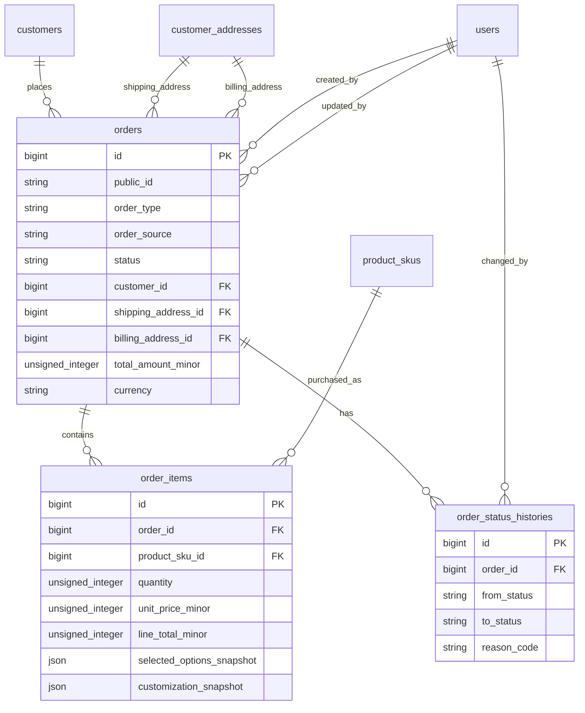

# Orders and Order Items Schema Plan

Task: A1.1.4 Orders/order items schema

Status: Planning draft

## Scope

This document defines the database direction for shared orders, order items, and minimal order status history.

It does not implement Laravel migrations, checkout, payment records, refunds, payment gateway logic, admin order screens, sales order workflow, inventory movement, shipping implementation, file storage, audit logs, notifications, or seed data.

## Design Goals

- Website checkout must create a pending order before payment starts.
- Website orders and future sales/manual orders must share the same order foundation.
- Order items must reference `product_skus.id`.
- Order items must preserve product, SKU, option, price, and customization snapshots.
- Orders must reference customers and selected addresses while preserving address snapshots.
- Order status must remain operational.
- Payment status must remain financial and be calculated from payment records.
- Customer tracking must be possible without exposing unsafe internal details.
- Later inventory, production, shipping, audit, notifications, and reports must be able to reference orders and order items.

## Core ERD



## Table: orders

Purpose: one row per official order, whether created by website checkout or later by admin sales workflow.

Quotations are not official orders until approved and converted.

| Column | Type | Nullable | Notes |
|---|---:|---:|---|
| `id` | unsigned big integer | No | Primary key. |
| `public_id` | varchar(40) | No | Customer/admin-facing order ID. Unique. Suggested format: `OD26-000001`; final generator belongs to A1.1.9. |
| `order_type` | varchar(32) | No | Suggested values: `website_order`, `sales_order`. |
| `order_source` | varchar(40) | No | Suggested values: `website`, `admin`, `quotation`, `import`. |
| `status` | varchar(32) | No | Operational order status. Default for checkout: `pending_payment`. |
| `customer_id` | unsigned big integer | No | FK to `customers.id`. |
| `shipping_address_id` | unsigned big integer | Yes | FK to `customer_addresses.id`. Nullable for non-shipping/manual draft cases if later approved. |
| `billing_address_id` | unsigned big integer | Yes | FK to `customer_addresses.id`. Can match shipping address. |
| `customer_snapshot` | json | No | Name, email, phone, company, and public customer ID captured at order time. |
| `shipping_address_snapshot` | json | Yes | Shipping address captured at order time. |
| `billing_address_snapshot` | json | Yes | Billing address captured at order time. |
| `subtotal_amount_minor` | unsigned big integer | No | Sum of item line subtotals before order-level adjustments. |
| `discount_amount_minor` | unsigned big integer | No | Default `0`. Order-level discount total. |
| `shipping_amount_minor` | unsigned big integer | No | Default `0`. |
| `tax_amount_minor` | unsigned big integer | No | Default `0`. Final GST rules are future decisions. |
| `total_amount_minor` | unsigned big integer | No | Final payable/order total in minor currency units. |
| `currency` | char(3) | No | Default `INR`. |
| `design_approved` | boolean | No | Default `false`. Design approval is order information, not order status. |
| `design_approved_at` | timestamp | Yes | When design was approved. |
| `design_approved_by_user_id` | unsigned big integer | Yes | FK to `users.id`; null on delete. |
| `design_notes` | text | Yes | Internal/customer-safe handling depends on later policy. Do not store file contents. |
| `customer_notes` | text | Yes | Customer-provided checkout note or support note. |
| `internal_notes` | text | Yes | Staff-only notes. Must not appear in customer APIs. |
| `placed_at` | timestamp | Yes | When order was placed/created. |
| `confirmed_at` | timestamp | Yes | When operationally confirmed. Payment alone must not auto-confirm unless a later rule says so. |
| `cancelled_at` | timestamp | Yes | Set when cancelled. Cancellation rules belong to A5.2. |
| `refunded_at` | timestamp | Yes | Optional operational marker; refund truth belongs to refund records in A1.1.5/A5.2. |
| `created_by_user_id` | unsigned big integer | Yes | Staff creator for admin/sales orders; null for website checkout. |
| `updated_by_user_id` | unsigned big integer | Yes | Last staff updater where applicable. |
| `idempotency_key` | varchar(120) | Yes | Optional checkout/admin creation key. Unique when present. Final idempotency table belongs to A4.5. |
| `created_at` | timestamp | No | Laravel timestamps. |
| `updated_at` | timestamp | No | Laravel timestamps. |
| `deleted_at` | timestamp | Yes | Soft delete only, if used. Normal admin should not delete core orders. |

### Order Status

Use the project-approved operational order statuses:

| Status | Meaning |
|---|---|
| `pending_payment` | Order exists before payment completion or booking amount. |
| `confirmed` | Order is accepted operationally. |
| `in_production` | Work has started. |
| `ready_to_ship` | Production is complete and shipment can be arranged. |
| `shipped` | Shipment has been handed to courier/manual delivery process. |
| `delivered` | Delivery is complete. |
| `cancelled` | Order is cancelled. |
| `refunded` | Operational marker for fully refunded order after refund rules allow it. |

Do not add `paid` as an operational order status. Payment state is calculated from payment records.

Design review, production status, shipping status, cancellation details, and refund facts should not overload `orders.status`. They can use explicit fields, later status tables, shipment tables, payment/refund records, and tracking events.

### Order Constraints

- Primary key: `id`.
- Unique: `public_id`.
- Unique nullable: `idempotency_key`, if stored directly here.
- FK: `customer_id` references `customers.id`.
- FK: `shipping_address_id` references `customer_addresses.id`.
- FK: `billing_address_id` references `customer_addresses.id`.
- FK: `design_approved_by_user_id` references `users.id`, null on delete.
- FK: `created_by_user_id` references `users.id`, null on delete.
- FK: `updated_by_user_id` references `users.id`, null on delete.
- Check/app enum: `order_type` in `website_order`, `sales_order`.
- Check/app enum: `order_source` in `website`, `admin`, `quotation`, `import`.
- Check/app enum: `status` in `pending_payment`, `confirmed`, `in_production`, `ready_to_ship`, `shipped`, `delivered`, `cancelled`, `refunded`.
- Check: monetary amount fields are `>= 0`.
- Check: `total_amount_minor = subtotal_amount_minor - discount_amount_minor + shipping_amount_minor + tax_amount_minor` where database check support is practical; otherwise validate in domain logic.

### Order Indexes

- `unique(orders.public_id)`.
- `unique(orders.idempotency_key)` when idempotency key is present.
- `index(orders.customer_id, orders.created_at)` for customer order history.
- `index(orders.status, orders.created_at)` for admin queues.
- `index(orders.order_type, orders.status, orders.created_at)` for website/sales order filters.
- `index(orders.order_source, orders.created_at)` for reporting.
- `index(orders.created_by_user_id, orders.created_at)` for staff-created sales orders.
- `index(orders.shipping_address_id)` and `index(orders.billing_address_id)` for traceability.
- `index(orders.deleted_at)` if soft-deleted admin views are needed.

## Table: order_items

Purpose: one row per product/SKU line on an order.

The SKU link preserves traceability. Snapshot fields preserve historical accuracy when product/SKU names, prices, options, or customization rules change later.

| Column | Type | Nullable | Notes |
|---|---:|---:|---|
| `id` | unsigned big integer | No | Primary key. |
| `order_id` | unsigned big integer | No | FK to `orders.id`. |
| `product_sku_id` | unsigned big integer | No | FK to `product_skus.id`. |
| `product_id_snapshot` | unsigned big integer | Yes | Product ID at order time, useful for reporting even if SKU changes later. |
| `product_name_snapshot` | varchar(180) | No | Product name at order time. |
| `product_slug_snapshot` | varchar(200) | Yes | Product slug at order time. |
| `sku_code_snapshot` | varchar(80) | No | SKU code at order time. |
| `sku_name_snapshot` | varchar(180) | Yes | SKU display name/suffix at order time. |
| `selected_options_snapshot` | json | No | Variant options and labels selected at order time. Use `{}` for simple products. |
| `customization_snapshot` | json | Yes | Print method, position, uploaded file references, preview references, placement metadata, and customer instructions. |
| `quantity` | unsigned integer | No | Ordered quantity. Must be `>= 1`. |
| `unit_price_minor` | unsigned big integer | No | Unit selling price snapshot. |
| `discount_amount_minor` | unsigned big integer | No | Default `0`. Line-level discount if used. |
| `tax_amount_minor` | unsigned big integer | No | Default `0`. Line-level tax if used. |
| `line_subtotal_minor` | unsigned big integer | No | `quantity * unit_price_minor` before line discount/tax. |
| `line_total_minor` | unsigned big integer | No | Final line total after discount/tax. |
| `currency` | char(3) | No | Default `INR`. |
| `sort_order` | unsigned integer | No | Stable display order. |
| `created_at` | timestamp | No | Laravel timestamps. |
| `updated_at` | timestamp | No | Laravel timestamps. |

### Selected Options Snapshot

Use a public-safe JSON object or array that preserves both machine codes and display labels.

Example:

```json
{
  "color": {
    "code": "black",
    "label": "Black"
  },
  "size": {
    "code": "m",
    "label": "M"
  }
}
```

Do not rely on current product variant labels for historical order display.

### Customization Snapshot

Store customization metadata needed to reproduce the ordered item.

Example:

```json
{
  "print_method": "dtf",
  "print_position": "front",
  "placement": {
    "x": 42,
    "y": 58,
    "scale": 0.72,
    "rotation": 0
  },
  "files": [
    {
      "file_id": 123,
      "role": "original_upload"
    },
    {
      "file_id": 124,
      "role": "mockup_preview"
    }
  ],
  "customer_note": "Logo centered on chest"
}
```

Rules:

- Store file IDs/references, not private file contents.
- Do not store raw storage paths in customer-facing payloads.
- File metadata and access rules belong to the file/upload schema.
- Customization JSON should be validated by product/customization rules before checkout or sales order creation.

### Order Item Constraints

- Primary key: `id`.
- FK: `order_id` references `orders.id`.
- FK: `product_sku_id` references `product_skus.id`.
- Restrict/no-action on deleting referenced SKUs once order items exist.
- Check: `quantity >= 1`.
- Check: monetary amount fields are `>= 0`.
- Check: `line_subtotal_minor = quantity * unit_price_minor` where practical; otherwise validate in domain logic.
- Check: `line_total_minor >= 0`.
- `selected_options_snapshot` must be valid JSON.
- `customization_snapshot` must be valid JSON when present.

### Order Item Indexes

- `index(order_items.order_id, order_items.sort_order)`.
- `index(order_items.product_sku_id)` for SKU/order traceability.
- `index(order_items.product_id_snapshot)` for product-level reporting.
- `index(order_items.sku_code_snapshot)` for admin search/reporting.

## Table: order_status_histories

Purpose: minimal operational status history for order lifecycle review and customer/admin timelines.

This table is not the immutable audit log. Audit storage belongs to C6.1, but this table gives order tracking and admin history a simple lifecycle record.

| Column | Type | Nullable | Notes |
|---|---:|---:|---|
| `id` | unsigned big integer | No | Primary key. |
| `order_id` | unsigned big integer | No | FK to `orders.id`. |
| `from_status` | varchar(32) | Yes | Previous status. Null for initial status. |
| `to_status` | varchar(32) | No | New status. |
| `reason_code` | varchar(80) | Yes | Optional internal code, such as `payment_received`, `manual_update`, `cancelled_by_staff`. |
| `note` | text | Yes | Internal note. Customer-safe text should be stored separately if needed later. |
| `changed_by_user_id` | unsigned big integer | Yes | FK to `users.id`; null for system/customer events. |
| `changed_at` | timestamp | No | Status change time. |
| `created_at` | timestamp | No | Laravel timestamp. |

### Status History Constraints

- Primary key: `id`.
- FK: `order_id` references `orders.id`.
- FK: `changed_by_user_id` references `users.id`, null on delete.
- Check/app enum: `from_status` and `to_status` use the approved order status values.
- Status history should append records; normal admin screens should not edit/delete them.

### Status History Indexes

- `index(order_status_histories.order_id, order_status_histories.changed_at)`.
- `index(order_status_histories.to_status, order_status_histories.changed_at)`.
- `index(order_status_histories.changed_by_user_id, order_status_histories.changed_at)`.

## Relationship Rules

### customers and orders

- Every official order belongs to one customer.
- Customer account pages must scope order lookup by authenticated customer ID.
- Admin-created sales orders use the same `customers.id` as website orders.
- Historical order display should use `customer_snapshot`, not mutable customer profile text.

### addresses and orders

- Orders may reference selected shipping and billing address IDs.
- Address snapshots preserve historical display if an address changes later.
- Deleted addresses must not break historical orders.

### orders and order items

- An order has one or many order items.
- An order should not be considered valid for checkout/payment unless it has at least one item.
- Multi-item/mixed carts are supported by multiple order item rows.

### order items and SKUs

- Every order item references `product_skus.id`.
- Order items also store SKU and product snapshots.
- If a SKU is later deleted or discontinued, historical order items remain readable.

### orders and payments

- Payment records are separate from orders.
- Do not store gateway-specific fields directly on `orders`.
- Do not treat Cashfree as the source that creates orders.
- Later payment tables should reference `orders.id`.
- Payment status should be calculated from payment/refund records, not hand-edited on the order.

## Delete Behavior

- Do not hard-delete orders through normal admin screens.
- Use restrict/no-action for future payment, refund, inventory, file, audit, and notification references.
- Use restrict/no-action for `order_items.product_sku_id`.
- Soft delete can be included for admin cleanup mistakes, but cancelled/refunded orders should remain normal visible business records, not deleted records.

## Laravel Migration Plan

Migration sequence for this schema area:

1. Ensure `customers` and `customer_addresses` exist.
2. Ensure `products` and `product_skus` exist.
3. Create `orders`.
4. Create `order_items`.
5. Create `order_status_histories`.
6. Later payment migration adds payment attempts, payments, schedules, webhook logs, and refunds referencing `orders.id`.
7. Later file/upload migration links uploaded files and mockup previews to orders/order items.
8. Later inventory migration references `orders.id`, `order_items.id`, and `product_skus.id` where needed.
9. Later production/shipping migration adds dedicated production/shipment/tracking tables instead of overloading `orders.status`.
10. Later audit and notification migrations reference order events without replacing order status history.

## Notes for Later Checkout Usage

- Checkout validates customer, address, cart items, product/SKU orderability, pricing, and customization before creating the order.
- Checkout creates an `orders` row with `status = pending_payment`.
- Checkout creates `order_items` with SKU links and snapshots.
- Checkout then creates a payment attempt in the later payment schema.
- Duplicate checkout submission must not create duplicate orders. Use `idempotency_key` or the A4.5 idempotency foundation.
- Failed/abandoned payment leaves a traceable pending order and payment attempt.

## Notes for Later Admin Orders

- Admin screens can show website and sales orders from the same `orders` table.
- Staff-created sales orders use `order_type = sales_order`.
- Sales orders can support advance/final/partial payment structures through later payment schedules and payment records.
- Sales staff may see safe payment status but must not see restricted profit/cost data unless permissioned.
- Staff order edits should write status history and later audit events where sensitive.

## Notes for Later Inventory Usage

- Inventory movements can reference `order_items.id` and `product_skus.id`.
- Inventory warnings should not corrupt or block order creation unless future business rules require blocking.
- Full stock reservation/deduction rules belong to inventory tasks.
- Made-to-order products can still produce order items even if no stock reservation exists.

## Notes for Later Production, Shipping and Tracking Usage

- Production and shipping status should not be crammed into `orders.status`.
- Dedicated production/shipping/tracking records can reference `orders.id` later.
- Customer tracking should map internal states to customer-safe timeline messages.
- Unsafe cancellation/refund/internal notes must not be exposed to customers.

## Notes for Later Audit and Notifications

- Order creation, status changes, item changes, design approval changes, cancellation, refund-related changes, and sensitive staff edits should emit audit events once A4.6/C6.1 exist.
- Notifications such as Order Created, Payment Pending, Payment Received, Production Started, Shipment Created, and Order Delivered can reference `orders.id`.
- Notification failures must not block order saves.

## Dependency Impact Summary

Affected projects:

- Platform A, Project B, and Project C.

Affected future tables:

- `payment_attempts`
- `payments`
- `payment_schedules`
- `refunds`
- `inventory_movements`
- `order_files` or generic file link tables
- `shipments`
- `tracking_events`
- `audit_logs`
- `notification_logs`
- `leads`
- `quotations`

Affected APIs:

- Checkout and pending-order APIs.
- Customer account order APIs.
- Customer tracking APIs.
- Admin order APIs.
- Payment, inventory, shipping, notification, and audit integration APIs.

Affected admin screens:

- Admin order list/detail.
- Sales order creation.
- Payment summary.
- Production queue.
- Shipping workflow.
- Finance views.
- Audit/order history.

Affected customer screens:

- Checkout confirmation.
- Customer dashboard.
- Order detail.
- Tracking page.

Affected reports and notifications:

- Order reports.
- Sales/payment reports.
- Production/shipping reports.
- Google Sheets order backup sync.
- Order and payment notifications.

Idempotency concerns:

- Order creation must be idempotent in checkout and possibly sales-order creation.
- Status history writes should avoid duplicate entries for repeated identical system events where relevant.
- Payment webhooks must update payment records without duplicating payments or corrupting order state.

Safe to proceed:

- Yes. This is a planning artifact. It does not change runtime behavior.

## Review Checklist

### Order Lifecycle Review

- Website checkout can create a `pending_payment` order before payment starts.
- Operational status values are separated from payment status, design status, production status, and shipping status.
- Status history can support lifecycle review and timelines.

Result: Pass.

### Order Item and SKU Relationship Review

- Every order item references `product_skus.id`.
- SKU deletion should be restricted/no-action once referenced.
- Product/SKU text is snapshotted for historical display.

Result: Pass.

### Customer and Address Relationship Review

- Orders reference `customers.id`.
- Orders can reference shipping and billing addresses.
- Customer and address snapshots preserve historical accuracy.

Result: Pass.

### Snapshot Accuracy Review

- Order-level customer/address snapshots are included.
- Item-level product/SKU/options/customization snapshots are included.
- Private file contents and gateway details are excluded.

Result: Pass.

### Checkout Pending-Order Review

- Pending order creation before payment is supported.
- Order rows are independent of gateway-specific fields.
- Idempotent creation can be supported later.

Result: Pass.

### Admin and Tracking Visibility Review

- Admin can view website and sales orders from the same tables.
- Customer tracking can use order and status data while hiding internal notes.
- Payment status remains derived from payment records.

Result: Pass.

### Migration Sequencing Review

- Orders depend on customers, addresses, and SKUs.
- Order items depend on orders and SKUs.
- Payment, inventory, files, shipping, audit, and notifications can reference orders later.

Result: Pass.

## Open Decisions for Future Tasks

- Final order public ID generator and sequence locking strategy.
- Whether sales orders can be created initially as draft before becoming official orders.
- Whether `shipping_address_id` and `billing_address_id` are always required for all order types.
- Final GST-inclusive or GST-exclusive pricing rules.
- Final discount model: order-level, line-level, coupon-based, manual, or combined.
- Whether `idempotency_key` lives directly on `orders` or in a shared idempotency table.
- Final payment schedule structure for sales orders.
- Final customer-safe tracking text mapping.
