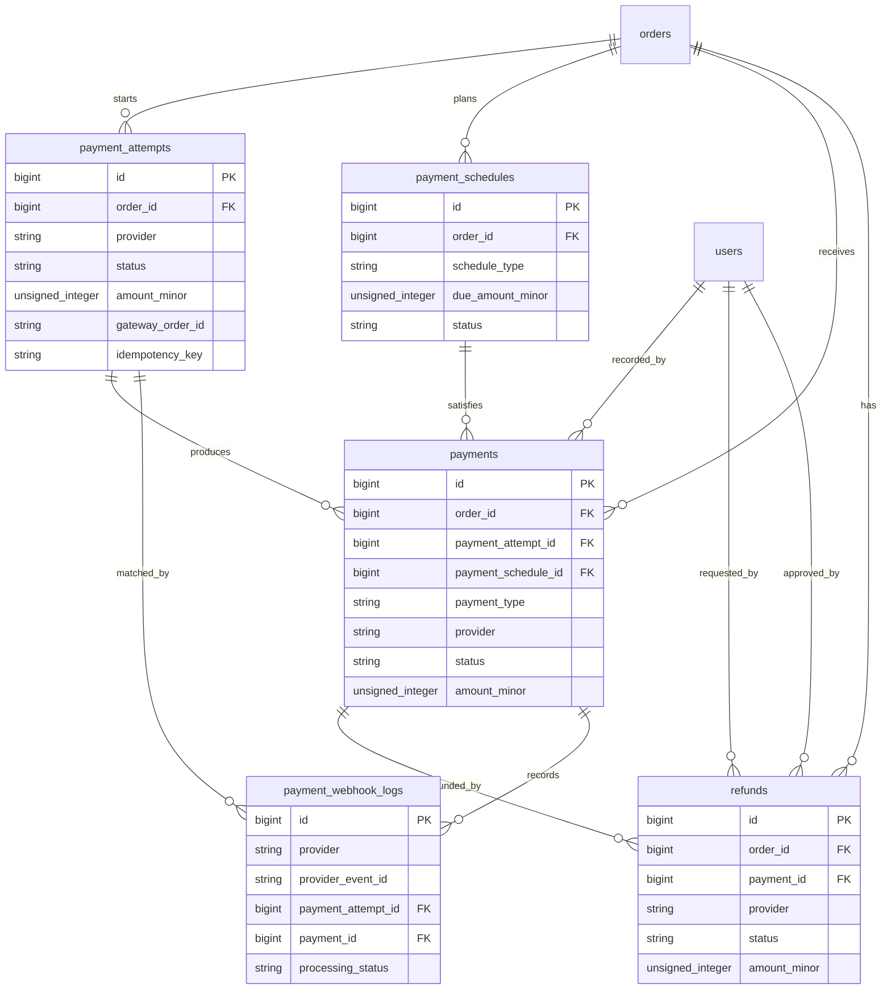

# Payments and Refunds Schema Plan

Task: A1.1.5 Payments/refunds schema

Status: Planning draft

## Scope

This document defines the database direction for payment attempts, payment records, payment schedules, payment webhook/gateway logs, and refund records.

It does not implement Laravel migrations, checkout, payment gateway services, Cashfree adapter code, webhook controllers, manual payment screens, refund approval workflow, finance reports, audit logs, notifications, or seed data.

## Design Goals

- Payment records must be separate from orders.
- Payment status must be calculated from payment and refund records.
- Checkout must create an order first, then a payment attempt.
- Cashfree must be the first gateway option without being hardcoded into checkout or order tables.
- Failed or abandoned payments must leave traceable attempts without corrupting orders.
- Manual payments must be representable without pretending they came from a gateway.
- Sales/manual orders must support full, advance, partial, installment, and final/balance payments.
- Refunds must preserve original payment history.
- Gateway webhook events must be logged and deduplicated.
- Sensitive card data, gateway secrets, private credentials, and raw unsafe payloads must not be stored in business records.

## Core ERD

## Table: payment_attempts

Purpose: one row per attempt to collect payment for an order through a gateway or manual link flow.

Payment attempts are not the source of paid amount. Confirmed `payments` records are.

| Column | Type | Nullable | Notes |
|---|---:|---:|---|
| `id` | unsigned big integer | No | Primary key. |
| `order_id` | unsigned big integer | No | FK to `orders.id`. |
| `provider` | varchar(40) | No | Suggested values: `cashfree`, `manual`, future `razorpay`, `payu`. |
| `attempt_type` | varchar(40) | No | Suggested values: `website_checkout`, `payment_link`, `manual_verification`, `retry`. |
| `status` | varchar(40) | No | Suggested values: `created`, `initiated`, `requires_action`, `succeeded`, `failed`, `expired`, `cancelled`. |
| `amount_minor` | unsigned big integer | No | Attempt amount in minor currency units. |
| `currency` | char(3) | No | Default `INR`. |
| `gateway_order_id` | varchar(120) | Yes | Provider order/session reference, such as Cashfree order ID. |
| `gateway_payment_id` | varchar(120) | Yes | Provider payment reference if known at attempt level. |
| `gateway_reference` | varchar(160) | Yes | Generic provider reference if a gateway uses another shape. |
| `checkout_url` | text | Yes | Provider-hosted checkout/payment link if returned. |
| `idempotency_key` | varchar(120) | Yes | Prevent duplicate attempts for the same request. |
| `failure_code` | varchar(80) | Yes | Provider/internal failure code. |
| `failure_message` | varchar(300) | Yes | Sanitized failure message. |
| `metadata` | json | Yes | Sanitized non-secret provider metadata. |
| `initiated_at` | timestamp | Yes | When gateway handoff began. |
| `expires_at` | timestamp | Yes | Attempt expiry if applicable. |
| `completed_at` | timestamp | Yes | When attempt reached terminal success/failure/cancelled state. |
| `created_at` | timestamp | No | Laravel timestamps. |
| `updated_at` | timestamp | No | Laravel timestamps. |

### Payment Attempt Constraints

- Primary key: `id`.
- FK: `order_id` references `orders.id`.
- Unique nullable: `idempotency_key`.
- Unique nullable by provider: `(provider, gateway_order_id)`.
- Unique nullable by provider: `(provider, gateway_payment_id)` if provider supplies it at attempt level.
- Check/app enum: `provider` in approved providers.
- Check/app enum: `attempt_type` in `website_checkout`, `payment_link`, `manual_verification`, `retry`.
- Check/app enum: `status` in `created`, `initiated`, `requires_action`, `succeeded`, `failed`, `expired`, `cancelled`.
- Check: `amount_minor > 0`.
- `metadata` must not contain secrets, full card data, credentials, or private tokens.

### Payment Attempt Indexes

- `index(payment_attempts.order_id, payment_attempts.created_at)`.
- `index(payment_attempts.provider, payment_attempts.status, payment_attempts.created_at)`.
- `index(payment_attempts.gateway_order_id)`.
- `index(payment_attempts.gateway_payment_id)`.
- `unique(payment_attempts.idempotency_key)` when present.

## Table: payment_schedules

Purpose: planned receivables for sales/manual orders, including advance, installments, and final/balance payments.

Website full-payment checkout may not need schedule rows in V1, but the table keeps sales order payments from becoming a later rewrite.

| Column | Type | Nullable | Notes |
|---|---:|---:|---|
| `id` | unsigned big integer | No | Primary key. |
| `order_id` | unsigned big integer | No | FK to `orders.id`. |
| `schedule_type` | varchar(40) | No | Suggested values: `full`, `advance`, `installment`, `final_balance`, `manual`. |
| `label` | varchar(120) | Yes | Human label such as `Advance`, `Second installment`, `Final payment`. |
| `due_amount_minor` | unsigned big integer | No | Planned amount due. |
| `paid_amount_minor` | unsigned big integer | No | Optional maintained summary. Default `0`; source remains payments. |
| `currency` | char(3) | No | Default `INR`. |
| `status` | varchar(40) | No | Suggested values: `pending`, `partially_paid`, `paid`, `cancelled`, `waived`. |
| `due_at` | timestamp | Yes | Due date/time. |
| `paid_at` | timestamp | Yes | Set when schedule is fully paid. |
| `sort_order` | unsigned integer | No | Default `0`. |
| `created_at` | timestamp | No | Laravel timestamps. |
| `updated_at` | timestamp | No | Laravel timestamps. |

### Payment Schedule Constraints

- Primary key: `id`.
- FK: `order_id` references `orders.id`.
- Check/app enum: `schedule_type` in `full`, `advance`, `installment`, `final_balance`, `manual`.
- Check/app enum: `status` in `pending`, `partially_paid`, `paid`, `cancelled`, `waived`.
- Check: `due_amount_minor > 0`.
- Check: `paid_amount_minor >= 0`.
- Check: `paid_amount_minor <= due_amount_minor` unless an overpayment rule is explicitly approved later.

### Payment Schedule Indexes

- `index(payment_schedules.order_id, payment_schedules.sort_order)`.
- `index(payment_schedules.status, payment_schedules.due_at)`.
- `index(payment_schedules.schedule_type, payment_schedules.status)`.

## Table: payments

Purpose: confirmed or manually recorded incoming payment facts.

Payments can come from a gateway attempt, a manual payment entry, a bank transfer, UPI, cash, or a future provider. Failed gateway events belong primarily on attempts and webhook logs, not as successful payment records.

| Column | Type | Nullable | Notes |
|---|---:|---:|---|
| `id` | unsigned big integer | No | Primary key. |
| `order_id` | unsigned big integer | No | FK to `orders.id`. |
| `payment_attempt_id` | unsigned big integer | Yes | FK to `payment_attempts.id`, nullable for manual payments. |
| `payment_schedule_id` | unsigned big integer | Yes | FK to `payment_schedules.id`, nullable for website full-payment cases. |
| `payment_type` | varchar(40) | No | Suggested values: `full`, `advance`, `partial`, `installment`, `final_balance`, `manual_adjustment`. |
| `provider` | varchar(40) | No | Suggested values: `cashfree`, `manual`, `bank_transfer`, `upi`, `cash`, future gateways. |
| `method` | varchar(40) | Yes | Suggested values: `card`, `upi`, `netbanking`, `wallet`, `cash`, `bank_transfer`, `cheque`, `other`. |
| `status` | varchar(40) | No | Suggested values: `pending_verification`, `succeeded`, `failed`, `cancelled`, `voided`. |
| `amount_minor` | unsigned big integer | No | Gross received amount in minor currency units. |
| `currency` | char(3) | No | Default `INR`. |
| `provider_payment_id` | varchar(120) | Yes | Provider payment/transaction reference. |
| `provider_order_id` | varchar(120) | Yes | Provider order/session reference. |
| `provider_reference` | varchar(160) | Yes | Generic provider/manual reference. |
| `receipt_number` | varchar(80) | Yes | Internal receipt/reference if generated. |
| `gateway_fee_minor` | unsigned big integer | Yes | Optional fee amount if provider reports it. |
| `net_amount_minor` | unsigned big integer | Yes | Optional net settlement amount. |
| `paid_at` | timestamp | Yes | Payment success/received time. |
| `recorded_by_user_id` | unsigned big integer | Yes | FK to `users.id`; null for automated gateway records. |
| `verified_by_user_id` | unsigned big integer | Yes | FK to `users.id`; used for manual verification. |
| `notes` | text | Yes | Internal note. Must not contain secrets/card details. |
| `metadata` | json | Yes | Sanitized non-secret metadata. |
| `created_at` | timestamp | No | Laravel timestamps. |
| `updated_at` | timestamp | No | Laravel timestamps. |

### Payment Constraints

- Primary key: `id`.
- FK: `order_id` references `orders.id`.
- FK: `payment_attempt_id` references `payment_attempts.id`, null on delete only if historical policy allows; otherwise restrict.
- FK: `payment_schedule_id` references `payment_schedules.id`, null on delete only if historical policy allows; otherwise restrict.
- FK: `recorded_by_user_id` references `users.id`, null on delete.
- FK: `verified_by_user_id` references `users.id`, null on delete.
- Unique nullable by provider: `(provider, provider_payment_id)`.
- Unique nullable: `receipt_number`.
- Check/app enum: `payment_type` in `full`, `advance`, `partial`, `installment`, `final_balance`, `manual_adjustment`.
- Check/app enum: `status` in `pending_verification`, `succeeded`, `failed`, `cancelled`, `voided`.
- Check: `amount_minor > 0`.
- Check: `gateway_fee_minor is null or gateway_fee_minor >= 0`.
- Check: `net_amount_minor is null or net_amount_minor >= 0`.
- `metadata` must not contain secrets, full card data, credentials, private payment tokens, or raw unsafe payloads.

### Payment Indexes

- `index(payments.order_id, payments.paid_at)`.
- `index(payments.payment_attempt_id)`.
- `index(payments.payment_schedule_id)`.
- `index(payments.provider, payments.provider_payment_id)`.
- `index(payments.status, payments.paid_at)`.
- `index(payments.payment_type, payments.status)`.
- `index(payments.recorded_by_user_id, payments.created_at)`.
- `unique(payments.receipt_number)` when present.

## Table: refunds

Purpose: refund records that preserve original payments and support partial/full refund tracking.

Refunds are not negative payments. They are separate financial facts linked to orders and, where possible, original payments.

| Column | Type | Nullable | Notes |
|---|---:|---:|---|
| `id` | unsigned big integer | No | Primary key. |
| `order_id` | unsigned big integer | No | FK to `orders.id`. |
| `payment_id` | unsigned big integer | Yes | FK to `payments.id`; nullable only when provider/order-level refund cannot map cleanly to one payment. |
| `provider` | varchar(40) | No | Suggested values: `cashfree`, `manual`, `bank_transfer`, `upi`, `cash`, future gateways. |
| `refund_type` | varchar(40) | No | Suggested values: `partial`, `full`, `manual_adjustment`. |
| `status` | varchar(40) | No | Suggested values: `requested`, `approved`, `processing`, `succeeded`, `failed`, `cancelled`. |
| `amount_minor` | unsigned big integer | No | Refund amount in minor currency units. |
| `currency` | char(3) | No | Default `INR`. |
| `reason_code` | varchar(80) | Yes | Optional reason code. Final cancellation/refund rules belong to A5.2. |
| `reason_note` | text | Yes | Internal note; customer-safe handling is a later policy. |
| `provider_refund_id` | varchar(120) | Yes | Provider refund reference. |
| `provider_payment_id` | varchar(120) | Yes | Provider payment reference if useful for matching. |
| `provider_reference` | varchar(160) | Yes | Generic provider/manual reference. |
| `requested_by_user_id` | unsigned big integer | Yes | FK to `users.id`. |
| `approved_by_user_id` | unsigned big integer | Yes | FK to `users.id`. |
| `processed_by_user_id` | unsigned big integer | Yes | FK to `users.id`, nullable for gateway/webhook processing. |
| `requested_at` | timestamp | Yes | Request time. |
| `approved_at` | timestamp | Yes | Approval time. |
| `processed_at` | timestamp | Yes | Success/failure processing time. |
| `metadata` | json | Yes | Sanitized non-secret provider metadata. |
| `created_at` | timestamp | No | Laravel timestamps. |
| `updated_at` | timestamp | No | Laravel timestamps. |

### Refund Constraints

- Primary key: `id`.
- FK: `order_id` references `orders.id`.
- FK: `payment_id` references `payments.id`.
- FK: `requested_by_user_id`, `approved_by_user_id`, and `processed_by_user_id` reference `users.id`, null on delete.
- Unique nullable by provider: `(provider, provider_refund_id)`.
- Check/app enum: `refund_type` in `partial`, `full`, `manual_adjustment`.
- Check/app enum: `status` in `requested`, `approved`, `processing`, `succeeded`, `failed`, `cancelled`.
- Check: `amount_minor > 0`.
- Application/domain check: successful refunds for a payment must not exceed the successful payment amount.
- Application/domain check: successful refunds for an order must not exceed successful payment total.
- `metadata` must not contain secrets, full card data, credentials, private payment tokens, or raw unsafe payloads.

### Refund Indexes

- `index(refunds.order_id, refunds.created_at)`.
- `index(refunds.payment_id, refunds.created_at)`.
- `index(refunds.provider, refunds.provider_refund_id)`.
- `index(refunds.status, refunds.processed_at)`.
- `index(refunds.refund_type, refunds.status)`.
- `index(refunds.requested_by_user_id, refunds.created_at)`.
- `index(refunds.approved_by_user_id, refunds.approved_at)`.

## Table: payment_webhook_logs

Purpose: immutable-ish processing log for payment gateway webhook/event callbacks and provider event deduplication.

This table is not the audit log. It is a gateway reliability and replay-safety record.

| Column | Type | Nullable | Notes |
|---|---:|---:|---|
| `id` | unsigned big integer | No | Primary key. |
| `provider` | varchar(40) | No | Gateway/provider, such as `cashfree`. |
| `provider_event_id` | varchar(160) | Yes | Unique provider event ID when available. |
| `event_type` | varchar(120) | No | Provider event type mapped or raw-safe name. |
| `provider_order_id` | varchar(120) | Yes | Provider order/session reference. |
| `provider_payment_id` | varchar(120) | Yes | Provider payment reference. |
| `provider_refund_id` | varchar(120) | Yes | Provider refund reference. |
| `payment_attempt_id` | unsigned big integer | Yes | FK to `payment_attempts.id` if matched. |
| `payment_id` | unsigned big integer | Yes | FK to `payments.id` if created/matched. |
| `refund_id` | unsigned big integer | Yes | FK to `refunds.id` if created/matched. |
| `processing_status` | varchar(40) | No | Suggested values: `received`, `processed`, `ignored_duplicate`, `failed`, `needs_review`. |
| `signature_verified` | boolean | No | Whether webhook signature passed verification. |
| `payload_summary` | json | Yes | Sanitized summary only. |
| `error_message` | varchar(300) | Yes | Sanitized processing error. |
| `received_at` | timestamp | No | Event receipt time. |
| `processed_at` | timestamp | Yes | Processing completion time. |
| `created_at` | timestamp | No | Laravel timestamp. |
| `updated_at` | timestamp | No | Laravel timestamp. |

### Webhook Log Constraints

- Primary key: `id`.
- FK: `payment_attempt_id` references `payment_attempts.id`.
- FK: `payment_id` references `payments.id`.
- FK: `refund_id` references `refunds.id`.
- Unique nullable by provider: `(provider, provider_event_id)`.
- Check/app enum: `processing_status` in `received`, `processed`, `ignored_duplicate`, `failed`, `needs_review`.
- `payload_summary` must not contain secrets, full card details, private credentials, raw signatures, or full unsafe payloads.
- Raw payload storage should be avoided. If ever required for debugging/compliance, store it encrypted with retention limits and never expose it broadly.

### Webhook Log Indexes

- `unique(payment_webhook_logs.provider, payment_webhook_logs.provider_event_id)` when event ID is present.
- `index(payment_webhook_logs.provider, payment_webhook_logs.event_type, payment_webhook_logs.received_at)`.
- `index(payment_webhook_logs.provider_order_id)`.
- `index(payment_webhook_logs.provider_payment_id)`.
- `index(payment_webhook_logs.provider_refund_id)`.
- `index(payment_webhook_logs.processing_status, payment_webhook_logs.received_at)`.
- `index(payment_webhook_logs.payment_attempt_id)`.
- `index(payment_webhook_logs.payment_id)`.
- `index(payment_webhook_logs.refund_id)`.

## Payment Status Calculation

Payment status is calculated from successful/verified payment and refund records.

Suggested calculation inputs:

- `order_total = orders.total_amount_minor`
- `paid_total = sum(payments.amount_minor where status = succeeded)`
- `refund_total = sum(refunds.amount_minor where status = succeeded)`
- `net_paid = paid_total - refund_total`

Suggested payment status output:

| Status | Calculation direction |
|---|---|
| `unpaid` | `paid_total = 0` and `refund_total = 0`. |
| `partially_paid` | `paid_total > 0`, `paid_total < order_total`, and no successful refund has changed the state. |
| `paid` | `paid_total >= order_total` and `refund_total = 0`. |
| `partially_refunded` | `refund_total > 0` and `net_paid > 0`. |
| `refunded` | `refund_total > 0` and `net_paid = 0`. |

Failed attempts do not make an order financially failed. They remain attempts/logs.

If a cached payment status is later stored on `orders` for speed, it must be treated as a derived cache that is recalculated from `payments` and `refunds`, not as the source of truth.

## Relationship Rules

### orders to payment_attempts

- An order can have zero or many payment attempts.
- Website checkout creates an order, then creates a payment attempt.
- Duplicate clicks/retries must not create duplicate active attempts for the same idempotency key.
- Failed attempts do not delete or corrupt the order.

### orders to payments

- An order can have zero or many payments.
- Sales/manual orders can receive multiple payments over time.
- Website full-payment orders usually receive one successful payment, but the schema does not assume that permanently.
- Payments must not be hard-deleted through normal admin screens.

### payment_attempts to payments

- A gateway attempt can produce one or more payment records only if the provider flow makes that possible.
- Most website full-payment attempts should produce zero or one successful payment.
- Manual payments can have no payment attempt.

### payment_schedules to payments

- A payment schedule can be satisfied by one or more payments.
- A payment can optionally be linked to the schedule it satisfies.
- Schedule status is derived or maintained from linked payments.

### payments to refunds

- A payment can have zero or many refunds.
- Refund records preserve the original payment record.
- Refunds are not negative payment rows.

## Delete Behavior

- Do not hard-delete payments, attempts, webhook logs, or refunds through normal admin screens.
- Future audit records should preserve payment/refund changes.
- Orders referenced by payments/refunds should use restrict/no-action on hard delete.
- Payment/refund correction should use void/cancel/reversal-style status changes, not destructive deletion.

## Laravel Migration Plan

Migration sequence for this schema area:

1. Ensure `orders` exists.
2. Create `payment_attempts`.
3. Create `payment_schedules`.
4. Create `payments`.
5. Create `refunds`.
6. Create `payment_webhook_logs`.
7. Later settings migration defines active gateway/payment settings.
8. Later payment gateway contract task maps Cashfree and future providers to these records.
9. Later audit and notification migrations reference payment/refund events.
10. Later finance/reporting tasks build summaries from payment/refund records.

## Notes for Later Checkout Usage

- Checkout must not call Cashfree directly.
- Checkout creates pending order first.
- Checkout creates a payment attempt through the shared payment service.
- Gateway response updates `payment_attempts`.
- Webhook verification creates/updates `payments` and recalculates payment status.
- Payment webhook replay must not create duplicate payments.
- Failed payment attempts leave the order recoverable.

## Notes for Later Manual/Admin Payment Usage

- Finance staff can record manual payments with `provider = manual`, `bank_transfer`, `upi`, `cash`, or another approved method.
- Manual payment records can start as `pending_verification` and become `succeeded`.
- Manual payment edits should be permissioned and audited later.
- Sales staff can see safe payment status without seeing restricted profit/cost fields.

## Notes for Later Refund Usage

- Refund eligibility and approval workflow belong to A5.2/C5.2.
- Partial and full refunds use the same `refunds` table.
- Refund webhook events can match existing refund records using provider references.
- Refund records should never erase or overwrite original payments.

## Notes for Later Audit and Notifications

- Payment attempt creation, payment success/failure, manual payment recording, payment verification, refund request, refund approval, refund success/failure, and webhook processing failures should emit audit events once A4.6/C6.1 exist.
- Notifications such as Payment Received, Payment Pending, refund updates, and job failures can reference `orders.id`, `payments.id`, or `refunds.id`.
- Notification failures must not block payment/refund persistence.

## Dependency Impact Summary

Affected projects:

- Platform A, Project B, and Project C.

Affected future tables:

- `orders`
- `audit_logs`
- `notification_logs`
- `settings` or payment gateway settings
- `files` if payment proof upload is approved later
- `finance_reports` or reporting views

Affected APIs:

- Payment attempt APIs.
- Payment verification APIs.
- Payment webhook APIs.
- Admin/manual payment APIs.
- Refund APIs.
- Customer dashboard payment summary APIs.

Affected admin screens:

- Admin order payment summary.
- Finance payment views.
- Manual payment entry.
- Refund management.
- Webhook/gateway event review.
- Finance reports.

Affected customer screens:

- Checkout payment handoff.
- Payment result page.
- Customer dashboard payment summary.
- Customer tracking payment/balance status.

Affected reports and notifications:

- Payment reports.
- Balance/pending payment reports.
- Refund reports.
- Google Sheets payment backup sync.
- Payment/refund/customer notifications.

Idempotency concerns:

- Payment attempt creation must be idempotent.
- Gateway webhook processing must deduplicate by provider event ID or provider payment/refund reference.
- Manual payment entry should guard against duplicate receipt/reference entries where applicable.
- Refund processing must guard against duplicate provider refund IDs and duplicate replayed events.

Safe to proceed:

- Yes. This is a planning artifact. It does not change runtime behavior.

## Review Checklist

### Payment State Calculation Review

- Payment status can be calculated from successful payments and successful refunds.
- Failed attempts do not corrupt order financial state.
- Cached status, if added later, is derived only.

Result: Pass.

### Payment Attempt Relationship Review

- Orders can have multiple payment attempts.
- Attempts preserve provider references and idempotency keys.
- Attempts can succeed, fail, expire, or be retried without deleting the order.

Result: Pass.

### Manual Payment Support Review

- Manual payments can be recorded without gateway attempt rows.
- Manual payments can be verified by staff.
- Manual payments can satisfy payment schedules.

Result: Pass.

### Refund Relationship Review

- Refunds link to orders and usually to payments.
- Multiple partial refunds are supported.
- Refunds do not erase original payments.

Result: Pass.

### Webhook and Idempotency Readiness Review

- Provider event IDs can be unique per provider.
- Provider payment/refund IDs can be unique per provider.
- Webhook logs can record duplicate, failed, and needs-review events.

Result: Pass.

### Finance and Reporting Visibility Review

- Finance can query payments, refunds, schedules, pending balances, and gateway events.
- Customer-facing summaries can hide internal notes and provider details.
- Sensitive payment data is excluded from business records.

Result: Pass.

### Migration Sequencing Review

- Payment tables depend on orders.
- Refunds depend on payments and orders.
- Webhook logs can reference attempts, payments, and refunds.
- Settings, gateway adapters, audit, notifications, and reports can build on these tables later.

Result: Pass.

## Open Decisions for Future Tasks

- Whether COD/manual payment is ever allowed for website checkout.
- Whether all direct website orders require full online payment in V1.
- Final payment retry rules and payment attempt expiry rules.
- Final Cashfree account type, webhook requirements, and accepted payment methods.
- Whether refund handling is implemented in Phase 1 or later.
- Whether partial payment links are needed in Phase 2.
- Whether payment proof uploads are needed for manual payments.
- Whether payment status is stored as a derived cache on `orders` or calculated on read.
- Final overpayment handling rules.
- Final refund approval workflow and permissions.
