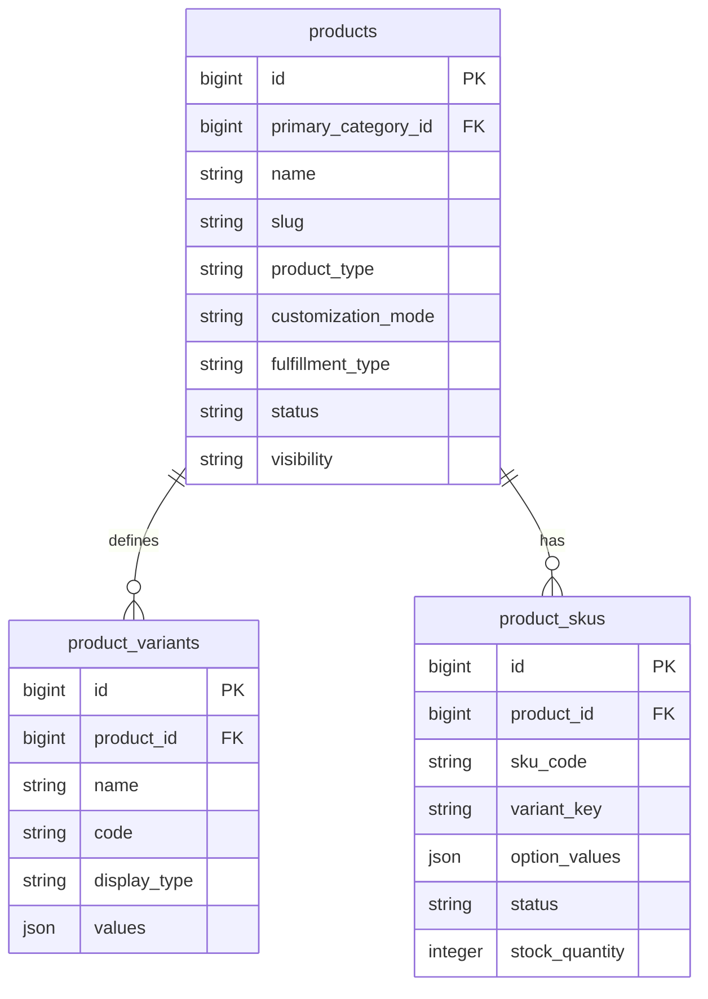

# Products, Variants and SKUs Schema Plan

Task: A1.1.3 Products, Variants and SKUs Schema

Status: Planning draft

## Scope

This document defines the database direction for products, product variants, and SKUs.

It does not implement Laravel migrations, models, admin screens, public APIs, cart, checkout, inventory movements, image uploads, import/export, or seed data.

## Design Goals

- Every purchasable product combination must have one SKU.
- Cart items, order items, inventory movements, and purchase items must reference `product_skus.id`.
- Product status and product visibility must be separate.
- Product-level data must stay on `products`.
- Option definitions such as size and color must stay on `product_variants`.
- Purchasable combination data must stay on `product_skus`.
- The schema must support simple products, variable products, customizable products, bulk-only products, and made-to-order products.
- The schema must support apparel size/color combinations and future non-apparel options without a new table for every product type.

## Core ERD



## Table: products

Purpose: one row per catalog product shown or managed as a product, such as printed t-shirt, polo t-shirt, cap, hoodie, mug, or corporate gift set.

Products are not the purchasable identity. SKUs are.

| Column | Type | Nullable | Notes |
|---|---:|---:|---|
| `id` | unsigned big integer | No | Primary key. |
| `primary_category_id` | unsigned big integer | Yes | Future FK to `product_categories.id`; set null if category is removed. |
| `name` | varchar(180) | No | Admin and public product name. |
| `slug` | varchar(200) | No | Public URL slug. Unique. |
| `short_description` | varchar(500) | Yes | Short public summary. |
| `description` | text | Yes | Long public/admin description. |
| `product_type` | varchar(32) | No | Suggested values: `simple`, `variable`, `bundle`. Default `simple`. |
| `customization_mode` | varchar(32) | No | Suggested values: `none`, `optional`, `required`. Default `none`. |
| `fulfillment_type` | varchar(32) | No | Suggested values: `stocked`, `made_to_order`. Default `stocked`. |
| `status` | varchar(32) | No | Product state. See status rules below. |
| `visibility` | varchar(32) | No | Public visibility. See visibility rules below. |
| `direct_checkout_enabled` | boolean | No | Whether direct website checkout can be used when SKU rules also allow it. |
| `quote_enabled` | boolean | No | Whether quote or bulk enquiry flow is available. |
| `min_order_quantity` | unsigned integer | No | Default `1`. Can be overridden or tightened by SKU/cart rules later. |
| `max_order_quantity` | unsigned integer | Yes | Optional product-level cap. |
| `bulk_threshold_quantity` | unsigned integer | Yes | Quantity at which quote flow should be suggested or required. |
| `base_price_minor` | unsigned integer | Yes | Base/display amount in minor currency units, such as paise. SKU price can override. |
| `currency` | char(3) | No | Default `INR`. |
| `seo_title` | varchar(180) | Yes | Public SEO title. |
| `seo_description` | varchar(300) | Yes | Public SEO description. |
| `sort_order` | unsigned integer | No | Default `0`. |
| `published_at` | timestamp | Yes | Public publish time. |
| `created_at` | timestamp | No | Laravel timestamps. |
| `updated_at` | timestamp | No | Laravel timestamps. |
| `deleted_at` | timestamp | Yes | Soft delete only. |

### Product Status

Use the project-approved product statuses:

| Status | Public behavior | Purchase behavior |
|---|---|---|
| `draft` | Not public. | Not purchasable. |
| `active` | Can be public when visibility is `public`. | Purchasable if SKU also allows checkout. |
| `out_of_stock` | Can remain public. | Direct checkout disabled unless later backorder rules allow it. |
| `bulk_only` | Can remain public. | Direct checkout disabled; quote flow used. |
| `discontinued` | Usually hidden or read-only. | Not purchasable. |

### Product Visibility

| Visibility | Meaning |
|---|---|
| `public` | Eligible for public website/API output if status also allows it. |
| `private` | Admin/internal only, not included in public catalog APIs. |

Status and visibility must not be merged. A product can be `active` but `private`, or `out_of_stock` and `public`.

### Product Constraints

- Primary key: `id`.
- Unique: `slug`.
- Check/app enum: `product_type` in `simple`, `variable`, `bundle`.
- Check/app enum: `customization_mode` in `none`, `optional`, `required`.
- Check/app enum: `fulfillment_type` in `stocked`, `made_to_order`.
- Check/app enum: `status` in `draft`, `active`, `out_of_stock`, `bulk_only`, `discontinued`.
- Check/app enum: `visibility` in `public`, `private`.
- Check: `min_order_quantity >= 1`.
- Check: `max_order_quantity is null or max_order_quantity >= min_order_quantity`.
- Check: `bulk_threshold_quantity is null or bulk_threshold_quantity >= 1`.
- Check: `base_price_minor is null or base_price_minor >= 0`.

### Product Indexes

- `unique(products.slug)`.
- `index(products.status, products.visibility, products.published_at)` for public catalog lookup.
- `index(products.primary_category_id, products.status, products.visibility)` for category pages.
- `index(products.sort_order, products.id)` for stable listing order.
- `index(products.deleted_at)` if soft-deleted admin views are needed.

## Table: product_variants

Purpose: defines SKU-forming option groups for one product.

Examples:

- Printed t-shirt has variant codes `color` and `size`.
- Cap has variant code `color`.
- Mug may have variant code `capacity` or no variant rows.

This table defines available option groups and values. It is not the purchasable record.

| Column | Type | Nullable | Notes |
|---|---:|---:|---|
| `id` | unsigned big integer | No | Primary key. |
| `product_id` | unsigned big integer | No | FK to `products.id`. |
| `name` | varchar(120) | No | Human label, such as `Size` or `Color`. |
| `code` | varchar(80) | No | Stable machine key, such as `size` or `color`. |
| `display_type` | varchar(32) | No | Suggested values: `select`, `swatch`, `button`, `radio`. |
| `values` | json | No | Ordered list of allowed values for this option group. |
| `is_required` | boolean | No | Default `true` for SKU-forming variants. |
| `sort_order` | unsigned integer | No | Default `0`. |
| `created_at` | timestamp | No | Laravel timestamps. |
| `updated_at` | timestamp | No | Laravel timestamps. |

### Variant Values JSON Shape

Store option values as an ordered JSON array:

```json
[
  {
    "code": "black",
    "label": "Black",
    "sort_order": 10,
    "is_active": true,
    "metadata": {
      "hex": "#111111"
    }
  },
  {
    "code": "white",
    "label": "White",
    "sort_order": 20,
    "is_active": true,
    "metadata": {
      "hex": "#ffffff"
    }
  }
]
```

The `code` values are used by `product_skus.option_values` and `product_skus.variant_key`.

### Product Variant Constraints

- Primary key: `id`.
- FK: `product_variants.product_id` references `products.id`.
- Unique: `(product_id, code)`.
- Check/app enum: `display_type` in `select`, `swatch`, `button`, `radio`.
- `code` should be lowercase slug format, such as `size`, `color`, `material`, or `capacity`.
- `values` must be valid JSON array.
- Each value inside `values` must have a unique `code` within the same variant.

The uniqueness of individual JSON value codes must be validated in application/admin logic because MySQL cannot easily enforce uniqueness inside a JSON array.

### Product Variant Indexes

- `index(product_variants.product_id, product_variants.sort_order)`.
- `unique(product_variants.product_id, product_variants.code)`.

## Table: product_skus

Purpose: one row per purchasable and stock-trackable product combination.

Examples:

- Plain simple mug: one SKU with `variant_key = default`.
- T-shirt, black, medium: one SKU with `variant_key = color:black|size:m`.
- T-shirt, white, large: one SKU with `variant_key = color:white|size:l`.

SKUs are the stable records referenced by cart items, order items, inventory movements, inventory reservations, and vendor purchase items.

| Column | Type | Nullable | Notes |
|---|---:|---:|---|
| `id` | unsigned big integer | No | Primary key. |
| `product_id` | unsigned big integer | No | FK to `products.id`. |
| `sku_code` | varchar(80) | No | Business SKU code. Globally unique. |
| `variant_key` | varchar(500) | No | Canonical option key. Use `default` for simple products. |
| `option_values` | json | No | Selected variant codes for this SKU. Use `{}` for simple products. |
| `name_suffix` | varchar(180) | Yes | Optional display suffix, such as `Black / M`. |
| `barcode` | varchar(120) | Yes | Optional barcode or external stock code. |
| `status` | varchar(32) | No | Suggested values: `active`, `out_of_stock`, `bulk_only`, `discontinued`. |
| `direct_checkout_enabled` | boolean | No | SKU-level direct checkout gate. |
| `quote_required` | boolean | No | SKU-level quote-only gate. |
| `track_stock` | boolean | No | Whether simple V1 stock fields are meaningful. |
| `stock_quantity` | integer | No | Simple V1 stock balance. Default `0`. Full movements come later. |
| `low_stock_threshold` | unsigned integer | Yes | Warning threshold. |
| `allow_backorder` | boolean | No | Default `false`. |
| `price_minor` | unsigned integer | Yes | SKU sell price in minor currency units. Falls back to product base price if null. |
| `compare_at_price_minor` | unsigned integer | Yes | Optional public comparison price. |
| `weight_grams` | unsigned integer | Yes | Useful for shipping later. |
| `length_mm` | unsigned integer | Yes | Optional package/product dimension. |
| `width_mm` | unsigned integer | Yes | Optional package/product dimension. |
| `height_mm` | unsigned integer | Yes | Optional package/product dimension. |
| `sort_order` | unsigned integer | No | Default `0`. |
| `created_at` | timestamp | No | Laravel timestamps. |
| `updated_at` | timestamp | No | Laravel timestamps. |
| `deleted_at` | timestamp | Yes | Soft delete only. |

### SKU Variant Key

`variant_key` must be generated in a consistent sorted format from `option_values`.

Examples:

```json
{}
```

```text
default
```

```json
{
  "color": "black",
  "size": "m"
}
```

```text
color:black|size:m
```

Rules:

- Use `default` when the product has no SKU-forming variants.
- Sort option codes alphabetically before building the key.
- Use lowercase variant and value codes.
- Do not use labels in the key.
- Do not change a SKU's key after the SKU has been referenced by cart, order, inventory, or purchase records. Create a new SKU instead.

### SKU Constraints

- Primary key: `id`.
- FK: `product_skus.product_id` references `products.id`.
- Unique: `sku_code`.
- Unique: `(product_id, variant_key)`.
- Unique nullable: `barcode`, if barcode is used.
- Check/app enum: `status` in `active`, `out_of_stock`, `bulk_only`, `discontinued`.
- Check: `stock_quantity` can be negative only if a later inventory rule explicitly allows it. For V1, keep it `>= 0`.
- Check: `low_stock_threshold is null or low_stock_threshold >= 0`.
- Check: `price_minor is null or price_minor >= 0`.
- Check: `compare_at_price_minor is null or compare_at_price_minor >= 0`.
- Check: dimensions and weight are null or `>= 0`.

### SKU Indexes

- `unique(product_skus.sku_code)`.
- `unique(product_skus.product_id, product_skus.variant_key)`.
- `index(product_skus.product_id, product_skus.status, product_skus.sort_order)` for product detail loading.
- `index(product_skus.status, product_skus.direct_checkout_enabled)` for admin filters.
- `index(product_skus.track_stock, product_skus.stock_quantity)` for low-stock queries.
- `index(product_skus.deleted_at)` if soft-deleted admin views are needed.

## Relationship Rules

### products to product_variants

- A product has zero or many product variant option groups.
- A product with no variants must still have one SKU.
- A product with variants should have one SKU for each purchasable option combination.
- Hard delete should not be available in normal admin usage. Use soft delete for products.

### products to product_skus

- A product has one or many SKUs.
- Every cart/order/inventory reference must point to `product_skus.id`, not only `products.id`.
- A product should not be treated as checkout-ready unless it has at least one active SKU.

### product_variants to product_skus

- There is no direct FK from `product_skus.option_values` to JSON variant values.
- Admin/application validation must ensure each SKU option code exists in `product_variants.code`.
- Admin/application validation must ensure each SKU option value exists in that variant's `values`.
- Database uniqueness is enforced through `(product_id, variant_key)`.

This avoids extra pivot tables during the planning foundation while still keeping SKU identity clear. If future admin tooling needs strict per-option value rows, `product_variant_values` and `product_sku_variant_values` can be introduced later without changing cart/order/inventory references, because those references already point to `product_skus.id`.

## Public Catalog Rules

A product can appear in public catalog APIs only when:

- `products.visibility = public`
- `products.status in (active, out_of_stock, bulk_only)`
- `products.published_at is null or products.published_at <= now()`
- `products.deleted_at is null`

A SKU can be offered for direct checkout only when:

- Product is public and active.
- Product `direct_checkout_enabled = true`.
- SKU `status = active`.
- SKU `direct_checkout_enabled = true`.
- SKU `quote_required = false`.
- If stock is tracked, stock is available or backorder rules allow it.

Bulk-only behavior:

- Product `status = bulk_only` means all direct checkout should route to quote flow.
- SKU `status = bulk_only` or `quote_required = true` means that combination routes to quote flow even if the product itself is active.

Out-of-stock behavior:

- Product `status = out_of_stock` can remain visible.
- SKU `status = out_of_stock` can remain visible as unavailable.
- V1 inventory warnings should not block checkout unless product/SKU rules say direct checkout is disabled.

## Laravel Migration Plan

Migration sequence for this schema area:

1. Ensure `product_categories` exists first if `primary_category_id` is included as an FK. If categories are not implemented yet, create `products.primary_category_id` nullable and add the FK in the categories migration task.
2. Create `products`.
3. Create `product_variants`.
4. Create `product_skus`.
5. Later cart migration adds `cart_items.product_sku_id` FK to `product_skus.id`.
6. Later order migration adds `order_items.product_sku_id` FK to `product_skus.id`.
7. Later inventory migration adds `inventory_movements.product_sku_id` and `inventory_reservations.product_sku_id` FKs to `product_skus.id`.
8. Later purchase migration adds `vendor_order_items.product_sku_id` FK to `product_skus.id`.

### Delete Behavior

- Use soft deletes on `products` and `product_skus`.
- Do not expose hard delete for products/SKUs in normal admin screens after launch.
- Future FK references from cart/order/inventory/purchase tables to `product_skus.id` should use restrict/no action on delete.
- Product variants may be edited while a product is still being prepared, but once SKUs exist and are referenced, variant code changes must be restricted or handled by creating replacement SKUs.

## Notes for Later Cart Usage

- `cart_items` must reference `product_sku_id`.
- Cart item display may also store a temporary customization payload, but selected stock identity comes from SKU.
- Cart validation should reload product and SKU status before checkout.
- Draft/private/discontinued products must not be addable.
- Bulk-only products/SKUs must redirect to quote flow instead of direct checkout.
- Cart price should be recalculated from current SKU/product pricing rules, not trusted from the browser.

## Notes for Later Order Usage

- `order_items` must reference `product_sku_id`.
- Order items must also store a snapshot of product name, SKU code, selected option labels, unit price, and customization details at the time of order.
- SKU links preserve traceability; snapshots preserve historical accuracy if product names or options change later.
- Orders must not depend on mutable product/variant labels for historical display.

## Notes for Later Inventory Usage

- Inventory movement records must reference `product_sku_id`.
- Initial V1 stock fields on `product_skus` are simple availability/admin fields.
- Full inventory in a later task should use movement tables as the source of stock history.
- If stock balance is later derived from movements, `product_skus.stock_quantity` must either become a maintained balance with transaction rules or be replaced by a calculated/reporting path.

## Notes for Later Admin Usage

- Admin product save should validate that active public products have at least one SKU before they are offered publicly.
- Admin SKU save should generate and lock `variant_key`.
- Admin should warn before changing variant codes used by existing SKUs.
- Finance/cost fields should not be exposed publicly.
- Product/SKU changes should emit audit events once the audit interface exists.

## Notes for Later Public API Usage

Public product APIs may expose:

- Product name, slug, descriptions, status labels, SEO fields.
- Public-safe variant option names and values.
- Public-safe SKU availability, selected option values, price display, and quote/direct-checkout flags.

Public product APIs must not expose:

- Internal stock quantities unless explicitly approved.
- Cost/profit data.
- Deleted SKUs.
- Private/draft products.
- Internal audit fields.

## Review Checklist

### Relationship Review

- Simple product can have zero product variant rows and one SKU with `variant_key = default`.
- Variable product can have variant rows such as `color` and `size`.
- Each purchasable option combination can have one SKU.
- Cart/order/inventory can reference `product_skus.id`.

Result: Pass.

### Unique SKU Constraint Review

- `sku_code` is globally unique.
- `(product_id, variant_key)` prevents duplicate combinations for the same product.
- Simple products use `variant_key = default`, preventing multiple default SKUs for one product.

Result: Pass.

### Status and Visibility Rule Review

- Product `status` controls lifecycle and purchasing state.
- Product `visibility` controls public exposure.
- SKU `status` controls combination-level availability.
- Bulk-only can be applied at product or SKU level.

Result: Pass.

### Cart, Order, Inventory Reference Review

- Future `cart_items` can reference `product_sku_id`.
- Future `order_items` can reference `product_sku_id` and keep snapshots.
- Future inventory movements can reference `product_sku_id`.
- Future vendor purchase items can reference `product_sku_id`.

Result: Pass.

### Migration Sequencing Review

- Products can be created before variants and SKUs.
- Variants and SKUs depend on products.
- Cart, order, inventory, and purchase tables depend on SKUs.
- Category FK can be added when product categories are implemented if not available first.

Result: Pass.

## Open Decisions for Future Tasks

- Final GST-inclusive or GST-exclusive pricing rules.
- Whether product categories are created before this exact migration in implementation.
- Whether full inventory later derives stock from movements or maintains a transactional balance on SKUs.
- Whether strict variant value tables are needed for richer admin filtering after Phase 1.

