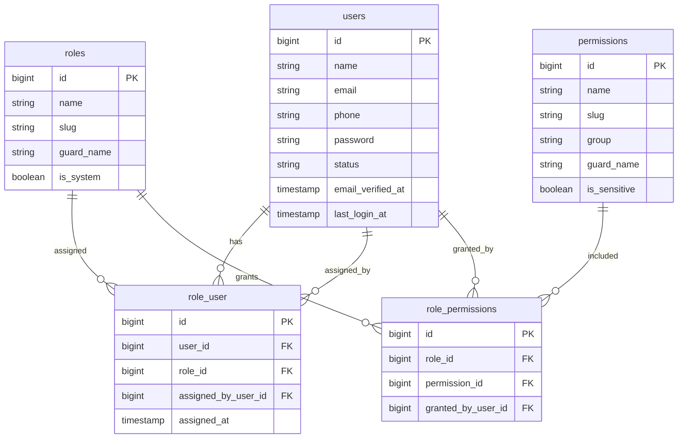

# Users, Roles and Permissions Schema Plan

Task: A1.1.1 Core users/roles schema

Status: Planning draft

## Scope

This document defines the database direction for staff/admin users, roles, permissions, and role assignments.

It does not implement Laravel migrations, Filament resources, admin login screens, customer login, policy classes, audit storage, password reset flows, or seed data.

## Design Goals

- Staff/admin authentication must have a clear schema foundation.
- Customer accounts must remain separate from staff/admin identity.
- Staff permissions must be role-based.
- Finance, cost, profit, refund, permission, audit, and delete actions must be restrictable.
- The schema must support Super Admin, Admin, Sales Staff, Inventory Staff, Finance Staff, and Production Staff.
- Sensitive staff, role, and permission changes must be able to emit audit events later.
- The schema should remain compatible with normal Laravel and Filament conventions.

## Core ERD

## Table: users

Purpose: one row per staff/admin account allowed to access the Laravel/Filament admin system.

Customers use the `customers` and `customer_accounts` schema. Do not mix public website customers into `users`.

| Column | Type | Nullable | Notes |
|---|---:|---:|---|
| `id` | unsigned big integer | No | Primary key. |
| `name` | varchar(160) | No | Staff display name. |
| `email` | varchar(190) | No | Login email. Unique. |
| `phone` | varchar(30) | Yes | Optional staff contact number. |
| `password` | varchar(255) | No | Laravel-hashed password only. |
| `status` | varchar(32) | No | Suggested values: `active`, `invited`, `suspended`, `left`. Default `active`. |
| `email_verified_at` | timestamp | Yes | Laravel-compatible email verification field. |
| `last_login_at` | timestamp | Yes | Useful for admin security review. |
| `password_changed_at` | timestamp | Yes | Useful for password rotation checks later. |
| `remember_token` | varchar(100) | Yes | Laravel remember token. |
| `created_by_user_id` | unsigned big integer | Yes | Self-FK to `users.id`; set null if creator is removed. |
| `updated_by_user_id` | unsigned big integer | Yes | Self-FK to `users.id`; set null if updater is removed. |
| `created_at` | timestamp | No | Laravel timestamps. |
| `updated_at` | timestamp | No | Laravel timestamps. |
| `deleted_at` | timestamp | Yes | Soft delete only. |

### User Constraints

- Primary key: `id`.
- Unique: `email`.
- FK: `created_by_user_id` references `users.id`, null on delete.
- FK: `updated_by_user_id` references `users.id`, null on delete.
- Check/app enum: `status` in `active`, `invited`, `suspended`, `left`.
- `password` must store a hash, never a plain password.
- Suspended, left, or soft-deleted users must not be allowed to log in.

### User Indexes

- `unique(users.email)` for login lookup.
- `index(users.status, users.deleted_at)` for admin staff filters.
- `index(users.created_by_user_id)` for admin/audit references.
- `index(users.updated_by_user_id)` for admin/audit references.

## Table: roles

Purpose: role records used to group permissions for staff/admin access.

Required business roles:

| Role | Slug | Notes |
|---|---|---|
| Super Admin | `super_admin` | Full system access. Treat as owner-level and protect assignment carefully. |
| Admin | `admin` | Broad operational access except owner/system-only settings if needed. |
| Sales Staff | `sales_staff` | Leads, customers, quotations, order status/payment visibility, follow-ups. No core record deletion by default. |
| Inventory Staff | `inventory_staff` | Stock quantities, movements, low-stock alerts, packing/stock status. No profit reports by default. |
| Finance Staff | `finance_staff` | Payments, balances, refunds, expenses, cost data, profit estimates, finance reports. |
| Production Staff | `production_staff` | Design review status, production queue, print instructions, production status updates. |

| Column | Type | Nullable | Notes |
|---|---:|---:|---|
| `id` | unsigned big integer | No | Primary key. |
| `name` | varchar(120) | No | Human role name. |
| `slug` | varchar(120) | No | Stable machine role key. Unique. |
| `guard_name` | varchar(80) | No | Default `web` unless the final auth setup uses a separate admin guard. |
| `description` | varchar(300) | Yes | Admin-facing explanation. |
| `is_system` | boolean | No | Protects built-in roles from accidental deletion/renaming. Default `false`. |
| `sort_order` | unsigned integer | No | Default `0`. |
| `created_at` | timestamp | No | Laravel timestamps. |
| `updated_at` | timestamp | No | Laravel timestamps. |

### Role Constraints

- Primary key: `id`.
- Unique: `slug`.
- Unique recommended if package-compatible guards are used: `(guard_name, slug)`.
- `slug` should use lowercase snake case.
- System roles should not be hard-deleted or renamed through normal admin screens.

### Role Indexes

- `unique(roles.slug)`.
- `index(roles.guard_name, roles.slug)` for permission package compatibility.
- `index(roles.is_system, roles.sort_order)` for admin role listing.

## Table: permissions

Purpose: permission records used by policies, Filament resources, and protected workflows.

Use action-style slugs such as `orders.view`, `orders.update_status`, `payments.record`, `finance.view_profit`, and `users.manage_roles`.

| Column | Type | Nullable | Notes |
|---|---:|---:|---|
| `id` | unsigned big integer | No | Primary key. |
| `name` | varchar(160) | No | Human permission name. |
| `slug` | varchar(160) | No | Stable permission key. Unique. |
| `group` | varchar(80) | No | Module group, such as `orders`, `finance`, `inventory`, or `settings`. |
| `guard_name` | varchar(80) | No | Default `web` unless the final auth setup uses a separate admin guard. |
| `description` | varchar(300) | Yes | Admin-facing explanation. |
| `is_sensitive` | boolean | No | Marks finance, deletion, permission, audit, and settings permissions. |
| `created_at` | timestamp | No | Laravel timestamps. |
| `updated_at` | timestamp | No | Laravel timestamps. |

### Permission Groups

Recommended groups:

- `users`
- `roles`
- `customers`
- `products`
- `orders`
- `quotations`
- `payments`
- `refunds`
- `inventory`
- `vendors`
- `files`
- `crm`
- `production`
- `shipping`
- `finance`
- `reports`
- `audit`
- `settings`

Sensitive permission examples:

- `users.manage_roles`
- `roles.manage_permissions`
- `orders.delete`
- `payments.record`
- `payments.edit`
- `refunds.approve`
- `finance.view_cost`
- `finance.view_profit`
- `inventory.view_cost`
- `files.download_private`
- `audit.view`
- `settings.manage`

### Permission Constraints

- Primary key: `id`.
- Unique: `slug`.
- Unique recommended if package-compatible guards are used: `(guard_name, slug)`.
- `slug` should use `module.action` format.
- `group` should be a known module group.

### Permission Indexes

- `unique(permissions.slug)`.
- `index(permissions.guard_name, permissions.slug)` for permission package compatibility.
- `index(permissions.group, permissions.is_sensitive)` for admin permission screens.

## Table: role_user

Purpose: assigns roles to staff/admin users.

| Column | Type | Nullable | Notes |
|---|---:|---:|---|
| `id` | unsigned big integer | No | Primary key. |
| `user_id` | unsigned big integer | No | FK to `users.id`. |
| `role_id` | unsigned big integer | No | FK to `roles.id`. |
| `assigned_by_user_id` | unsigned big integer | Yes | FK to `users.id`; set null if assigner is removed. |
| `assigned_at` | timestamp | No | When the role was assigned. |
| `created_at` | timestamp | No | Laravel timestamps. |
| `updated_at` | timestamp | No | Laravel timestamps. |

### Role Assignment Constraints

- Primary key: `id`.
- FK: `user_id` references `users.id`.
- FK: `role_id` references `roles.id`.
- FK: `assigned_by_user_id` references `users.id`, null on delete.
- Unique: `(user_id, role_id)`.
- A user can have multiple roles, but normal launch behavior can restrict staff to one role if operations prefer.
- At least one active Super Admin should exist; enforce in application/admin logic, not only database constraints.

### Role Assignment Indexes

- `unique(role_user.user_id, role_user.role_id)`.
- `index(role_user.role_id, role_user.user_id)` for role membership lookup.
- `index(role_user.assigned_by_user_id)` for audit/reference lookup.

## Table: role_permissions

Purpose: grants permissions to roles.

| Column | Type | Nullable | Notes |
|---|---:|---:|---|
| `id` | unsigned big integer | No | Primary key. |
| `role_id` | unsigned big integer | No | FK to `roles.id`. |
| `permission_id` | unsigned big integer | No | FK to `permissions.id`. |
| `granted_by_user_id` | unsigned big integer | Yes | FK to `users.id`; set null if grantor is removed. |
| `created_at` | timestamp | No | Laravel timestamps. |
| `updated_at` | timestamp | No | Laravel timestamps. |

### Role Permission Constraints

- Primary key: `id`.
- FK: `role_id` references `roles.id`.
- FK: `permission_id` references `permissions.id`.
- FK: `granted_by_user_id` references `users.id`, null on delete.
- Unique: `(role_id, permission_id)`.
- Super Admin may be implemented as an explicit permission grant set or as a policy-level bypass for `super_admin`.

### Role Permission Indexes

- `unique(role_permissions.role_id, role_permissions.permission_id)`.
- `index(role_permissions.permission_id, role_permissions.role_id)` for permission membership lookup.
- `index(role_permissions.granted_by_user_id)` for audit/reference lookup.

## Standard Auth Support Tables

Laravel may also create these standard auth support tables:

- `password_reset_tokens`: email, token hash, created_at.
- `sessions`: only if database sessions are selected.
- `personal_access_tokens`: only if token-based admin/API authentication is selected later.

These tables are implementation support and should not be used as customer/account domain records.

Customer website authentication must use a separate provider, session guard, and password broker backed by `customer_accounts`.

## Relationship Rules

### users to roles

- A user has zero or many assigned roles.
- An active admin user should normally have at least one role.
- Removing a role assignment is a sensitive action and should emit an audit event once the audit interface exists.
- Normal admin screens should not hard-delete staff users; suspend or soft delete instead.

### roles to permissions

- A role has zero or many permissions.
- Permissions should be checked through roles.
- Direct user permissions are intentionally excluded from this planning draft to avoid hard-to-audit exceptions.
- If a future business case requires direct user overrides, add them deliberately with audit and expiry rules.

### customers and staff users

- Staff/admin users belong in `users`.
- Customer business identity belongs in `customers`.
- Customer website login identity belongs in `customer_accounts`.
- Staff-created sales orders can reference the acting staff user through `users.id`.
- Website orders should reference customer records, not staff users.

## Delete Behavior

- Use soft deletes on `users`.
- Do not hard-delete system roles or system permissions in normal admin usage.
- Role and permission pivots can cascade only on hard delete, but hard delete should be rare and restricted.
- `assigned_by_user_id`, `granted_by_user_id`, `created_by_user_id`, and `updated_by_user_id` should use null-on-delete to preserve the main record.
- Sensitive changes should be preserved in audit logs later, not only inferred from timestamps.

## Laravel Migration Plan

Migration sequence for this schema area:

1. Create `users`.
2. Create `password_reset_tokens` and other standard Laravel auth tables if selected by the scaffold.
3. Create `roles`.
4. Create `permissions`.
5. Create `role_user`.
6. Create `role_permissions`.
7. Later policy/admin work seeds roles and permissions.
8. Later audit work records user, role, and permission changes through the audit interface.

If a package such as Spatie Laravel Permission is selected during implementation, keep the same logical relationships but adapt table names to the package conventions, such as `model_has_roles`, `role_has_permissions`, and `model_has_permissions` if direct permissions are explicitly approved.

## Notes for Later Admin Authentication

- Admin login should check `users.status = active`.
- Suspended, left, or soft-deleted users must not authenticate.
- Password reset tokens must be hashed.
- Initial production seed should create a Super Admin safely and require credential rotation.
- A later decision should confirm whether Super Admin can create another Super Admin.

## Notes for Later Policies and Filament

- Filament resources should map actions to permission slugs.
- Delete permissions should be explicit and absent from most staff roles.
- Finance/cost/profit fields should be hidden unless the user has the matching finance permission.
- Sales Staff may see payment status without receiving profit/cost permissions.
- Inventory Staff may manage stock quantity/movements without seeing purchase cost unless explicitly granted.
- Production Staff should see only production-relevant order/design data.

## Notes for Later Audit Usage

- Staff account creation, suspension, role assignment, role removal, permission grant, permission removal, and sensitive setting changes should emit audit events once A4.6/C6.1 exist.
- Audit payloads must not include password hashes, password reset tokens, remember tokens, or private file contents.
- `users.id` should be usable as the actor reference for staff/admin audit events.

## Dependency Impact Summary

Affected projects:

- Platform A and Project C primarily.
- Project B indirectly only through customer/staff identity separation and later staff-created order visibility.

Affected future tables:

- Orders and quotations may reference `users.id` for staff ownership, assignment, creation, or approval.
- Audit logs should reference `users.id` as actor where the actor is staff/admin.
- Finance, inventory, files, and settings modules will use permission checks from this schema.

Affected screens:

- Filament admin login and staff management.
- Role/permission management.
- Finance, inventory, files, audit, settings, CRM, orders, and reports screens through policy checks.

Affected APIs:

- No public customer APIs in this subtask.
- Future admin APIs must enforce these permissions.

Idempotency concerns:

- No idempotency table is needed for this schema draft.
- Later seeders should be idempotent by role and permission slug.

## Review Checklist

### Schema Review

- Users, roles, permissions, role assignments, and role permission grants are represented.
- Customer accounts are kept out of this staff/admin schema.
- Laravel auth support tables can be added without becoming domain records.

Result: Pass.

### Permission Relationship Review

- Staff permissions can be checked through assigned roles.
- Role permissions are unique per role/permission pair.
- Direct user permissions are intentionally excluded from V1 planning.

Result: Pass.

### Role Coverage Review

- Super Admin, Admin, Sales Staff, Inventory Staff, Finance Staff, and Production Staff are supported.
- Launch seeding can still start with a smaller set if implementation phases require it.

Result: Pass.

### Finance Visibility Review

- Finance/cost/profit permissions can be marked sensitive and granted only to approved roles.
- Sales Staff can see payment status without receiving cost/profit permissions.
- Inventory Staff can see stock quantities without receiving profit report permissions.

Result: Pass.

### Audit Readiness Review

- Role assignment, permission grant, and staff account changes have actor reference fields.
- Later audit tables can reference `users.id` as actor.
- Sensitive credential fields are excluded from audit payload recommendations.

Result: Pass.

## Open Decisions for Future Tasks

- Whether launch seeding includes all six roles immediately or starts with Super Admin, Admin, and Sales Staff.
- Whether Super Admin can create another Super Admin.
- Whether staff activity logging is required from Phase 1 or only once the audit module is implemented.
- Whether the final auth setup uses Laravel's default `web` guard or a dedicated admin guard.

## Implementation Note

The V1 implementation selected app-owned RBAC tables and helpers rather than a third-party permissions package. The schema and relationships above remain the logical model for staff/admin access.
